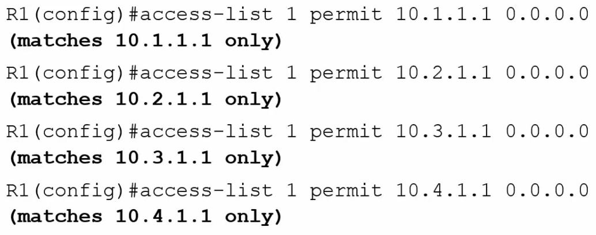
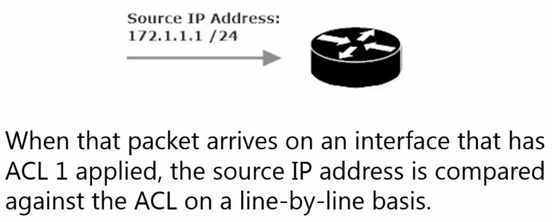
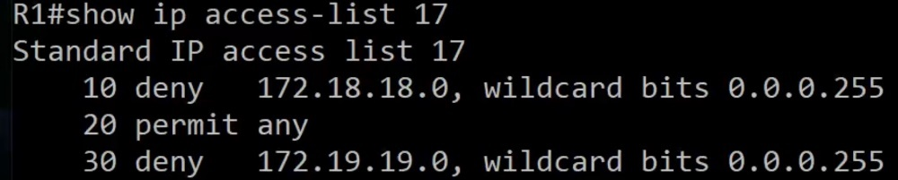
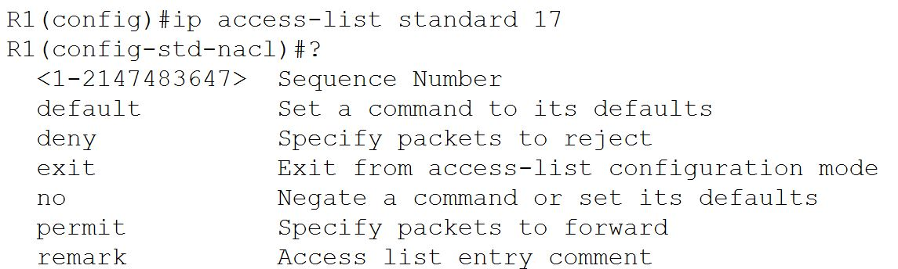
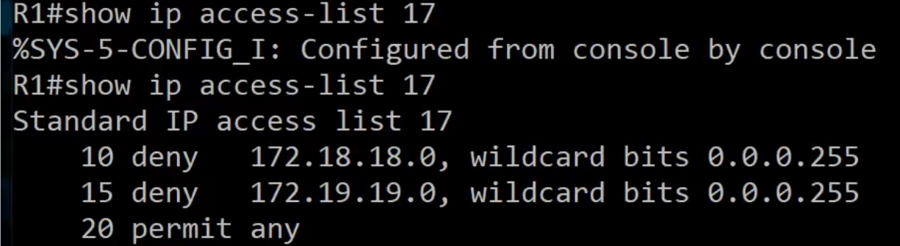
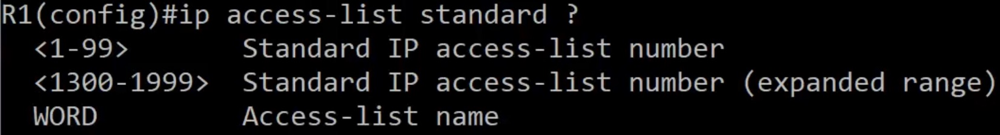
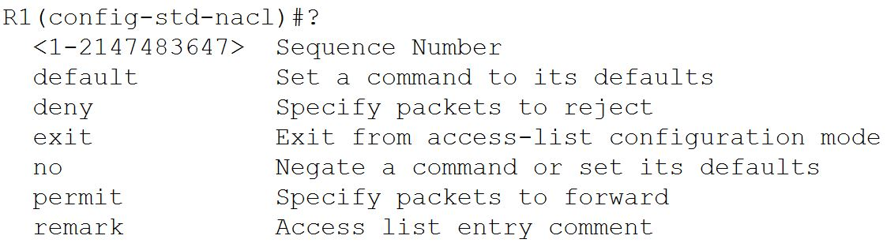

**Access Control Lists (ACLs) Notes**

ACLs are used to allow/deny traffic based on packet source and/or
destination IP address.

ACLs are also used to identify traffic.

<u>ACL Rules</u>

1.  One ACL per interface per direction (one incoming, one outgoing)

2.  Reads the ACL from the top down, stops when it reaches a match

3.  Implicit Deny all

<u>Session 1: The implicit deny</u>

ACL Implicit Deny in Action: when a packet enters/exits an interface
that has an ACL applied, at least one packet value is compared against
the CAL on a line-by line basis. Generally, the lines compared contain
the source IP address and/or the destination IP address.

To see the ACLs in place on a router, type *access-list \<*the number of
the ACL\> \<1-99\> \<100-199\>

ACLS use wildcard masks to determine which part of an IP address should
be examined for matches against ACL lines, and just as importantly, they
indicate the part of the IP address that should <u>not</u> be compared.

Standard ACLs can only match on the source IP address of a packet.

Example ACL 1

The items in bold are notes added by the instructor to clarify how the
access-list command is used.

Remember ACLs use wildcard masks, so 0.0.0.0 means only that one ind. IP
add

Assume the above ACL rules are in place and our router/int (interface
has an ACL applied) receives a packet from source ip address
172.1.1.1/24. As this IP address is not included in the ACL, no match is
found and the implicit deny is applied to the packet

The *implicit deny*: essentially an invisible deny. There won’t be any
visible deny added to the end of the ACL, but it’s there. Since it is
not visible to us, it is easy to forget about. Forgetting about the
implicit deny is a common reason for an ACL to not give the desired
results.

<u>3 Types of ACLS</u>

1.  Standard

2.  Extended

3.  Named

<u>Standard ACLs</u>

A standard ACL is concerned only with the source IP address of the
packet. The source IP address is the *only* value that can be configured
in a standard ACL.

Standard ACL numeric ranges

1)  \<1-99\> IP standard access list

2)  \<1300-1999\> IP standard access list (expanded range)

Extended ACL numeric ranges

1)  \<100-199\> IP extended access list

2)  \<2000-2699\> IP extended access list (expanded range)

**Standard ACL Lab**

Using a Standard ACL

- On R1, block traffic on Se0/1/0 sourced from 3.3.3.0/24 if destined
  for 11.11.11.0/24

- R1 should allow packets from 3.3.3.0/24 on that interface,

if intended for any other subnet, including any subnets added in the
future.

To complete this lab the ACL is going to be made on Router 1 and will be
numbered between \<1-99\>

R1(config)#access-list 1 deny 3.3.3.0 0.0.0.255

R1(config)#access-list 1 allow any

The above two commands only create the standard ACL.

We need to also apply these rules listed in ACL 1 to an interface.

Per our instructions that interface is R1 int Se 0/1/0. And per the
instructions these are inbound packets.

R1(config)#int se 0/1/0

R1(config-if)#ip access-group 1 in

This command, specifies that int se 0/1/0 is part of the access-group
associated with access-list 1 for inbound packets.

This is as far as we can go with the instruction for a Standard ACL

The effect of these instructions is that any traffic from subnet
3.3.3.0/24 will be denied

And all other traffic will be accepted.

This of course means that we did not complete the instructions as
intended, in order to choose both a source and a destination, we will
need to set an extended ACL

**  
**

**Extended ACL Lab**

Using an Extended ACL

- On R1, block traffic on Se0/1/0 sourced from 3.3.3.0/24 if destined
  for 11.11.11.0/24

- R1 should allow packets from 3.3.3.0/24, if intended for any other
  subnet, including any subnets added in the future.

To complete this lab the ACL is going to be made on Router 1 and will be
numbered between \<100-199\>

R1(config)#access-list 100 deny ip 3.3.3.0 0.0.0.255 11.11.11.0
0.0.0.255

Remember that if we only type this command for access-list 100, all
traffic will be denied, not just traffic sourced from 3.3.3.0/24
destined for 11.11.11.0/24 due to the implicit deny

R1(config)#access-list 100 permit ip any any

As the extended ACL command is more specified command *permit any* will
not suffice as it did in a standard ACL command. We must also specify
the protocol(s) to allow (in this case any ip protocol) and we must
specify the source address and the destination address.

Thus access-list 100 permits *ip traffic* sourced from *any* (source
host) destined for *any* (source host), thus the *any any* at the end of
our command.

The above two command only create the extended ACL.

We need to also apply these rules listed in ACL 100 to an interface.

Per our instructions that interface is R1 int Se 0/1/0. And per the
instructions these are inbound packets.

Note an interface can only have 1 ACL for its inbound traffic and 1 ACL
for its outbound traffic.

You can set an interface to have the same ACL for its inbound traffic
and its outbound traffic.

Or you can separate your ACLs for interfaces specifying ACL \#x for
inbound traffic and ACL \#xx for outbound traffic.

Since there can only by one inbound or outbound ACL per interface,
running the command on Int Se0/1/0 to use ACL 100’s rules to “permit any
any”, we over-wrote the rules as set forth in ACL 1.

Running a *show ip int ser 0/1/0* command.

Shows that “Inbound access list is 100” and “outbound access list is not
set”

<u>Using the “*host*” and “*any*” specifiers in ACL commands</u>

A wild card mask of 0.0.0.0 (same as a subnet mask of 255.255.255.255)
indicates that the rules is in place for a single host. Rather than
typing an ip address (A.B.C.D.) and a wildcard mask (0.0.0.0) you can
use the “*host*” specifier instead.

Example using *host*

Create an ACL blocking all traffic on Se0/1/0 sourced from R3’s se0/1/0
interface when destined for 1.1.1.1/32

R1(config)#access-list 101 deny ip *host* 172.12.123.3 *host* 1.1.1.1

R1(config)#access-list 101 permit ip any any (Needed to disable implicit
deny)

R1(config)#int Se0/1/0

R1(config-if)#ip access-group 101 in (Applies the ACL 101 rules to
interface for inbound traffic)

The above rules applied to int se0/1/0 on R1 denies traffic sent from
172.12.123.3 (R3’s Se 0/1/0 int) when it is destined for Loopback 1. All
other ip traffic is allowed. We avoided using 0.0.0.0 (wildcard add)
after both host addresses.

A wild card mask of 255.255.255.255 (same as a subnet mask of 0.0.0.0)
indicates that the rules is in place for a *any* and hosts. Rather than
typing an ip address (A.B.C.D.) and a wildcard mask (255.255.255.255)
you can use the “any” specifier instead.

Example using *any*

Create an ACL allowing all traffic on Se0/1/0 sourced from any host and
se 0/1/0

R1(config)#access-list 101 permit ip *any host* 172.12.123.1

R1(config)#access-list 101 permit ip *any any*

(Only Needed to disable implicit deny sourced from other local hosts and
destined for all other local ip address)

Another way of typing this command with a different syntax (likely won’t
be done as it is needlessly verbose)

This time I will be using a standard ACL (thus I only specify the source
address)

R1(config)#access-list 10 permit ip 0.0.0.0 255.255.255.255 which is the
same as

R1(config)#access-list 10 permit ip any (which allows ip traffic sent
from any source address)

R1(config#access-list 10 permit ip A.B.C.D 255.255.255.255 is still the
same as

R1(config)#access-list 10 permit ip any as the wildcard mask is stating
all hosts are included

Of course, we would need to add theses ACL rules (access-list \#) to an
interface (ip access-group \# - match the ACL \#) and specify whether
the rules are meant for inbound or outbound traffic.

R1(config)#int Se0/1/0

R1(config-if)#ip access-group 101 in (Applies the ACL 101 rules to
interface for inbound traffic)

Access-group (set on interface) for inbound and/or outbound traffic with
an ACL set to Allow and/or Deny

Access-Group \# ***in*** with an Access-list ***Deny*** -deny inbound
traffic from given source to given local destination

Access-Group \# **out** with an Access-list ***Deny*** -deny outbound
traffic from given local source to destination

Access-Group \# ***in*** with an Access-list ***Allow*** -allow inbound
traffic from given source to given local destination

Access-Group \# ***out*** with an Access-list ***Allow*** -deny outbound
traffic from given local host to given destination

Note that setting an interface access-group number for inbound and/or
out bound traffic will do very different things depending if the
access-list in question is set to permit or deny traffic form a source
or from a source and to a destination.

**If multiple access lists using the same protocol are installed on an
interface, only the last ACL applied will be active.**

Extended ACL

R1(config)#access-list 100 deny ip host 172.12.123.3 any

This denies source interface from sending ip traffic from source host to
any other destination host

R1(config)#int se0/1/0

R1(config-if)#ip access-group 100 in – sets this interface (se0/1/0) to
deny incoming ip traffic from (R3 se0/1/0) no matter the destination.

R1(config)#int se0/1/0

R1(config-if)#ip access-group 100 out - sets this interface (se0/1/0) to
deny outgoing ip traffic from (R3 se0/1/0) which makes no sense as a
remote router’s interface cannot be used to send outgoing traffic.

As such verify the rules in the ALC before setting the access-group to
inbound or outbound

You may prefer to Permit outbound traffic from a local source (ip
address of host) and

Deny inbound traffic from a remote source (ip address of host/interface)

The *log* option

This is an additional piece of syntax that can be appended to an
access-list command

Log matches against this entry (IOS explanation)

Should we include an ACL with a deny any definition, by default this
definition will not be included under the *show access-list \#* command,
as it is the same as the implicit deny which is in place by default but
not seen in the show command.

Should we want to include the deny any definition under a *show
access-list* definition all we need to do is append the access-list deny
ip any command with *log*, As seen below

R1(config)#access-list 1 deny any log (note this is a standard ACL)

Now when we do a *show access-list \#* command we will see the deny all
definition in plain text and the router will log matches against the
implicit deny (aka the invisible deny all definition)

ACL definition commands written with a 255.255.255.255 wildcard are
often written to negate the implicit deny. Though we can always have a
second definition in an access-list *allow any*

<u>Law Order and ACLs (nuances in ACL definitions) and sequencing</u>

Golden rule of ACLs – getting just one line out of place in an ACL can
wreck everything you’re trying to do.

Remember order of definitions matter

Example

ACL is created that denies traffic from 172.18.18.0/24 while allowing
traffic from any other subnet

R1#show access-list

Standard IP access list 1

10 deny 172.18.18.0, wildcard bits 0.0.0.255

20 permit any

Standard IP access list 2

10 permit any

20 deny 172.18.18.0, wildcard bits 0.0.0.255

Only access-list 1 is going to act appropriately per our aim above

Access-list 2 is going to permit any (always!!) and any subsequent deny
definition will be ignored.

Therefor, the permit any definition needs to be our bottom definition in
an ACL

<u>Sequencing in ACLs</u>

Sequence Numbers in an ACL definition (*show access-list*) start with 10
and increment by 10

Sequence order matters greatly. Any *deny* instructions after a *permit
all* instruction will be ignored

Any *permit* instructions after a *deny all* instruction will be ignored

Let’s say you wanted to remove an ACL definition (because it is in the
wrong sequence for instance), doing a no access-list \# …… command will
not remove the individual line, instead the entire ACL will be erased.

Example 1

Notice

Seq 30 will be ignored, as it comes after a *permit any* definition

To rearrange sequence numbers or to delete a definition for a given seq
\# you have to go to “named sequence mode”

We will firstly delete sequence 30 and then put the same definition back
in at sequence

R1(config)#ip access-list standard 17

R1(config-std-nacl)#no 30 (30 is the ACL sequence \# for the definition
we aim to remove)

Next, we will re-add the definition to our list with a seq \# between 10
and 20

R1(config-std-nacl)#15 deny 172.19.19.0 0.0.0.255 (15 was chosen as it
is between 10 and 20)

This is all the options we have in creating an ACL in named sequence
mode

R1(config-std-nacl)#30 \<permit\>\<deny\> \<A.B.C.D\>\<host\>\<any\>
\<if A.B.C.D – wildcard mask\>

These are the options available under named ACL mode for a given ACL

Note: standard vs extended needs to be specified before ACL \#

This is the result of our realign sequence numbers for access-list 17

<u>Named ACLS</u>

Named ACL logic is the same as numbered ACL logic, and we can use *host*
and *any* in the same fashion as we would with a numbered ACL.

Named ACL interface application uses the same command as numbered
interface applications.

To use the named ACL as opposed to a numbered ACL, you start in global
config with an *ip access-list* CMD

Notice the WORD option, this means we can specify a word rather than a
number for our ACL.

From there we can add definitions to our ACL just as we would when using
the CMD: R1(config)#access-list \#

