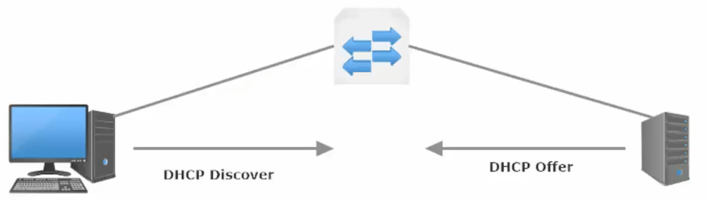
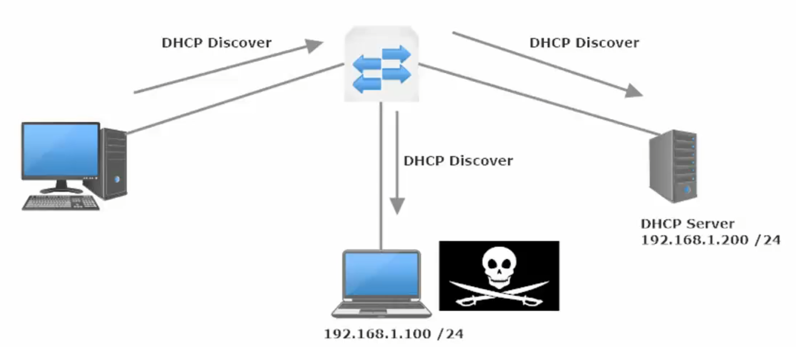
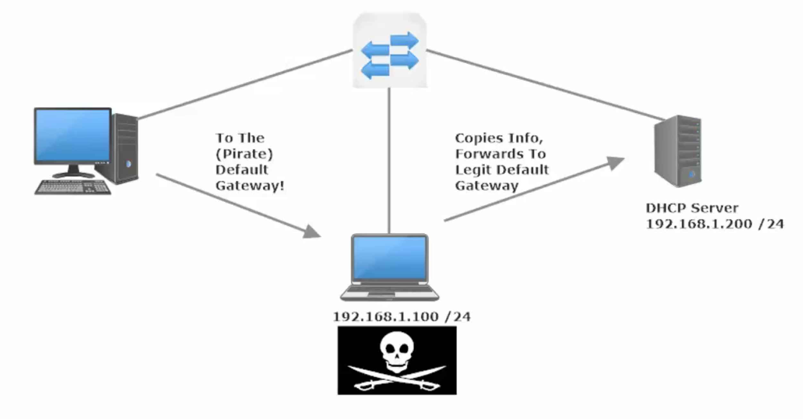
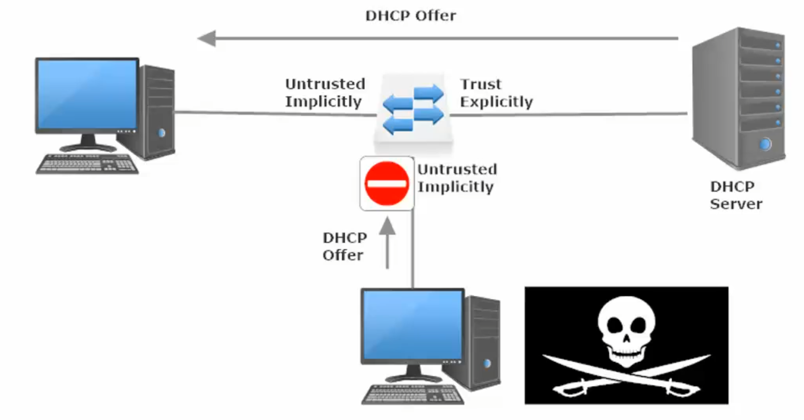
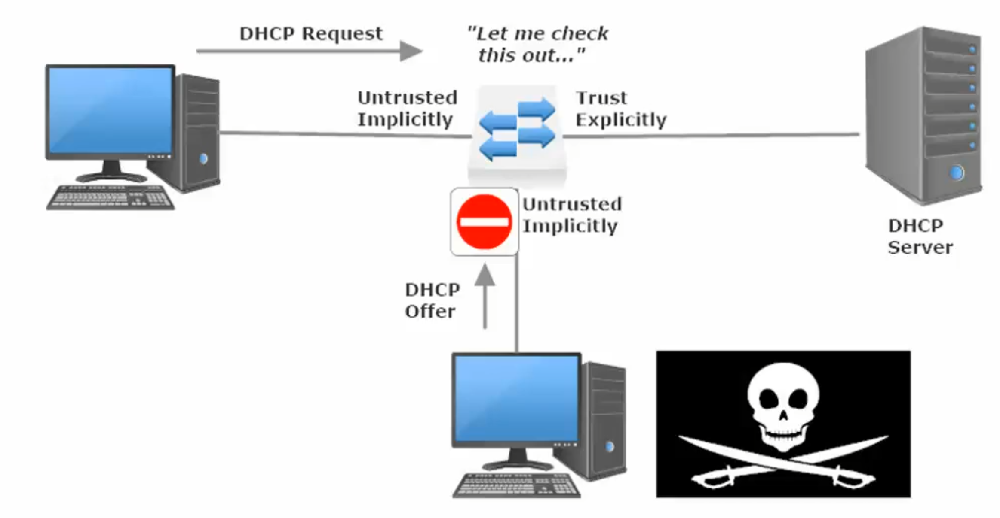
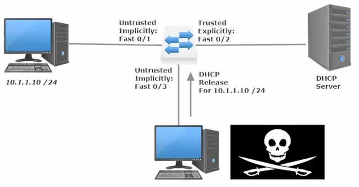

**DHCP Snooping and Dynamic ARP Inspection**

DHCP Snooping

Prevents unauthorized DHCP servers from joining your network.

In Cisco switches, DHCP snooping is enabled manually. Trusted ports
should be manually configured and the rest unconfigured ports are
considered untrusted ports. Most devices connected to trusted ports are
routers, switches, and servers. DHCP clients like PC and laptops are
commonly connected to an untrusted port.

How it works is that it will allow DHCP server messages like DHCPOFFER
and DHCPACK that are coming from a trusted source. If the DHCP server
messages are coming from untrusted ports, it will discard the DHCP
traffic. The switch creates a table called the DHCP Snooping Binding
Database. The DHCP snooping database registers the source MAC address
and IP address of the hosts that are connected to an untrusted port.

DHCP Snooping Theory

DHCP_Discover Packet is broadcast to

So_IP: 0.0.0.0

De_IP: 255.255.255.255

So_MAC: Host Mac Address

De_MAC: FF:FF:FF:FF:FF

As such **the man in the middle** at .100 gets the Disc Packet and could
respond with a rogue DHCP Offer.

The DHCP Offer coming from the pirate will list the Pirate as the
Default Gateway. Meaning the Host will send all traffic through the true
default gateway on to the non-legit hacker Default Gateway.

Man in the Middle Attack / Reconnaissance Attack – collects info/packets
and uses this info towards a further attack.

DHCP Snooping

Configured on switches, since those are typically devices between the
hosts and the DHCP servers / relay agents

Uses the concept of trusted / untrusted ports (similar to port-security)
(MAC address used as key)

Ports are untrusted by default

Must be enabled globally and then on a per-interface level

Typically, you’ll trust ports rec messages from DHCP Servers and leave
untrusted ports to receive DHCP messages from clients.

On a trusted port, all DHCP messages (DORA + Release + Decline) flow
freely.

Release – sent by client to release the IP address it leased from a DHCP
Server

Decline – sent by client because a duplicate IP has been detected by the
client

Client Messages – Disc + Request + Decline + Release

Server Messages – Offer + Acknowledge

Remember: DHCP Messages sourced from a client are treated differently
than those sourced from a server on untrusted ports.

DHCP Server Messages \>\> arrive on untrusted port \>\> discarded
(Implicit Deny unless explicitly Permitted)

DHCP Client Messages \>\> on untrusted port \>\> generally can flow, but
may be blocked if Snooping process considers them dangerous.

 

Compares the client ID (for the MAC) and the ETH Encapsulation (contains
the Source MAC) and deny if they do not match

Example of another DHCP Attack

Attacker sends DCHP release packet (this packets orginate from DHCP
Clients) to attempt to force a DHCP handshake and complete a
Man-in-the-middle attack.

However, the port on the Sw where the lease for 10.1.1.10 originated was
Fa0/1 and now Fa0/3 is attempting to send a release packet, which alerts
the DHCP snooping agent which then denies the DHCP release.

**<u>DHCP Snooping Rate Limit</u>**

Used to prevent a Denial of Service (DoS) attack by flooding an
interface with tons of DHCP discover requests

Enabled on a per-interface basis, can be set on trusted or untrusted
interfaces

Sw(config)#int g0/0

Sw(config-if)#ip dhcp snooping rate limit 10

When configuring DHCP snooping rate limiting on a Layer 2 LAN interface,
note the following information:

- We recommend an untrusted rate limit of not more than 100 packets per
  second (pps).

- If you configure rate limiting for trusted interfaces, you might need
  to increase the rate limit on trunk ports carrying more than one VLAN
  on which DHCP snooping is enabled.

- DHCP snooping puts ports where the rate limit is exceeded into the
  error-disabled state.

**<u>  
</u>**

**<u>IP</u>** **<u>ARP Inspection Lab</u>**

You enable ARP inspection globally for specific VLANs

Sw(config)#ip arp inspection vlan 1

Specify what the ARP inspection will validate against (src-mac \|
dst-mac \| ip) globally

Sw(config)#ip arp inspection validate (src-mac)

And then from the interface-config mode for individual interface you
elect whether the interface will be trusted.

If not explicitly trusted, then the interface (if on a VLAN with ARP
inspection active) will be implicitly not trusted.

Sw(config-if)#ip arp inspection trust

Multiple ways for ARP inspection to validate whether an ARP packet is
legitimate.

These way are set with the “ip arp inspection validate \<dst-mac\> or
\<src-mac\> or \<ip\> command (from global-config mode) If you only
select one option in the command, only that option will be enabled.

Example: Sw1(config)#ip arp inspection src-mac will enable the
source-mac validation, but it you then

enable IP validation with another command (Sw1(config)#ip arp inspection
ip), src-mac validation gets disabled and ip validation gets enabled.

To enable multiple validation options, you must do so in one command
(order doesn’t matter)

Example: Sw1(config)#ip arp inspection validate ip src-mac dst-mac
(Enables All 3 options)

Sw1(config)#*ip arp inspection validate ?*

**dst-mac** Validate destination MAC address

**src-mac** Validate source MAC address

**ip** – Validate IP address

Checks for unexpected and invalid IP addresses, including (0.0.0.0) and
(255.255.255.255) and all multicast add

Checks sender IP in ARP Request and Responses

Checks destination IP in ARP Responses

Optional additional signifier for IP validation: \#ip arp inspection ip
allow zeros

Allows the (0.0.0.0) sender/source IP address. Necessary for DHCP to
work.

**dst-mac** – Validate destination MAC address

Validates the destination MAC address in the Ethernet header to the
target MAC address in the ARP message (ARP Responses only)

**src-mac** - Validate source MAC address

Validates the source MAC address in the Ethernet header to the sender
MAC in ARP Requests and Responses

If a mis match is detected under any of these optional validation
techniques, the offending packet is dropped.

The packet is dropped, but the interface stays UP, there is no
err-disabled state)

<table>
<colgroup>
<col style="width: 14%" />
<col style="width: 39%" />
<col style="width: 46%" />
</colgroup>
<thead>
<tr class="header">
<th>OPTIONAL</th>
<th>ARP Request</th>
<th>ARP Response</th>
</tr>
</thead>
<tbody>
<tr class="odd">
<td>IP</td>
<td>Checks sender IP in ARP Request</td>
<td>
Checks sender IP in ARP Responses

Checks destination IP in ARP Responses
</td>
</tr>
<tr class="even">
<td>DST-MAC</td>
<td>N/A</td>
<td>
Validates Dest MAC (in the Ethernet Header)

to Target MAC (in the ARP Response)
</td>
</tr>
<tr class="odd">
<td>SRC-MAC</td>
<td>
Validates Source MAC (Eth Header)

To the Sender MAC (ARP Request)
</td>
<td>
Validates Source MAC (Eth Header)

To the Sender MAC (ARP Response)
</td>
</tr>
</tbody>
</table>

The IP validation option has the ‘allow zeros’ option to <u>allow a
source IP of 0.0.0.0</u> through the ARP inspection protections.
