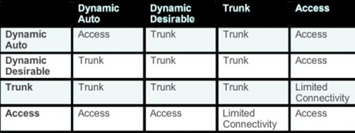

**Dynamic Trunking Protocol (DTP)** – handles the actual Trunk negotiation workload. When this Cisco proprietary point-to-point protocol is in action, it attempts to negotiate a trunk with the remote port.

Trunk (definition) – a switchport that can carry multiple vlans. Frames are tagged with a VLAN when leaving a trunk port and the VLAN tag is then decapsulated when it arrives on a Trunk port and forwarded

This mode sends DTP frames every 30 seconds, thus eating into HW resources.

To turn this function off

SW1(config)#switchport nonegotiate

For this command to work you need to remove dynamic status

SW1(config)#switchport trunk encapsulation dot1q (Encapsulation cannot be set to auto) (no need to do this on C2960 as dot1q is the only option)

SW1(config)#switchport mode trunk

SW1(config)#switchport nonegotiate

**Four Switchport modes**

Unconditional trunking - switchport mode trunk

Unconditional non-trunking - switchport mode access

Dynamic trunking - switchport mode dynamic desirable (Actively attempts to trunk)

Passive trunking - switchport mode dynamic auto

> (waits for other switch to initiate the process)
>
> If one port is desirable or on mode a trunk is made
>
> If both ports are on auto (Passive) no trunk is made

**Dynamic Trunking Protocol**

Shares a database of Vlans across trunk ports. So one only needs to configure the VLAN info on a single switch and have the info propogated to others so long as they are in the VTP domain and have a lower revision number.

**3 VTP Modes**

Server – default mode – create/modify/delete vlans

Client – changes are applied and updates are forwarded, cannot create modify delete vlans and have those changes propagated

Transparent – updates are forwarded only, changes are not applied

**VTP Pruning**

Prevents unnecessary traffic from crossing the network

Lets say Sw1 has information on VLAN 2 and Sw2 (connected via trunk) has no interfaces in vlan 2, the pruning command will prune information on VLAN 2 from the VTP database and not propogate that info to Sw2.

Note: If there is a VTP transparent switch in between the VTP server and client, the pruning will not work

Sw1(config)#vtp pruning

**Troubleshooting VTP**

Trunk Down? Are the connections between the switch set as access?

Interface is UP/UP

Trunking Encapsulation must match on both sides (ISL or Dot1Q)

Adding new Switch to VTP domain

Always add the switch in Client mode, as Server mode will propogate changes

Be careful when adding a new switch to your network, as the switch may not be cleared of all information and if the VTP revision number is higher than the other switches, by default the VLANs from this switch will be propogated to the others, likely ruining your network
