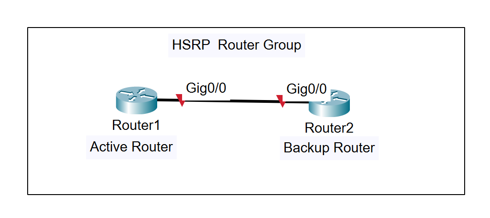
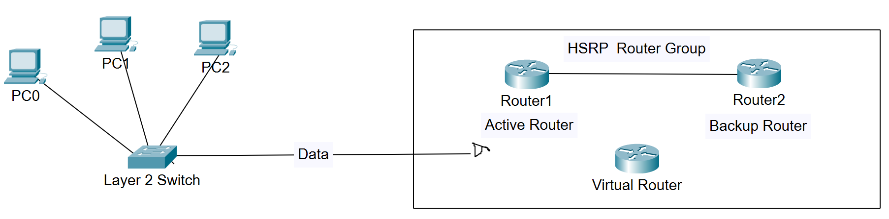
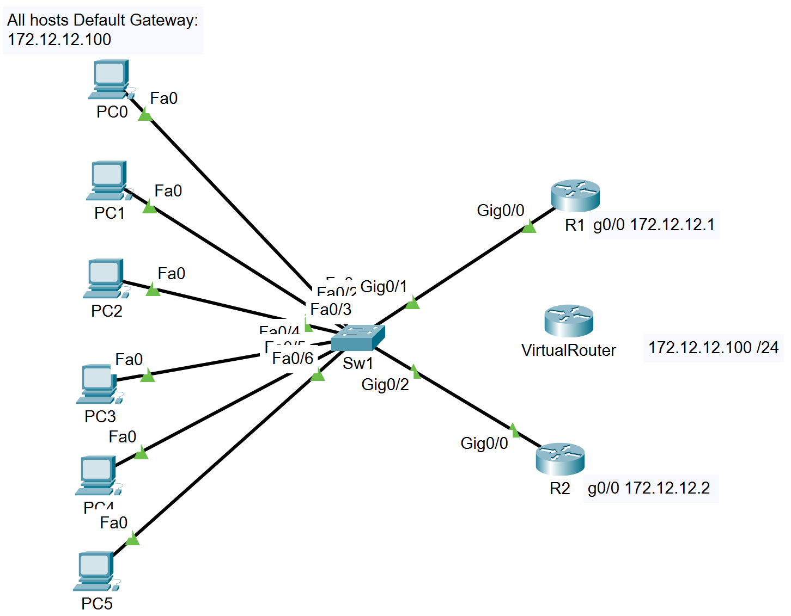
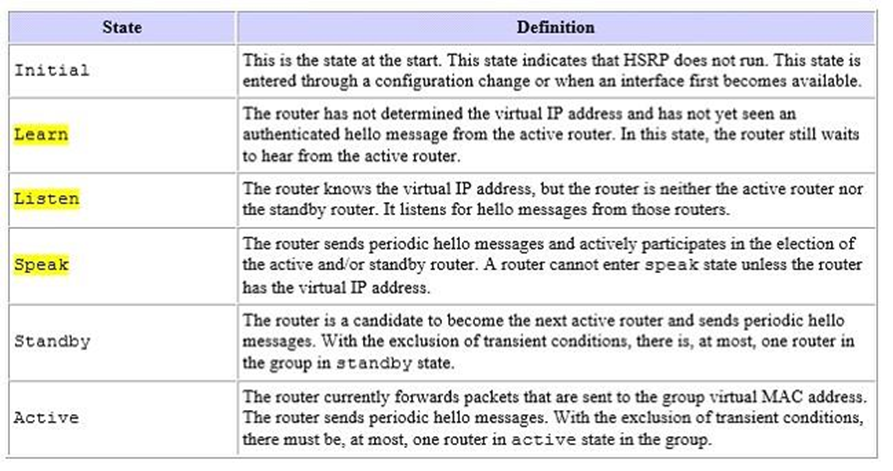
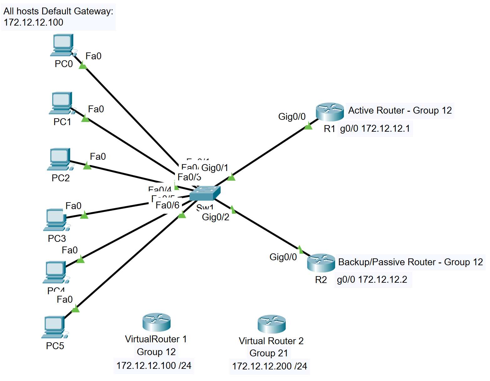
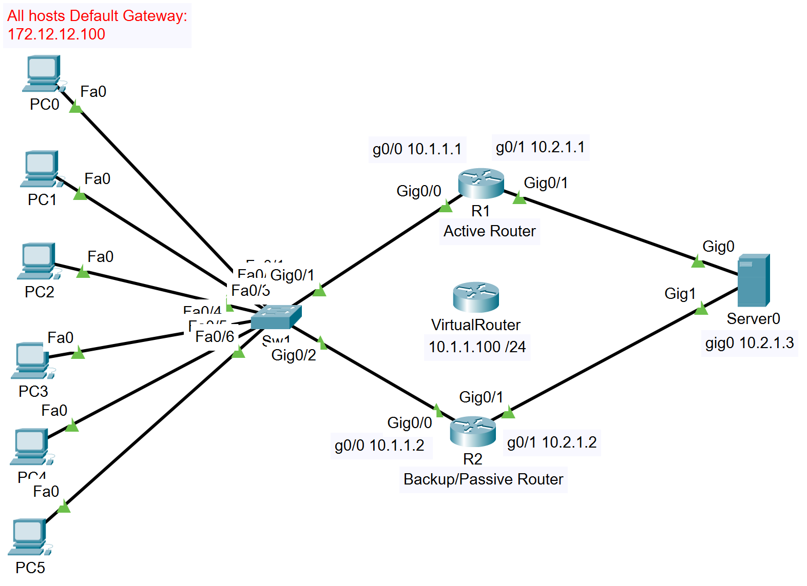

**First-Hop Redundancy Protocols (FHRP)**

Hot Standby Routing Protocol (HSRP)

Gateway Load Balancing Protocol (GLBP)

Virtual Router Redundancy Protocol (VRRP)

*Hot Standby Routing Protocol (HSRP)* (defined in RFC2281)

A cisco-proprietary router redundancy protocol in which routers are placed into an HSRP router group.

One of the routers in the group is selected as the *active router*, while the other router(s) are the *standby router(s)*

Virtual Router (“pseudo router”) gets created by R1 and R2 when given some basic information. The hosts would connect to this v-router rather than R1 or R2, as if either of those routers go down, hosts pointed to that router would go down also, rather than switching to the backup router or the backup router becomes active.

HSRP ensures high network uptime, since it routes IP traffic without reliance on a single router

In this example: all hosts connect to a virtual router at (.100)

Should we have setup redundancy to have host PC0 – PC2 connect to R1 and hosts PC3 – PC5 connect to R2, should either router go down, half the hosts would go down as well. Using a virtual router, R1 still receives all the traffic, but all the hosts point to the vrouter, so if R1 goes down, the backup router will become active. If R2 goes down no change will be made, as it is already designated a backup.

HSRP Load Balancing: You can also configure HSRP to allow the routers to split the workload and maintain redundancy

The HSRP config is done at the interface-config level and all routers in the group will need the same information entered.

**R1(config)#int g0/0**

**R1(config-if)standby 12 ip 172.12.12.100**

**R2(config)#int g0/0**

**R2(config-if)standby 12 ip 172.12.12.100**

HSRP default virtual-MAC address **<u>0000.0C07.AC0C</u> the first 10 hex numbers do not change, we got 0C as our final digits as we chose 12 (hex value C) as our HSRP group number**

**HSRP virtual MAC address: 00:00:0C:07:AC:xx for HSRP Version 1 (xx is the group number in hex)**

**HSRP virtual MAC address: 00:00:0C:9F.Fx.xx for HSRP version 2 (xxx is the group number in hex)**

HSRP active router election:

The router with the **highest priority wins** the election and is made the active router,

If the routers have the same priority (default 100) the router with the **higher IP address wins**

Based on priority value, HSRP elects a **single active router** and a **single backup router**.

The **active router** (higher priority, 100 is default) forwards packets, responds to ARP requests with virtual MAC address, and can be the only router that is explicitly configured with the virtual IP Address.

The **standby router** has the second-highest priority (if priority is equal, then the highest IP address)

Other Routers in an HSRP Group are in a listening state

Multicast Addresses

HSRP V1: 224.0.0.2 (all routers multicast)

HSRP V2: 224.1.1.102 (all hsrp v2 routers multicast)

<u>Change active router election</u>

To change the HSRP priority, we go to the interface and change the standby \<group \#\> priority to a number higher than 100

**R1(config-if)#standby 12 priority 110**

The change to the election will not be done automatically if ‘preemption disabled’ is set in the HSRP standby command (note: preemption disabled is the default)

**R1(config-if)#standby 12 preempt**

<u>Change HSRP Group Name</u>

Command set at the interface level. Must be made on both routers if you want the name change reflected in both places, the HSRP name change is strictly a local change

**R1(config-if)#standby 12 name \<enter name 25 char max\>**

<u>HSRP States</u>

1.  Initial (INIT) – The interface enters this state when HSRP is first enabled.

2.  Listen – The router knows the virtual router’s IP address. The “Active” and “Standby” roles have not yet been decided. Its listening for HSRP Hello packets from other routers.

3.  Speak – The router is sending Hellos and is participating in the Active router election.

4.  Standby – The router is now a candidate to become the Active router. If the router does not become the active router, then it will remain in this “standby” state.

5.  Active – The Active router is now forwarding packets sent to the virtual router’s IP address.

<u>HSRP Load Balancing</u>

FHRP - first hop redundancy protocol

HSRP wasn’t built with load balancing in mind. If you have only one group, there is no way to have load balancing (always have one active router and one or more standby routers). By creating multiple HSRP groups, a router can be the active router for one group and the backup router for another group.

Virtual Router 1 – 172.12.12.100 – Group 12 has R1 as Active Router

Virtual Router 2 – 172.12.12.200 – Group 21 has R2 as Active Router

You would then need to set up one half of the hosts to have .100 as their DG

And the other half of the hosts to have .200 as their DG

R1(config)#int g0/0

R1(config-if)#standby 12 ip 172.12.12.100

R1(config-if)#standby 12 priority 110 - makes the priority higher than the default 100,

> so R1 (group 12) is Active router

R1(config-if)#standby 12 preempt - Allows the HSRP Active router election to occur again

R1(config-if)#standby 21 preempt - Preemption must be enabled on both devices for FHRP

R2(config)#int g0/0

R2(config-if)#standby 21 ip 172.12.12.200

R2(config-if)#standby 21 priority 110 - makes the priority higher than the default 100,

> so R2 (group 21) is Active router

R2(config-if)#standby 21 preempt - Allows the HSRP Active router election to occur again

R2(config-if)#standby 12 preempt - Preemption must be enabled on both devices for FHRP

R1 – HSRP Active Router for Group 12 (priority 110/default 100)

Preempt enabled for group 12 and group 21 (so if R2 goes down, R1 comes up on group 21 as well)

R2 – HSRP Active Router for Group 21 (priority 110/default 100)

Preempt enabled for group 21 and group 12 (so if R1 goes down, R2 comes up on group 12 as well)

<u>HSRP Interface Tracking</u>

R1 gig 0/0

R1(config-if)#standby 12 track g0/1

> Above is a legal command, but live hardware may have one more option at the end of the command (Decrement Value) The default decrement value is 10. Even if not stated in the command, built into HSRP is a default Decrement Value – 10

R1(config-if)#standby 12 track g0/1 \<1-255\> (Decrement value)

> Decrement value – if the watched interface’s line protocol goes down (ie goes down logically), the HSRP priority of the Router will decrement (go down by the set amount) so the router would go from active to passive

R1(config-if)#standby 12 track g0/1 10 (15 is the decrement value)

R1 (HSRP 12) – priority is 110 and if a line protocol goes down on the watched interface (g0/1) the HSRP priority will go to 95 (105 – 10 = 95) which is lower than R2 (HSRP 12) priority of 100, so R2 would become the Active Router.

Virtual Mac Addresses

VRRP

1 VRRP over Ethernet. Over Ethernet, VRRP routers use a common MAC address of the format 00:00:5E: 00:01:XX. 

HSRP uses Active/standby

VRRP uses Master/Backup

VRRP = 0000.5E00.01XX (XX = GROUP ID)

HSRP V1 = 0000.0C07.ACXX (XX = GROUP ID)

HSRP V2 = 0000.0C9F.FXXX (XXX = GROUP ID)

GLBP = 0007.B400.XXYY (XX = GROUP ID) (YY = AVF ID)s

Gateway Load Balancing Protocol (GLBP)

Cisco Proprietary

The active virtual gateway (AVG) assigns a virtual mac address to a maximum of four primary active virtual forwarders; all other routers in the group are considered secondary AVFs and are placed in the listening state.

BLBP virtual Mac address 0007.B400.XXYY (XX = GROUP ID) (YY = AVF ID)s

- 1 AVG and max of 4 AVFs

- Election

  - Preemption is enabled by default

  - then by highest priority/weighting,

  - then by highest IP address

- MAC and Multicast

  - Up to 4 distributed virtual Mac addresses: GLBP - 0007.B400.XXYY (XX = GROUP ID) (YY = AVF ID)s

  - IPv4 Multicast Address: 224.0.0.102 (All GLBP routers)

- Authentication

  - Text authentication with a maximum of 8 characters

  - MD5 Auth with a max of 64 characters

Virtual Router Redundancy Protocol (VRRP)

- IETF industry standard for both Cisco and Non-Cisco devices.

- Only Cisco devices are used in the topology and a choice between HSRP and VRRP is available.

- Described in RFC 5798

- Has 1 Master router and all other routers are “**Backup routers”**.

- Election

  - Preemption is enabled by default

  - Active device election goes to the virtual IP address that matches an interfaces,

  - then by highest priority,

  - then by highest IP address

- MAC and Multicast

  - One virtual Mac address: VRRP = 0000.5E00.01XX (XX = GROUP ID)

  - IPv4 Multicast Address: 224.0.0.18 (All VRRP routers)

- Authentication

  - Text authentication with a maximum of 255 characters

  - MD5 Auth with a max of 100 characters
