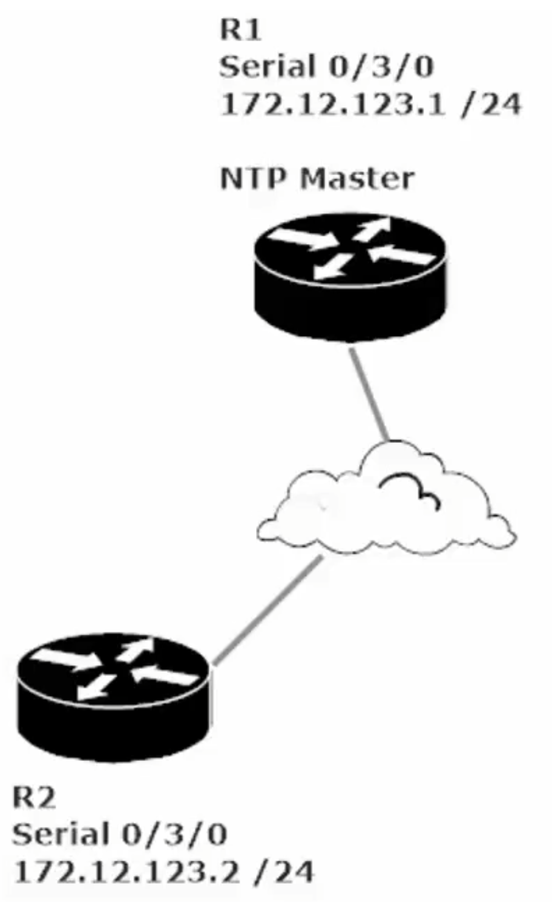
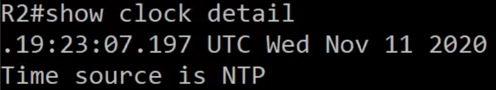
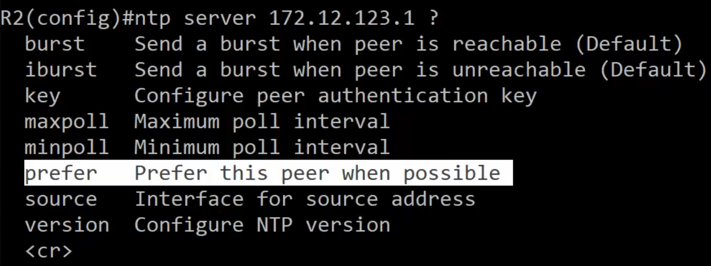
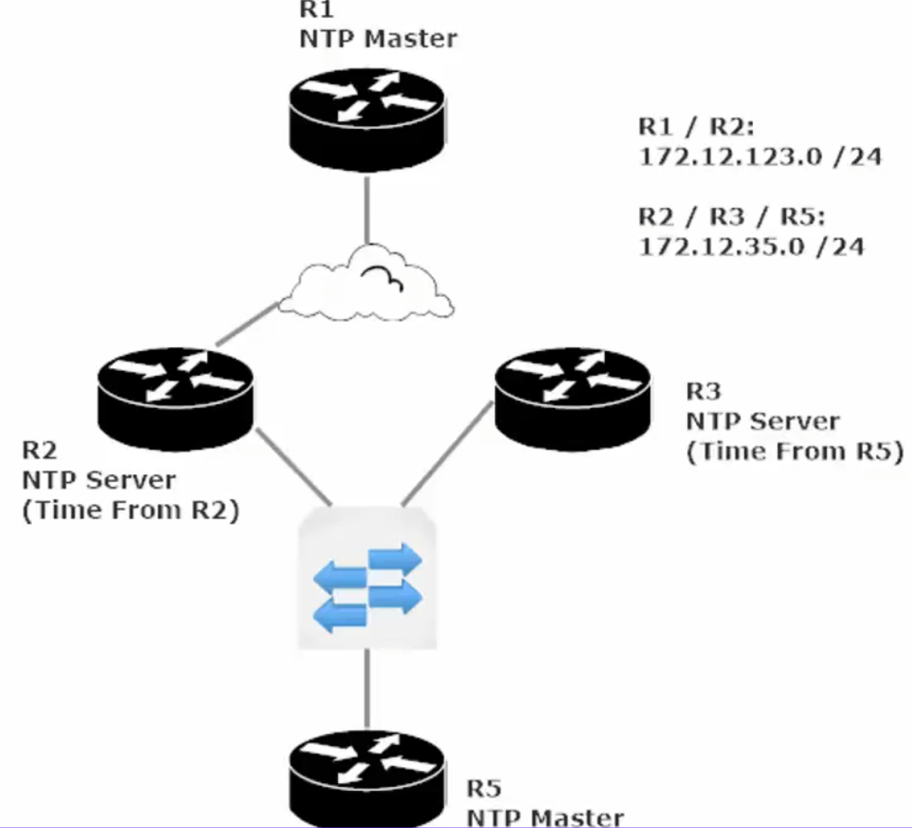

**IP Services**

**Network Time Protocol** (**NTP**) Theory

We need to get time from a trusted source

NTP allow us to specify time sources for our routers/switches, whether the time source is within the same network (another router or L3 switch) or from an external time source (such as time.windows.com or time.nist.gov)

At the very top of our NTP hierarchy are *stratum-0 devices*, typically atomic clocks. You can’t configure a Cisco router to get its time directly from a stratum-0 server.

The number in “*stratum-#”* in *non-stratum-0* *devices* indicates how many hops away the device is from the *stratum-0* *device*. Stratum-1 servers are generally referred to as *time servers*, which a Cisco device can gets its time from,

*time-servers* – are considered stratum-1 devices, indicating it is only 1 hop from a stratum-0 device (like an atomic clock). These are the lowest numbered stratum device a Cisco router or L3 switch can connect to.

It is strongly recommended that the Network’s “outside” router receives its time from a public NTP timeserver (such as time.windows.com, time.nist.gov. NTP runs on ‘UDP port 123’, so be sure that port is not blocked.

Cisco routers can serve as an NTP master, server or peer/client.

*NTP Master*: Router is only acting as a server

*NTP Server*: Router is only acting as a client, and potentially as a server.

*NTP Client/Peer*: Router establishes a client-based relationship.

<u>Example of Error caused by non-synched devices</u>

Time-based ACL: a type of ACL that permits or denies based on the ACL setting plus based on the given time.

Example of useful time-based ACL: Mon-Thurs 9am-5pm permit hosts to telnet into the Router/Switch.

In the above example the two routers have non-synced clocks. R1 thinks it is a Tues and R2 thinks it is a Fri,

And since Telnet is not allowed on Friday based on the time-based ACL the telnet session is not allowed.

Potential issues with non-synced tine:

- Secure certificate date issues

- Time-based ACLs won’t work

- Timestamps not synced

It is vital for routers/switches to have a central time source that allows network devices to synch their clocks.

- allows our syslog timestamps to have accurate/synched time throughout the network

(makes troubleshooting less frustrating)

- Synched time is critical for digital certificate operation.

**NTP Lab**

Frame-Relay between R1 (NTP Master) and R2 (NTP Peer)

R1 Se0/0/0: 172.12.123.1/24 R2 Se0/0/0: 172.12.123.2/24

To enable NTP master on R1 enter CMD: **R1(config)#ntp master**

Be sure to set the clock from priv mode (enable mode) with R1#clock set 14:10:00 7 November 2021

Which would set the date and time to 4:10 pm and 00 seconds on Nov 7, 2021

Also set your timezone (remember DST or Standard Time in your UTC Offset)

R1(config)#clock timezone WORD \<-23 to 23 for UTC hour offset\> \<0-59 for UTC minute offset\>

R1(config)#clock timezone PST -8 0 (for Pacific Standard Time)

**R1#show ntp association**

address ref clock st when poll reach delay offset disp

\*~127.127.1.1 .LOCL. 7 42 64 377 0.00 0.00

Note the address of 127.127.1.1 (a loopback address) and the ref clock of .LOCL., these indicate a the clock is set locally.

Note: ‘st’ value of 7 indicates that the device has a *stratum-7* where as the show ntp status address shows a stratum of 8. This indicates that it is one hop away from the ntp source even though the source is local to the router.

Cisco’s default Stratum for an NTP device is 8.

**R1#show ntp status**

Clock is synchronized, stratum 8, reference is 127.127.1.1

nominal freq is 250.0000 Hz, actual freq is 249.9990 Hz, precision is 2\*\*24

reference time is E505A778.00000331 (16:16:56.817 UTC Sun Nov 7 2021)

clock offset is 0.00 msec, root delay is 0.00 msec

root dispersion is 0.00 msec, peer dispersion is 0.48 msec.

loopfilter state is 'CTRL' (Normal Controlled Loop), drift is - 0.000001193 s/s system poll interval is 6, last update was 62 sec ago.

If you run \#show ntp status and get a result of “Clock is unsynchronized, stratum 16” that could be because NTP has not yet managed to synchronize. NTP synchronization can take quite a while in a production network and even in a two-router lab can take longer than expected. (i.e. not instantaneous).

Note: \#show NTP association command under address look for an \* and a ~ next to the loopback address.

Address \*~127.127.1.1 means synchronized

Note the . before 19:53:07:197 That time is still accurate, but the period “.” Indicates that the time is not synched

Set the NTP Server on R2 so R2 can collect the time and date set on R1

R1(config)#ntp server \<A.B.C.D – ip address of peer (aka NTP Master)\> \<key\> (Configure peer auth key)

Note: Instructor’s router had more options for *ntp server \<A.B.C.D\>* command

*prefer* option – provides a first choice to be set should there be multiple NTP peers. He also suggests setting backup NTP peers, as NTP is essential to many routing features/configs

**NTP Lab 2**

NTP Master on Two Routers and Two subnets
