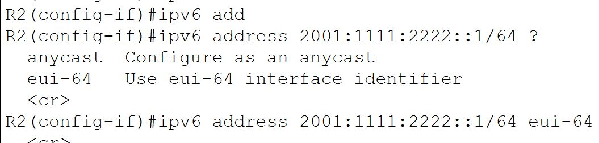
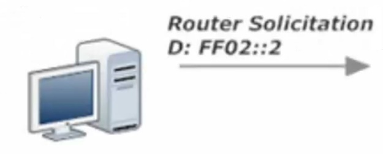
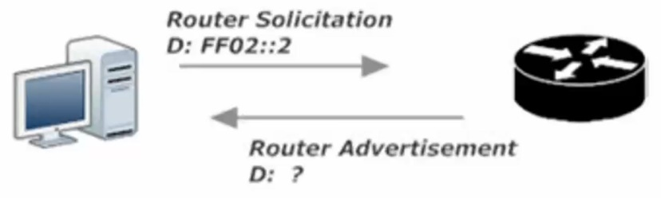
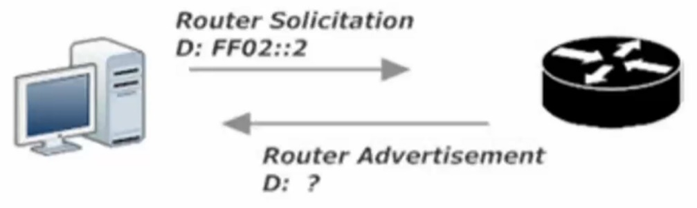
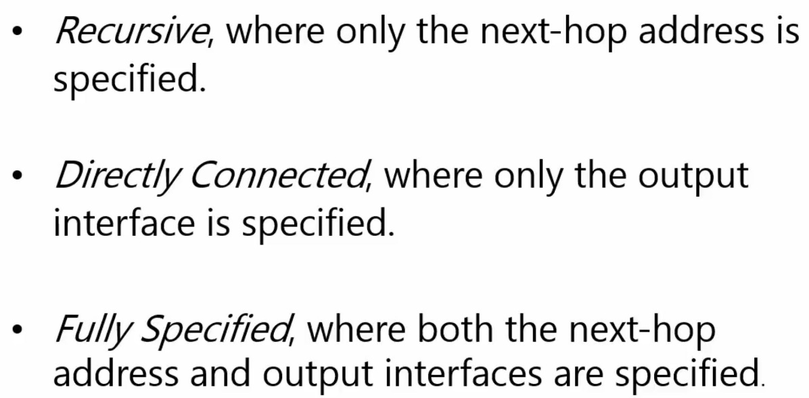
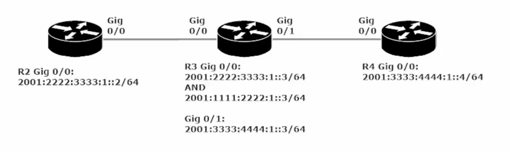
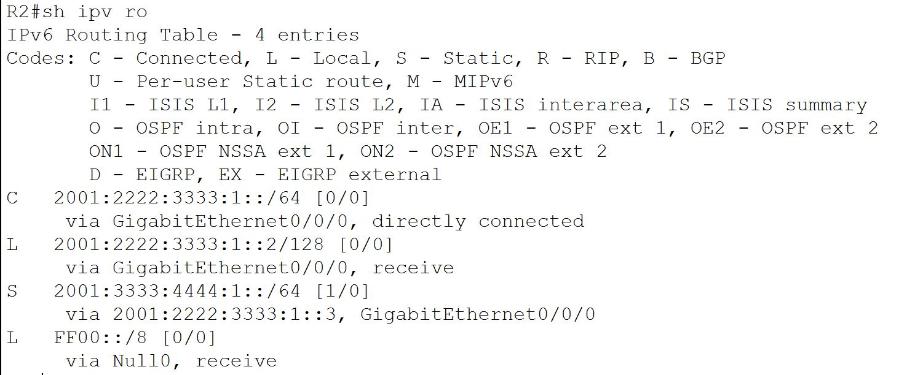

The global routing prefix from out ISP comes with a prefix length

The /48 prefix length is so common that prefixes tith length are often referred to as “forty-eights”.

Example using the /48 prefix assuming a global routing prefix of 2001:1111:2222

The prefix length is IPv6 is very similar to the network mask in IPv4

IPv6 address is 128 bits long

Prefix length is set at 48 bits

Leaving 80 for subnetting? NO because of the interface identifier which is almost always 64 bits

Interface Identifier is found at the end of an IPv6 address. The combo of a 64-bit II and a 48-bit prefix leaves 16 bits for subnetting

Global routing prefix (48 bits) + Subnet ID (16 bits) + Interface ID (64 bits) = Complete IPv6 address (128 bits)

The subnet ID portion has 2 ^16 number of available subnets or 65535 subnets in hexa-decimal FFFF

The subnet portion of the address is one (1) of the eight blocks (each consisting of 16 bits)

Similar to IPv4’s 4 blocks (each consisting of 8 bits)

Since each block of an IPv6 address is 16 bits it is written in hexadecimal. 0000 to FFFF

The 128 bits of an IPv6 address are represented in 8 blocks of 16 bits each. Each group is written as four hexadecimal digits (sometimes called <u>hextets[\[36\]](https://en.wikipedia.org/wiki/IPv6#cite_note-Graziani2012-36)[\[37\]](https://en.wikipedia.org/wiki/IPv6#cite_note-Coffeen2014-37)</u> or more formally <u>hexadectets[\[38\]](https://en.wikipedia.org/wiki/IPv6#cite_note-Horley2013-38)</u> and informally a quibble or quad-nibble[<u>\[38\]</u>](https://en.wikipedia.org/wiki/IPv6#cite_note-Horley2013-38)) and the groups are separated by colons (:). An example of this representation is *2001:0db8:0000:0000:0000:ff00:0042:8329*.

For convenience and clarity, the representation of an IPv6 address may be shortened with the following rules.

- One or more [<u>leading zeros</u>](https://en.wikipedia.org/wiki/Leading_zero) from any group of hexadecimal digits are removed, which is usually done to all of the leading zeros. For example, the group *0042* is converted to *42*.

- Consecutive sections of zeros are replaced with two colons (::). This may only be used once in an address, as multiple use would render the address indeterminate. [<u>RFC</u>](https://en.wikipedia.org/wiki/RFC_(identifier)) [<u>5952</u>](https://datatracker.ietf.org/doc/html/rfc5952) requires that a double colon not be used to denote an omitted single section of zeros.[<u>\[39\]</u>](https://en.wikipedia.org/wiki/IPv6#cite_note-rfc5952sec422-39)

An example of application of these rules:

> Initial address: *2001:0db8:0000:0000:0000:ff00:0042:8329*.
>
> After removing all leading zeros in each group: *2001:db8:0:0:0:ff00:42:8329*.
>
> After omitting consecutive sections of zeros: *2001:db8::ff00:42:8329*.
>
> The loopback address *0000:0000:0000:0000:0000:0000:0000:0001* is defined in [<u>RFC</u>](https://en.wikipedia.org/wiki/RFC_(identifier)) [<u>5156</u>](https://datatracker.ietf.org/doc/html/rfc5156) and is abbreviated to *::1* by using both rules.
>
> As an IPv6 address may have more than one representation

Determining Subnet IDs

Example GRP (Global Routing Prefix) is 2001:1111:2222

Thus the next block belongs to the subnet portion of the address

2001:1111:2222:0001:: /64

2001:1111:2222:0002:: /64

2001:1111:2222:0003:: /64

2001:1111:2222:000F:: /64 this is subnet 15

2001:1111:2222:FFFF:: /64 for 65,535 subnets

64 (remember there is no space between the last digit in the address and the / in the /64 mask when using IOS)

/64 mask cover the 48 bits GRP and 16 bits for the Subnets

Using IPv6 in Cisco IOS

Step 1: enable IPv6 routing manually with CMD: R1(config)#ipv6 unicast-routing

Before you can use IPv6 routing you will need an interface in UP and UP state (phys/logic) with an assigned ipv6 address.

Assuming an IPv4 address is set for an interface (say Router 1 aka R1’s gig 0/0 interface

R1(config)#int gig0/0

R1(config-if)#ipv6 address 2001:1111:2222:1::1/64 make sure there is no space before /64

**  
**

**Link Local addresses**

Packets sent a link-local address never leave the local link. The router will not forward a packet destined for a local link address. They are unicast addresses, so the only device that will actually process it is the destination host.

Link-local addresses exist in IPv4, but rarely come into play

In IPv6, link-local addresses are so important that they’re assigned automatically to every IPv6-enabled interface. The router creates the LL add on its own in accordance with a few rules.

The address has been compressed according to some other simple rules, so let’s uncompress it and examine it an all its 128-bit glory.

FE80::66F6:9DFF:FE3E:A88

FE80:0000.0000:0000:66F6:9DFF:FE3E:0A88

FE80

**1111 1110 10**00 0000

The first part of this address comes from the ***link-local reserved address block***, FE80::/10. Which means the first ten (10) bits have to match FE80, and breaking that down into binary and noting the bits that must match means there are only 4 possible combos for the final two bits in the third block, 00 01 10 and 11.

**1111 1110 10**<u>00</u> 0000 FE8 (this is only address we can use acc to FRD 4291

**1111 1110 10**<u>01</u> 0000 FE9

**1111 1110 10**<u>10</u> 0000 FEA (A=10)

**1111 1110 10**<u>11</u> 0000 FEB (B=11)

RFC 4291 – the 54 bits after the in initial 10 bits of a link-local address should all be set to zero, and the only value that makes possible is FE80.

Therefore, all LLadd’s will begin with FE80:0:0:0 (written in leading zero format)

The second half of a LLadd is the 64-bit interface identifier. The most common way to get that value is to allow the router to create the identifier via EUI-63 rules (as set forth by IEEE).

<u>EUI-64 Rules</u>

The router takes the interface’s MAC address, chops it in half, sticks FFFE in the middle, and then performs bit inversion.

Example:

Interface MAC address: 11-22-33-aa-bb-cc

Chop in half and add FFFE: 11 22 33 FFFE AA BB CC

Put into correct grouping (4 hex values) 1122:33FF:FFAA:BBCC

Then invert the values

0001 0001 0010 0010 0011 0011 1111 1111 1010 1010 1011 1011 1100 1100

Bit Inversion - Convert the first two values into binary and invert the seventh bit

First two values are 11

<table>
<colgroup>
<col style="width: 100%" />
</colgroup>
<tbody>
<tr class="odd">
<td><blockquote>

8 4 2 1 8 4 2 1

1 (1st) 0 0 0 1

1 (2nd) 0 0 <strong>0</strong> 1

</blockquote></td>
</tr>
</tbody>
</table>

By inverting the seventh bit, we are left with 0001 0011 which converted to decimal is 13 (1 + 3) (1 is the value of the first four binary digits (0001) and 3 is the value of the second four binary digits (0011) combine them to make 13. Note these are two separate four-digit binary values, not a single octet. Thus we have 0-F not 0-255

1122:33FF:FFAA:BBCC Replace the first 2 char with the one we just arrived at (13) and we’re done

1322:33FF:FEAA:BBCC

IOS gave the gig0/0 interface on R2 an MAC of 64F6:9D3E:0A88

64F6:9DFF:FE3E:0A88

64

0110 0100 = 6 and 4

0110 0110 = 6 and 6

Thus with bit inversion (inverting the 7th binary digit of the first two values of the address), we arrive at

66F6:9DFF;FE3E:0A88

We then attach this number to the first half of the link-local address and arrive at the full 128 bit IPv6 address

FE80:0000:0000:0000:66F6:9DFF:FE3E:0A88

1 2 3 4 5 6 7 8 (8 groups of 16) (16 is divided into 4 hexadecimal values)

The address can then be compressed by zero and leading-zero, leaving us with the compressed link-local addres

FE80::66F6:9DFF:FE3E:A88

EUI-64 option

R2 gig 0/0 ipv6 address: 2001:1111:2222:1::2/64

Rather than statically assigning an ipv6 address to an interface, we can have the router assign the interface identifier as the host portion with the eui-64 option

Cmd: R2(config-if)#ipv6 address 2001:1111:2222:1::/64 eui-64

2001:1111:2222:0:2D0:BCFF:FE58:2C01 This is the resultant address for my R2 in Packet Tracer Lab

00d0.bc58.2c01 MAC Address

2001:1111:2222:0001 is the Network Portion (1st 64 bits of the address) (48 bit GRP + 16 bit Subnet)

02D0:BCFF:FE58:2C01 is the host portion (2nd half of full 128 bit ipv6 address – 64 bit host)

00d0.bc58.2c01

00D0:BCFF:FE58:2C01

**02D0:BCFF:FE58:2C01** which is the second half of the full ipv6 address 2001:1111:2222:0:**2D0:BCFF:FE58:2C01**

| R2#sh ipv6 int gig 0/0                                                         |
|--------------------------------------------------------------------------------|
| GigabitEthernet0/0 is up, line protocol is up                                  |
| IPv6 is enabled, link-local address is FE80::2D0:BCFF:FE58:2C01                |
| No Virtual link-local address(es):                                             |
| Global unicast address(es):                                                    |
| 2001:1111:2222:0:2D0:BCFF:FE58:2C01, subnet is 2001:1111:2222::/64 **\[EUI\]** |

**Multicast Groups**

In IPv4 – multicast addresses are Class D addresses with the first octet of 224 to 239.

With IPv6, the multicast range is much larger, but easier to remember. Any address that begins with 1111 (FF in hex) is a multicast address. The uncompressed full prefix is FF00::/8

Link local addresses in the FF00:: /8 range worth noting:

**FF02::1 – All Nodes** on the local link (All IPv6 Nodes)

**FF02::2 – All routers** on the local link (All IPv6 Routers)

FF02::5 – All OSPF Routers (DR,BDR, DRother)

FF02::6 – All OSPF Designated Routers (DR)

FF02::9 – All RIP Routers

FF02::A – All EIGP Routers

FF02::1 FFzz:zzzz/104 - Solicited-node addresses

Solicited-node addresses – These are used in Neighbor Solicitation messages, the z’s represent the rightmost 24 bits of the unicast address of the node.

**Neighbor Discovery Protocol**

NDP allows an IPv6 host to dynamically discover its neighbors, but the process of discovering neighboring routers is different than that of discovering other hosts

Router Discovery process begins with the host multicasting a *Router Solicitation (RS)* message on its local link. The destination is FF02::2, the ‘All IPv6-Routers address.

The router receiving the RS, responds with an RA (Router Advertisement)

Two destinations for an RA:

1)  If the querying host has an IPv6 address, that address would have been in the original RS, and the router will unicast its RA back to that same address.

2)  If the querying host does not *yet* have an IPv6 address, the source address of the RS will be all zeroes, and the router will then multicast the RA to FF02::1, the “All-IPv6-Nodes” address.

In addition to sending an RA when specifically requested to by an Router Solicitation (RS) message, IPv6 routers multicast an RA to FF02:1 every 200 seconds.

NDP is also used to discover other IPv6 Hosts. The NDP *RS and RA* messages replace ARP in IPv6

with *RS messages* serving as the rough equivalent of IPv4’s ARP Request.

Difference between IPv4 (ARP request) and IPv6 (NDP Router Solicitation messages)

An ARP request asks for the MAC address of the device at a given IPv4 address

A RS message is destined for the solicited-node multicast address range of the host whose MAC address is requested.

IPv4 -ARP – I have IP address need MAC address multicast to all nodes

IPv6 – I need MAC address for this IPv6 address sent to the SNMA (*Solicited-Node multicast address*) range

*Solicited-Node multicast address* range: A multicast using this range goes to some hosts on the local link, but not all hosts, just the ones that have the same last 6 hex values of the destination IPv6 address. Aka the rightmost 24 bits match.

The SNMA addresses are listed under the show ipv6 int xx cmd under the all nodes and all routers addresses

The top address (usually the third listed under joined group addresses) is for the Global Unicast addresses

The bottom address (usually fourth) is for the link-local address

To calculate the SNMA; follow two steps

1)  The SNMA always begins with FF02::1:FF (this is only 7 of the 8 groups) (the eighth group is derived from rule 2)

2)  Take the last six values (these are the uncompressed last six) of the global unicast address or the link-local address and tack them on to the end of FF02::1:FF

Host B answers Host A’s NS with an NA, containing Host B’s MAC address. Host A pops that address into its Neighbor Discovery Protocol neighbor table (the equivalent of IPv4’s ARP cache) and the RS/RA exchange is completed.

IPV6 static routes

Very much the same procedure as ipv4 static routing in that a dynamic routing protocol needs to be set for a router to communicate with another router more than 1 hop away or there needs to be a static route added to the routing table.

The Non- Regular static route types are DEFAULT and HOST

IPV6 Static Routes Lab

The first static route we will set is from R2 to R4 via R3 (gig0/0/0 2001:2222:3333:1::3)

R2(config)#ipv6 route 2001:3333:4444:1::4/64 2001:2222:3333:1::3

Note that we could also change the Administrative Distance of this static route by including a number \<1-254\> at the end of the command:

R2(config)#ipv6 route 2001:3333:4444:1::4/64 2001:2222:3333:1::3 \<1-254\>

The purpose of changing the AD; The AD of a Static route (1) is so low by default, that if it is exactly the same length of any route discovered by a protocol, the static route will always be used. There are times where we would prefer the dynamic routing protocol be used, rather than the static route, as is the case when setting a floating-static route (only comes into use if the route assigned by the dynamic routing protocol is not available.

At this point in our config: R2 can send packets to R4, but the pings will not get a response and we will see ….. result when we: R2#ping 2001:3333:4444:1::4 To resolve this we must set a static route on R4 back to R2.

R4(config)#ipv6 static route 2001:2222:3333:1::/64 gig 0/0/0

This time we used a directly connected static route by setting the outgoing interface as opposed to the next hop’s ipv6 address.

Note: Setting this directly connected route through R4’s gig0/0/0 interface worked for the instructor, but did not work in my lab environment (using ISR 4321 x3 and 1941 x3). The static routes to R4 and R2 had to be set via recursive static route with the next hop set to the ipv6 address of R3 g0/0/1.

R4(config)#ipv6 route 2001:2222:3333:1::/64 2001:3333:4444:1::3

To set a fully specified static route for R2 to R4 we select what subnet is being routed the exit interface and the next hop address

R2(config)#ipv6 route 2001:3333:4444:1::/64 gig 0/0/0 2001:2222:3333:1::3

R2#show ipv6 route

Notice that the one static route in this IPV6 routing table has both the exit interface and next hop listed below the routed subnet (2001:3333:4444:1::/64)

<u>Static Routing Lab 2 (video mentions slightly tricky)</u>

When creating a recursive static route, you can use the <u>next-hop link-local address</u> instead of the next-hop *global unicast address*

Recursive static route between R2 and R4 via R3’s link-local address (R3 is the next-hop)

1)  Copy R3’s link-local address. Link-local: FE80::250:FFF:FE91:CB01

2)  R2(config)#ipv6 route 2001:3333:4444:1::/64 gig 0/0/0 FE80::250:FFF:FE91:CB01

Note: this recursive static route operates much the same as fully specified route as you need to specify both the exit interface and the next-hop link-local address.

When using a link-local address as the next-hop, the local exit-interface must be specified.

<u>Static Default Route and Static Host Routes</u>

Setting a Default Static Route in IPv6

R2(config)#ipv6 route ::/0 \<exit interface\> or \<next-hop IPv6 Global Unicast Address\>

R2(config)#ipv6 route ::/0 gig 0/0/0

Or

R2(config)#ipv6 route ::/0 2001:2222:3333:1::3

Note: just as before setting the default route with just the exit interface did not yield the appropriate results (cannot ping R4’s ipv6 add) but setting the command with the next-hop address for R3 with the same subnet (note R3 gig0/0/0 has two ipv6 addresses set, only one is in the same subnet as R2) did work and we can ping R4 just fine.

Note: When setting a default route, you will not see an asterisk next to the S in the IPv6 Routing Table (as you would in IPv4, representing a candidate default), as there is no candidate default in IPv6.

Setting a Static Host Route in IPv6

In this example we will be setting a host route on R2 to R4’s gig 0/0/0 interface

R2(config)#ipv6 route 2001:3333:4444:1::4/128 \<exit interface\> or \<next-hop IPv6 Global Unicast Address\>

R2(config)#ipv6 route 2001:3333:4444:1::4/128 2001:2222:3333:1::3

Note: we use the /128 mask as we want this route to only match this one host and only this one host
