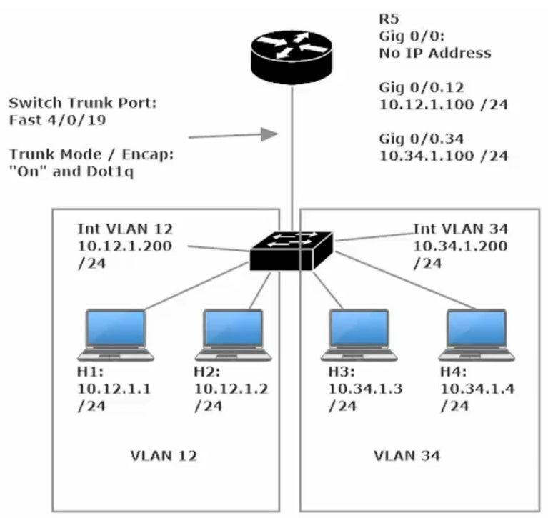
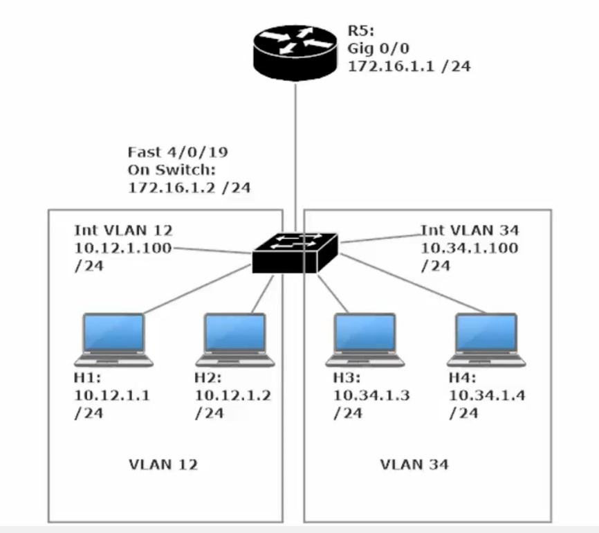
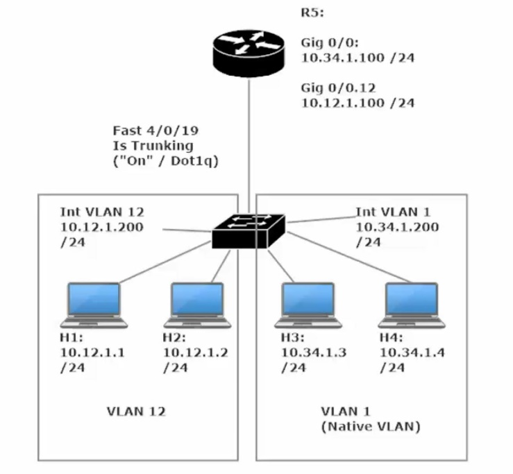

**Layer 3 Switching**

<u>Router on a Stick</u>

A router on a stick, also known as a one-armed router, is a router that has a single physical or logical connection to a network. It is a method of inter-VLAN routing where one router is connected to a switch via a single cable. The router has physical connections to the broadcast domains where one or more VLANs require the need for routing between them.

Router --🡪 switch -🡪 Multiple Hosts (Vlan 12 is Sw1 gig1/0/1 and 1/0/2 + Vlan 34 is Sw1 gig 1/0/3 and 1/0/4

R5 – be sure to set the encapsulation to dot1q \# on int g0/0/0.12 and int g0/0/0.34 before settings the sub-interface’s ip addresses and subnet mask

Switch Config

int range gig1/0/1 – 2 \#switchport mode access vlan 12

int range gig1/0/3 – 4 \#switchport mode access vlan 34

(Note: The switch will auto create the VLANs

Create SVI - Int VLAN 12 - \#ip address 10.12.1.200 255.255.255.0 (this is known as an SVI - Switch Virtual Interface)

Create SVI - Int VLAN 34 - \#ip address 10.34.1.200 255.255.255.0

Int g1/0/24 - \#switchport trunk encapsulation dot1q

\#switchport mode trunk

Host Config

FastEthernet1 for each Laptop

H1- 10.12.1.1 255.255.255.0

Global Settings – Gateway: 10.12.1.100

H2- 10.12.1.2 255.255.255.0

Global Settings – Gateway: 10.12.1.100

H3- 10.34.1.3 255.255.255.0

Global Settings – Gateway: 10.34.1.100

H4- 10.34.1.4 255.255.255.0

Global Settings – Gateway: 10.34.1.100

Verify Inter-Vlan Pinging between Host 1 and Host 3 and 4 and to Sw1 VLan 12 + 34 IP addresses + R1 gig0/0/0.12 + .34 ip addresses (ie the default gateway addresses)

Running SVI on a Layer 3 Switch (No router)

Set the SVI address for VLAN 12 and VLAN 34 (per our 4 host setup above) (this is the same type of router-on-a-stick setup sans a router… Sw1 -🡪 H1 – H4)

The main item to make note of is to enable IP routing at the global config standpoint

Check your work by running CMD: Sw1#show ip route

If you don’t get a routing table, you either have not setup IP addresses for the SVIs or did not yet enable IP routing or you need to run an SDM prefer command and reload the switch (certain switches only)

<u>Layer 3 Switching: Routed Ports (aka “no switchport” command)</u>

Even after running the IP routing cmd, each switchport is still in access mode

Changing the switchports into a routed port may be important if you aim to route through that port and assign an ip address to said port. To set an interface on a switch as a routed port type this CMD: Sw1(config-if)#no switchport

This is the same topology as before, except now R5 has no sub interfaces.

R5 gig0/0 is set with an ip add of 172.16.1.1/24 and

Sw1 gig1/0/24 is set with ip add 172.16.1.2/24 (note: my interface numbers differ as I am using different hardware)

As this topology is configured, the hosts can ping eachother (inter-vlan routing) and can ping Sw1’s G1/0/24 ip add (172.16.1.2) but cannot reach R5. To make router 5 reachable we will need to configure OSPF on the Router and the Switch (OSPF 1 Area 0)

R5(config)#router ospf 1

R5(config-router)#network 172.16.1.0 0.0.0.255 area 0

R5(config)#int g0/0/0

R5(config-if)#ip ospf 1 area 0

Sw1(config)#int g1/0/24

Sw1(config-if)#ip ospf 1 area 0

Sw1(config)#int Vlan 12

Sw1(config-if)#ip ospf 1 area 0

Sw1(config)#int Vlan 34

Sw1(config-if)#ip ospf 1 area 0

Alternate method of setting OSPF for the topology above

Sw1(config)#router ospf 1

Sw1(config-router)#network 172.16.1.0 0.0.0.255 area 0

Sw1(config-router)#network 10.12.1.0 0.0.0.255 area 0

Sw1(config-router)#network 10.34.1.0 0.0.0.255 area 0

R5(config)#router ospf 1

R5(config-router)#network 172.16.1.0 0.0.0.255 area 0

Using the network command rather than the interface command makes this process much quicker.

Note that Sw1 lists the three networks it is directly connected to

Whereas, R5 only list 172.16.1.0 /24 as this is the only network that it has local interfaces on

<u>Layer 3 EtherChannel’s</u>

To set an EtherChannel in Layer 3 is much the same as in Layer 2, however you must first set your interfaces to routing mode (aka “no switchport” command)

Simple EtherChannel Topology - Sw2 with first four interfaces connected directly to Sw3, all 4 interfaces are added to port-channel 1

Switch 2 CMD instructions

Sw2(config)#iint range fa1/0/1 - 4

Sw2(config-if-range)#no switchport

Sw2(config-if-range)#channel-group 1 mode on

Switch 3 CMD instructions

Sw3(config)#iint range fa1/0/1 - 4

Sw3(config-if-range)#no switchport

Sw3(config-if-range)#channel-group 1 mode on

Then set an IP for both Ether-Channels on Sw2 and Sw3

Sw2(config)#int port-channel 1

Sw2(config-if)#ip address A.B.C.D subnet mask

Sw3(config)#int port-channel 1

Sw3(config-if)#ip address A.B.C.D subnet mask

Verify the two port channel ip addresses can ping each other and you’re done

**<u>Router-on-a-Stick and the Native VLAN</u>**

This is very much the same ROAS topology as we had before except VLAN 34 is now configured with the Native VLAN (vlan 1).

Because we are using the native vlan, R5 g0/0/0’s physical interface can be assigned an ip address directly, rather than creating extra sub-interfaces.

Note the physical interfaces will automatically assign interfaces (physical) to the Native VLAN (vlan 1) by default.

**<u>Sw1 Config</u>**

Sw1(config)#int range g1/0/1 – 2

Sw1(config-if-range)#switchport access vlan 12

Sw1(config)#int range g1/0/3 – 4

Sw1(config-if-range)#switchport access vlan 1

Sw1(config)#int g1/0/24

Sw1(config-if)#switchport (this needs to be done only if the port were set as a routed port)

Sw1(config-if)#switchport trunk encapsulation dot1q

Sw1(config-if)#switchport mode trunk

Sw1(config)#int vlan 1

Sw1(config-if)#ip address 10.34.1.200 255.255.255.0

Sw1(config-if)#no shut

Sw1(config)#int vlan 12

Sw1(config-if)#ip address 10.12.1.200 255.255.255.0

Sw1(config-if)#no shut

**<u>R5 Config</u>**

R5(config)#int g0/0/0

R5(config-if)#ip address 10.34.1.100 255.255.255.0

R5(config-if)#no shut

R5(config)#int g0/0/0.12

R5(config-if)#encapsulation dot1q 12

R5(config-f)#ip address 10.12.1.100 255.255.255.0

R5(config-if)#no shut

Note there is no option to configure encapsulation when configuring R5’s physical interface g0/0/0.

The instructor’s router showed “Encapsulation DotlQ Virtual LAN, Vlan ID 1.” when he typed a *show int g0/0/0*

Whereas my router show “Encapsulation ARPA”, however my topology operated in exactly the same way as his.

Check that pings get through via inter-vlan routimg, check *show run* and on Sw1, check *show int trunk*

**<u>R5 Config (altenate method)</u>**

R5(config)#int g0/0/0.34

R5(config-if)#encapsulation dot1q **1 native**

R5(config-if)#ip address 10.34.1.100 255.255.255.0

R5(config-if)#no shut

R5(config)#int g0/0/0.12

R5(config-if)#encapsulation dot1q 12

R5(config-f)#ip address 10.12.1.100 255.255.255.0

R5(config-if)#no shut

Note this config w
