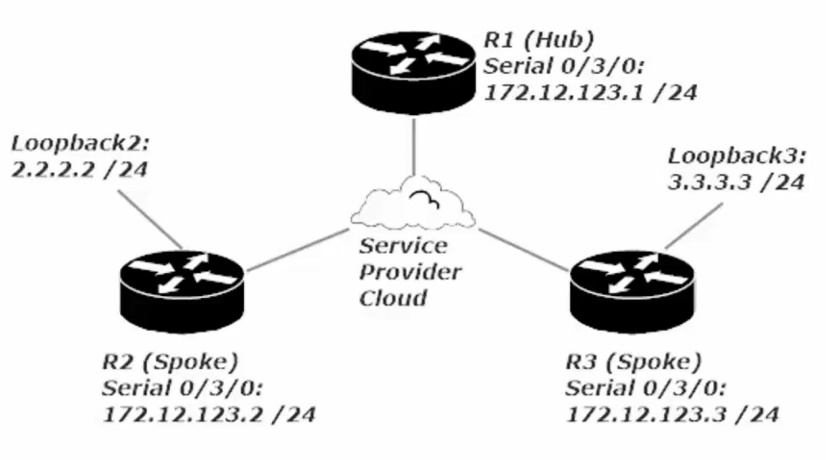
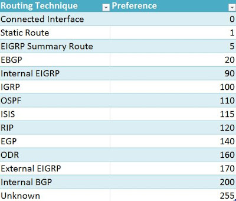

Loopback interfaces are virtual/logical interfaces

Don’t use the 127.0.0.0/8 network on a Cisco Router. This is reserved for Host Loopbacks

Rip 1 and RIP 2

AD (administrative distance is 120 for RIP 110 for OSPF)

For example

R1#show ip route

2.2.2.0/24

2.2.2.2/32 (120/1) The 120 represents the AD for a RIP route and 1 represents the hop count.

RIP’s use of hop counts make it a poor protocol for routing as it only shows how many connected routers it must go through before reaching the router with said subnetter Locally conneeted. RIPv1+2 don’t take the speed of a network link into account, just how many “hops” away the route is

