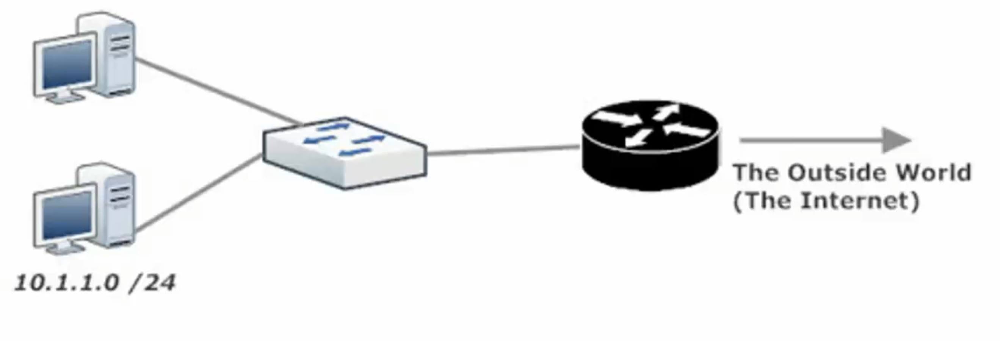
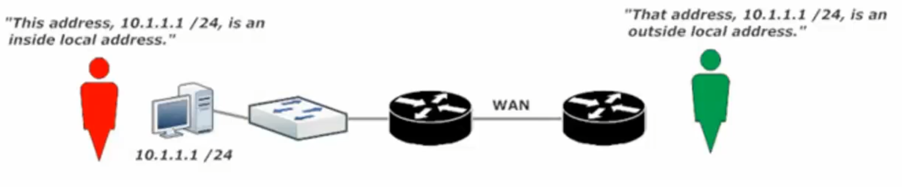
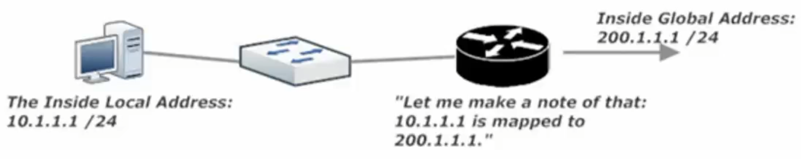
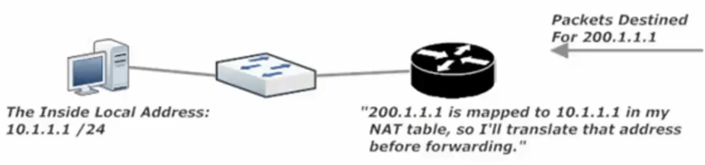
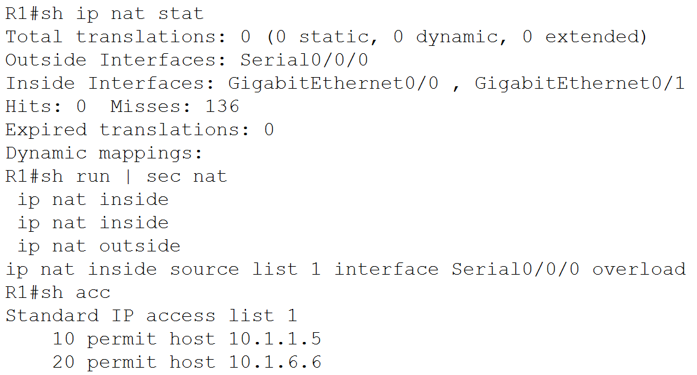

**Network Address Translation** (NAT) takes a host’s private, non-routable IP address and translates it to a public, routable address. Without NAT, a host (on the private and reserved network) cannot communicate with the outside world, since its IP address is non-routable.

**RFC1918**

- 10.0.0.0 /8

- 172.16.0.0 /12

- 192.168.0.0 /16

- *Inside Local Address* – the addresses inside your network (behind the router) that are to be converted to an address outside the private address space

- *Inside Global Address* – the term for the inside local address once it has been translated by NAT to be routable globally (ie outside of your network are/or across the internet)

- *Local Router* – this is the router where the inside local address is translated to an inside global address

- *Outside Local Addresses* are the non-routable addresses of hosts on the remote network

- *Outside Global address* are the routable addresses to hosts on a remote network

Note the terms *inside* and *outside* (*local addresses*) depend on your perspective of where you are physically in the network

- *Inside Address* - is in use on your network (global or local)

- *Outside Address* – is in use by the other involved network

When a router performs NAT, that *local router* makes an entry in its *NAT translation table*, mapping the *inside local address* to the assigned *inside global address*.

NAT Translation Outbound

NAT Translation Inbound

*Static NAT (SNAT)*

If only a limited number of hosts need NAT, static NAT may be the preferable method. SNAT is a one-to-one mapping of *inside local* to *inside global addresses*.

This is inefficient as often times there are only so many globally routable addresses to give out

*Dynamic NAT* (DNAT)

Uses a pool of globally routable addresses and assigns them to hosts with *inside local addresses* as needed

**Static NAT LAB**

Before creating the mappings, it is strongly recommended that you configure the required *ip nat inside* (command) and *ip nat outside* (command) commands on the appropriate interfaces. You don’t want to spend time troubleshooting NAT mappings, only to realize you forgot these vital interface-level commands.

*ip nat inside* (cmd)

*ip nat outside* (cmd)

NAT Lab – Dynamic (DNAT) LAB

Steps to successful Dynamic NAT

1.  “ip nat inside” \| “ip nat outside”

2.  Create Pool ‘ip nat inside source list 1 pool CCNA’

3.  Write ACL ‘access-list 1 permit host 10.1.1.5’

4.  Write the ip nat inside source command ‘ip nat inside source list 1 pool CCNA’

5.  Verify with sh ip nat translation R3#show ip nat tr

ip nat pool CCNA 200.1.1.1 200.1.1.5 netmask 255.255.255.0

ip nat inside source list 1 pool CCNA

access-list 1 permit host 10.1.1.5

access-list 1 permit host 10.1.1.1

**  
**

**Port Address Translation (PAT)**

Below: The diagram for this Lab’s Network Topology

PAT uses the ip address that is already in use by our Outside interface

PAT Lab

Steps to successful PAT

1.  “ip nat inside” \| “ip nat outside” Note Se0/0/0 is Outside and G0/0 + G0/1 are both Inside

2.  Write ACL R3(config)#access-list 1 permit 10.1.1.5 + access-list 1 permit 10.1.6.6

3.  Write IP nat source command R3(config)# ip nat inside source list 1 int s0/0/0 overload

Note: Overload at the end of this IP nat inside source command makes this a PAT instruction

4.  Verify with sh ip nat translation R3#show ip nat tr

Step 4: sh ip nat stat

