Network Architecture

Fundamental Network Topologies

Star Topology (can look like a cross or plus sign) – has a central device that connects to multiple devices in the topology. Those multiple devices do not connect to each other.

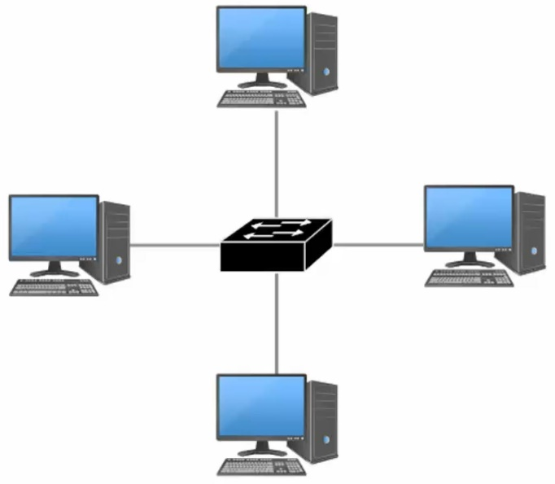

Full mesh Topology – every device has a connection to every device

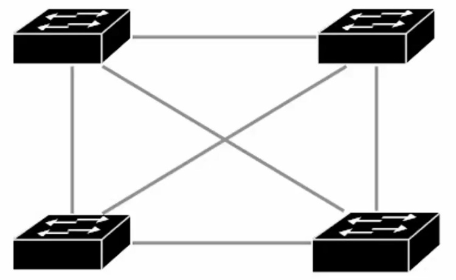

Partial Mesh – may look like a full mesh, not every device is connected to every other device.

Hybrid Topology: a combination of any of the other topologies (Star, Full Mesh, Partial Mesh)

SoHo: Small Office / Home Office

A term used to distinguish small businesses from mid-sized and large businesses. (Usually less than 10 employees and no IT department or even single IT person. Not strictly a networking term.

Small office usually has 2-50 employees. Home office usually has 2-5 employees

Usual SoHO Network: Modem \>\>\> Router (usually with Wireless AP \>\>\>\> Switch (x1 only) \>\>\> hosts

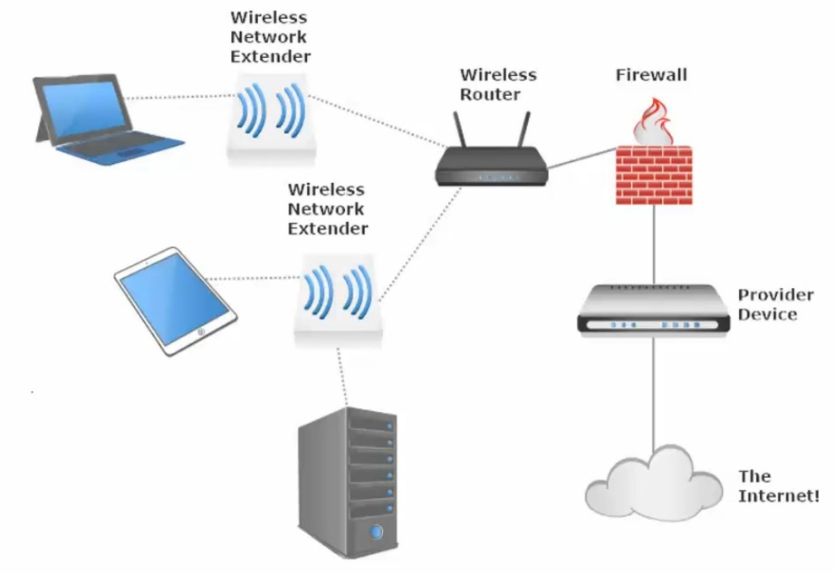 Note: Usually no enterprise level gear

**<u>  
</u>**

**<u>LAN Designs</u>**

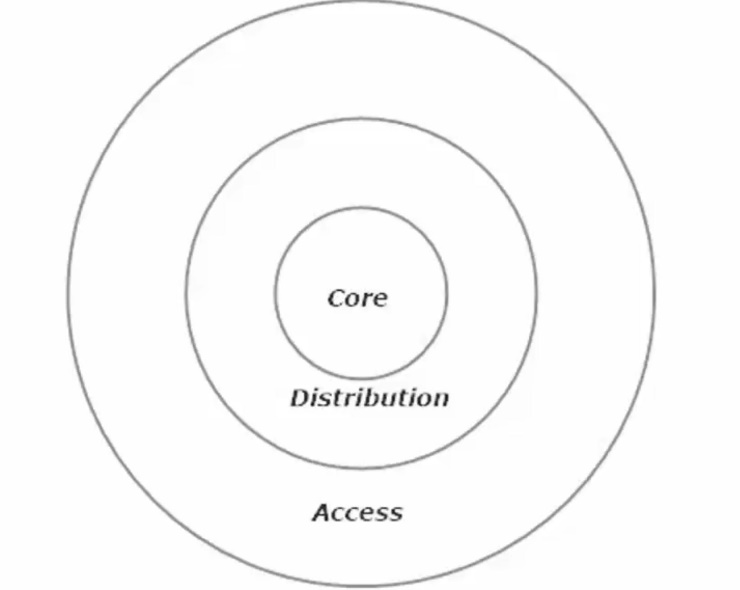

Left: Cisco Three Layer Switching Model

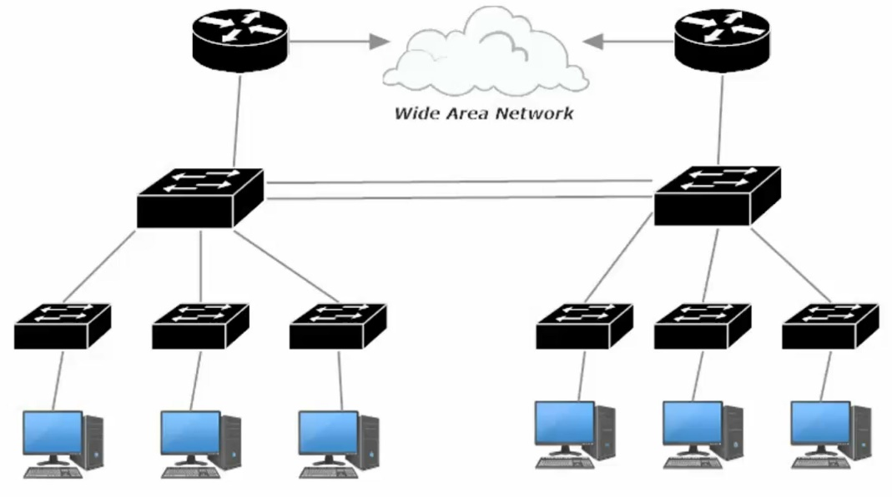

Left: Two-Tiered Campus LAN

(Collapsed Core)

Distribution Layer switches allow the access Layer switches to talk to each other.

Access are where the end users connect to the network

Collapsed Core has the core layer “collapsed” into the Distribution Layer

The Three-Tier Campus LAN Approach (Non-Collapsed Core)

Core switches are connected to Distribution switches.

Distribution switches are connected to Access switches

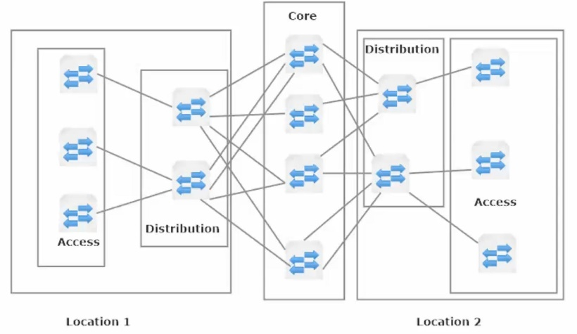

Example of a Three Tiered Campus LAN with 2 locations. The Core to Distribution links are in a semi-mesh topology.

WAN Designs

Metro Ethernet: Metro Ethernet is an Ethernet transport network that provides point-to-point or multipoint connectivity services over a metropolitan area network (MAN). Ethernet originated as a LAN technology and became a replacement for low-speed WAN technologies.

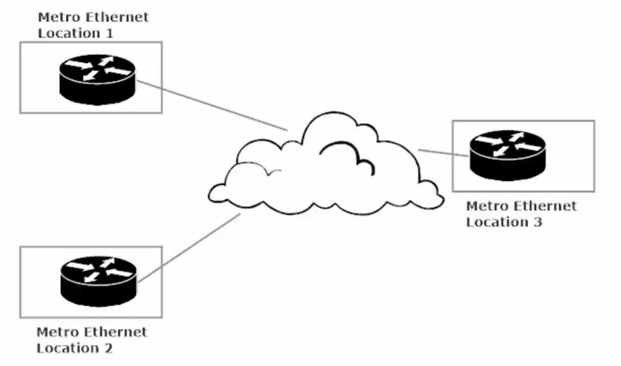

3 types of Metro Ethernet Services

1.  Ethernet Line Service (E-Line): point-to-point

- Ethernet Virtual Circuit

- Can have multiple P2P links

2.  Ethernet LAN Service (E-LAN): Full Mesh

- 

3.  Ethernet Tree Service (E-Tree): Hub-and-spoke

- 

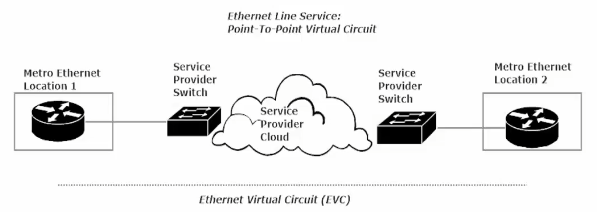

Ethernet Virtual Circuit: Goes straight through from ME Location 1 to ME Location 2

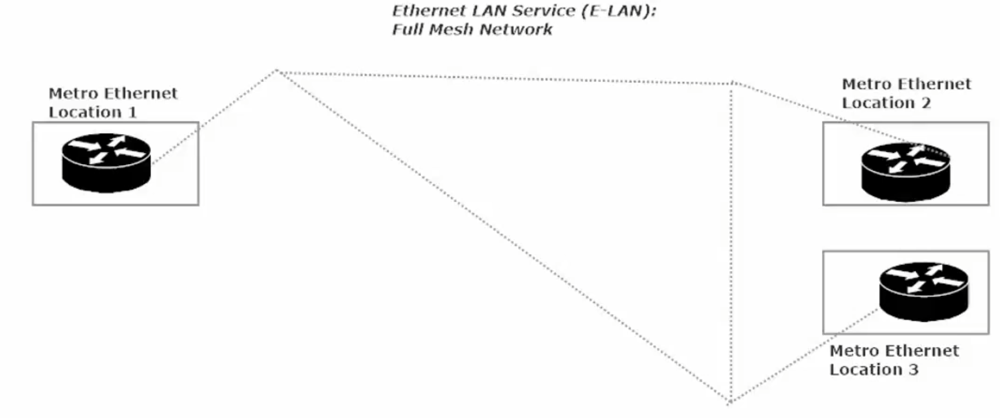 Example of E-LAN

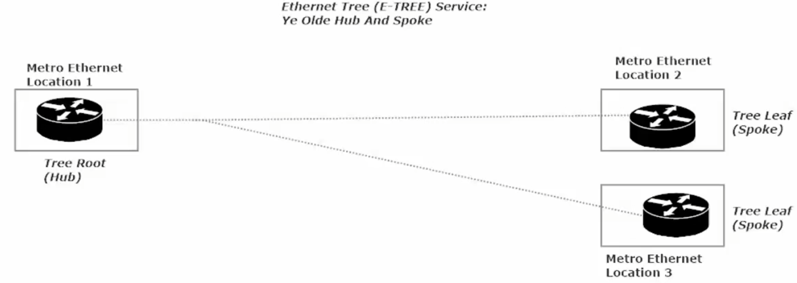 Use a Tree and Leaf setup

Aka Hub-and-spoke

MPLS & MPLS VPN

*Packet Routing*: to route a packet the router looks in its IP routing table, looking for the longest match. Once found, the next-hop address for that packet is determined and the packet is routed to that next-hop router. The process continues at the next router and subsequent routers, until the packet reaches its final destination. Requires an IP lookup at each hop.

*Multi-Protocol Label Switching* (MPLS): eliminates the per-device IP lookup by determining the full path to the final destination at the very first router that receives the packet. A label is applied to that packet indicating how successive devices should handle the packet.

The label is read at each successive hop by the service provider devices, but the only IP routing table lookup that has to be performed is carried out by the Provider Edge (PE) closest to the destination.

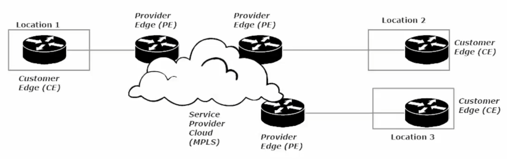

CE = Customer Edge PE = Provider Edge P = Provider router not on the edge of the cloud

CE router (location 1) connects with a PE router (at the edge of the cloud), which connects to other Provider routers to cross the MPLS network operated by the provider.

Ending with a PE router than connects to a CE router in another location (2 or 3).

The PE closest to the source will do an IP lookup (determing the full path to the final destination) and then applies a label indicating how each successive provider router will handle the packet.

The Provider Edge (PE) closest to the destination will remove the MPLS label and then do an IP lookup to forward traffic to the destination CE

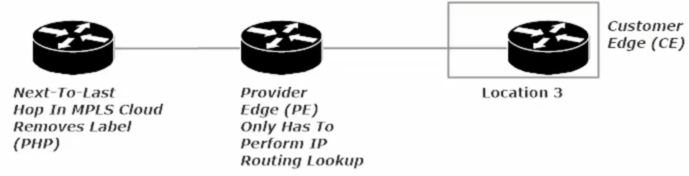

On occasion we will prefer for the next-to-last hop in the MPLS Cloud removes the label, so the PE router closest to our destination CE routers only has to perform an IP routing table lookup.

This referred to as *Penultimate Hop Popping.*

MPLS is very QoS friendly, as seen in the diagram below

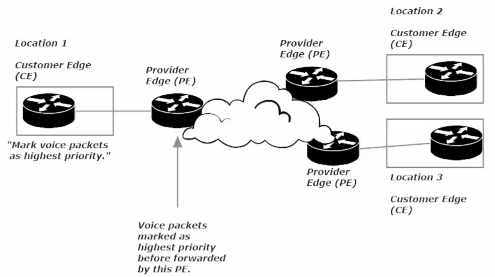

*Layer 3 MPLS VPN*: Layer 3 VPN (Virtual Private Routed Network)

- CE forms routing protocol relationship with PE

- CE does NOT form routing protocol relationship with other CEs

- Multiprotocol BGP (MP-BGP) runs between the routers in the MPLS cloud

- Provider and Provider Edge routers perform *route redistribution* so they know where all client networks are

Cloud Computing: An introduction

*Cloud computing*: a model for enabling ubiquitous, convenient, on-demand network access to a shared pool of configurable computing resources (e.g., networks, servers, storage, applications, and services) that can be rapidly provisioned and released with management effort or service provider interaction. This cloud model is composed of five essential characteristics, three service models, and four deployment models.

5 Essential Characteristics of Cloud Computing

1.  *On-Demand Self-Service*: The customer can access their resources when desired, from wherever and whenever: adjusting values (such as data storage capacity, compute power, allocate more RAM) at will.

2.  *Broad Network Access*: Customer should be able to access the service from multiple locations, over different network types, and via different devices.

3.  *Resource Pooling*: the provider’s computing resources are pooled to serve multiple consumers using a multi-tenant model, with different physical and virtual resources dynamically assigned and reassigned according to customer demand.

4.  *Rapid Elasticity*: resources and capabilities can be added and subtracted form rapid scaling (or downsizing) by the customer. When it comes to adding capabilities there is no limit from the customer’s point of view.

5.  *Measured Service*: The customer’s usage of available network services is metered.

3 Service Models

1.  Infrastructure-as-a-service (IaaS): The capability provided to the consumer is to provision processing, storage, networks, and other fundamental computing resources where the consumer is able to deploy and run arbitrary software, which can include operating systems and applications. The consumer does not manage or control the underlying cloud infrastructure but has control over OSes, storage, and deployed application, and limited networking components. Any potential lack of accountability is addressed by a Service Level Agreement, where the provider guarantees a percentage of uptime and level of service, and specifies to the End-User their limitations and allowed actions.

IaaS provides quick recovery from disaster (ransomware attack) (DDoS) (On-site fire or water damage)

2.  Software as a Service: The capability provided to the consumer is to use the provider’s applications running on a cloud infrastructure. The applications are accessible from various client devices. The consumer does not manage or control the underlying cloud infrastructure including network, servers, OS, storage… with the possible exception of limited user-specific application config settings. Similar to IaaS, except you pay for software instead of Hardware. Subscription based model is often the case, such as Office 365 or google for business.

3.  Platform as a Service (PaaS): customer is able to use the provider’s applications on a cloud infrastructure. The applications are accessible from various client devices. The customer does not manage or control the underlying cloud infrastructure, but has control over the deployed Apps.

Deployment Models

- Private cloud – “on premise”, single organization in control

- Community cloud – available to a particular group of consumers

- Public Cloud: called just “cloud”, Open to the public via the web

- Hybrid Cloud: a combo of two or three of the above

Controller-Based Networking and Software Defined Networking (SDN)

<u>3 Logical planes within a router/switch</u>

Data Plane: called the *forwarding plane* or *user plane*, defines the part of the router architecture that decides what to with packets arriving on an inbound interface.

- Most commonly, it refers to a table in which the router looks up the destination address of the incoming packet and retrieves the information necessary to determine the path from the receiving element, through the internal forwarding fabric, and to the proper outgoing interface.

- Includes the activities at Layers 2 and 3.

- Involves data being received processed or forwarded

- IP routing and MAC address table lookups

- Includes *denying* forwarding at L3 (ACLs) and L2 (port security)

Control Plane: Controls what the Data Plane can do by supplying the IP routing table entries and MAC table entries the Data Plane needs. Control plane has to do its job for the data plane to do its job. Anything that has to do with gathering information the Data Plane needs runs at the Control Plane. That includes our routing protocols, the process of populating the MAC address table, and even the Spanning-Tree Protocol.

Control Plane is said to run on top of the data plane. Controls OSPF adjacencies

Management Plane: Allows an end user/admin to manage the router’s configuration.

SSH (TCP 22) and Telnet (TCP 23) operate at the Management plane.

Management Plane is on top of the control plane.

Distributed Architecture with distributed control plane. Typical of routers and switches that operate with all three planes on a single device.

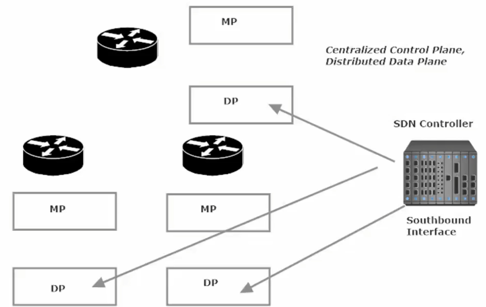

With an SDN Controller we’re able to separate the control plane for the individual routers and manage the control plane of multiple routers from one central location… The SDN controller.

Software Defined Networking is the same as Controller Based Networking

SBI NBI and SCI

Southbound Interface (SBI): a software-based interface that allows the data plane and the SDN Controller to interact.

Southbound Interface is the interface of the SDN controller that communicates with our data planes

We have a centralized control plane, rather than individual control plane on each router, and a distributed data plane (distributed across the multiple routers)

Application Protocol Interface (API) : A gateway that allows one application to communicate with another.

The intermediary between the SDN controller software and the individual routers software

Benefit of SDN: the SDN controller serves as a motherlode of information about our network’s topology, physical capabilities, and the configuration of each device.

Northbound Interface (NBI): Accesses the information about the network topology, physical capabilities and

the configuration of each device.

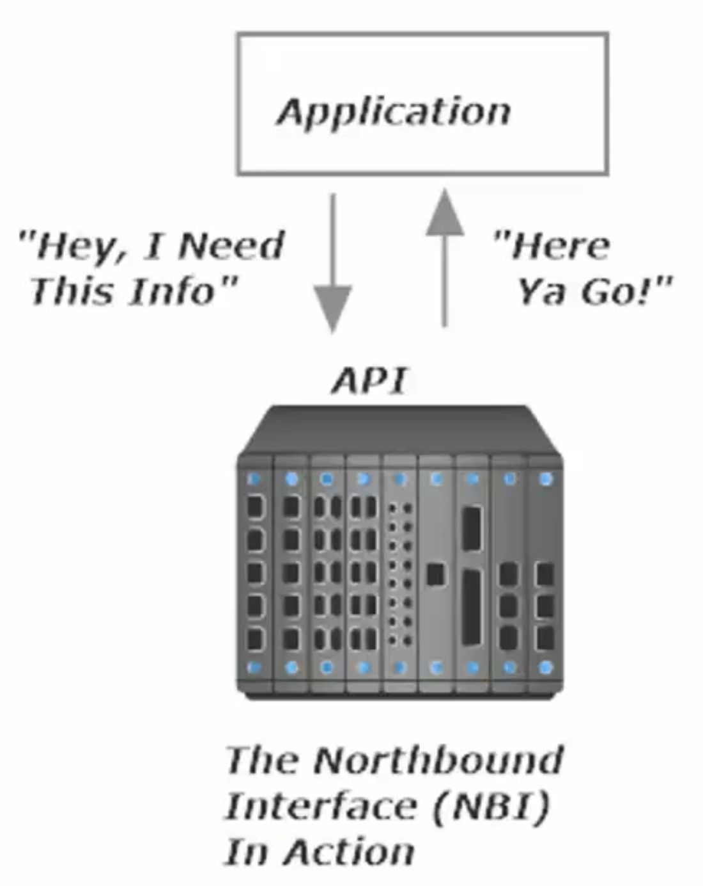

Cisco Application Centric Infrastructure (ACI): a data center infrastructure created with a focus on applications.

ACI uses a Spine-and-Leaf (Clos) Topology (Clos was one the developers of S&L topology)

- Each spine connects to every life and every leaf connects to every spine

- Leaves never connect to Leaves and spines never connect to spines.

- Endpoints connect only to leaf switches, but they may connect to more than one leaf switch

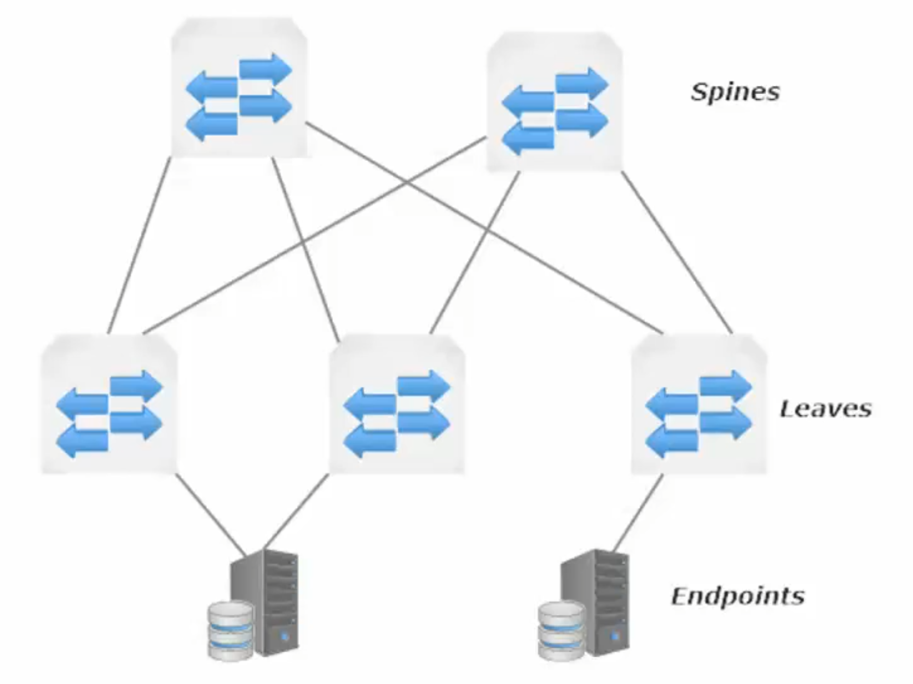

The Cisco Application Policy Infrastructure Controller (APIC)

You’ll likely want to create a policy or set of policies that determine which endpoints are allowed to communicate and which are not. APIC allows the network admin, to implement policies in one location, rather than connecting to each router and individual configuring them.

Makes *intent-based networking* possible

*intent-based networking*: captures and translates business intent into network policies that can be automated and applied consistently across the network. The end goal is for the network to continuously monitor and adjust network performance to assure the desired business outcome.

Traditional Networking vs Software Defined Networking

With SDN, the entire “central controller” concept eases automation, and in fact makes some types of automation possible.

The centralization of information in a database on a single SDN controller makes analyzation of network data much simpler.

Pushing configs from a central point, rather than individually configuring each device, makes the goal of error-free configurations much easier to achieve.

Software-Defined Access (SDA)

A different and new approach to building campus LANs.

Three main components of Cisco’s SDA are found off the SDN controller’s SBI (southbound interface).

The Digital Network Architecture Controller’s (DNA Controller) SBI, to be more accurate.

DNA Controller interacts with multi-layer switches (L3 Switches).

The SDA’s Southbound Components

- The Overlay

- The Underlay

- The Fabric

- The Overlay: The part of the network where VXLAN tunnels are created between SDA switches in order to provide data transfer from one endpoint to another.

- The Underlay: All the switches that make the transfer possible.

- The Fabric: the combination of the Underlay and the Overlay

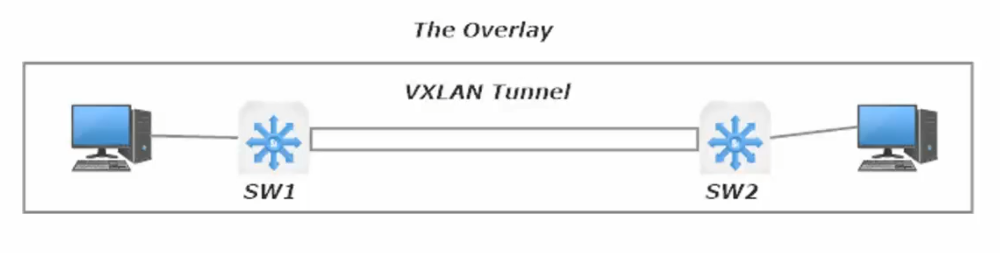

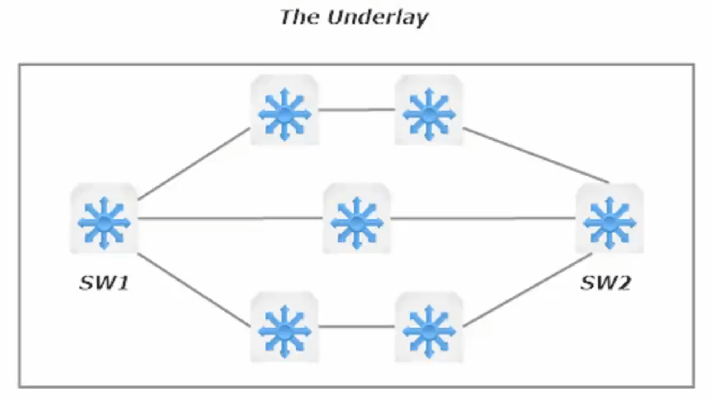

The Underlay Switch Roles

Fabric Edge (as access-layer switch) (connects to end hosts)

Fabric Border (Connects to a device not part of the SDA network)

Fabric Controller (Provides certain control plane functions, including LISP)

“greenfield” – a term from the construction industry, referencing land that hadn’t been developed as of yet.

In IT, it means starting without having to consider integrating with existing hardware or software, a blank slate.

Greenfield SDA deployments use the *routed access layer* design technique (meaning all L3 Switches)

***routed access layer* Rules**

- All switches are L3 switches

- All links between switches are L3 links

- Uses IS-IS as the routing protocol

- STP is unnecessary since everything operates at Layer 3

ASICs encapsulate and de-encapsulate packets headed across the VXLAN Tunnel

The Overlay IP Addressing

The switches will have an IP address from the same address space as the hosts that will be communicating over the VXLAN tunnel.

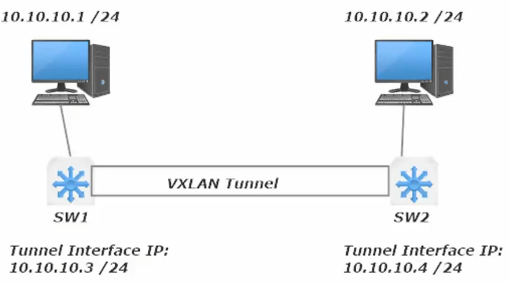 Left: Overlay devices visualized.

Underlay IP addressing will have each L3 switch in the underlay using an address from a subnet separate and distinct from the overlay devices.

**  
**

**The LISP Process**

LISP: Locator / ID Separation Protocol maintains an EID/RLOC mapping database.

With a routed access layer, the location and identity are separated. It’s the job of LISP (the LISP Server) to collect identity-location mappings and answer queries relating to that information.

Note: in traditional routing the id and location of a host was the same thing; their IP address.

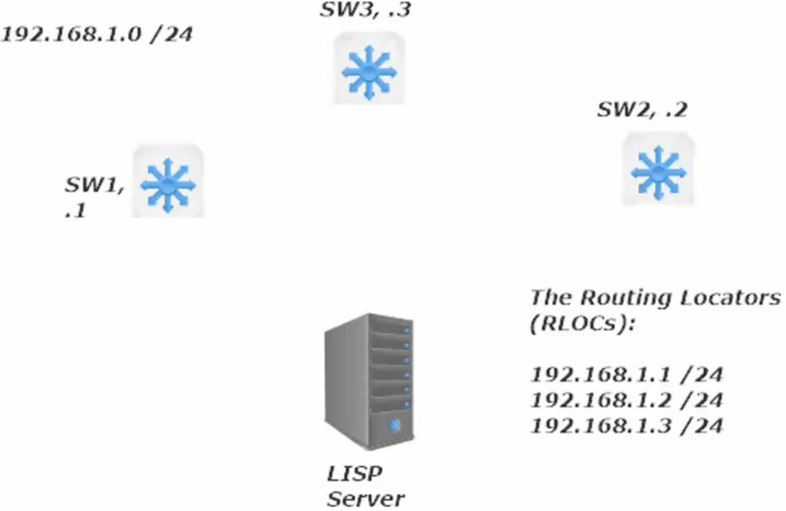

In the diagram above,

SW2 will indicate to the LISP server that it is aware of 10.1.11.0/24 subnet.

SW3 will indicate to the LISP server that it is aware of the 10.1.31.0/24 subnet.

So the LISP Server will note this with multiple entries

Entry: EID 10.1.11.0/24, RLOC 192.168.1.2 (aka SW2) (EID: Endpoint Identifier)

Entry: EID 10.1.31.0/24, RLOC 192.168.1.3 (aka SW3)

So when SW1 has traffic for 10.1.11.200, it will ask the LISP Server to locate that host and the LISP will in turn point check with SW2. After verifying with SW2, SW2 then reaches out to SW1 and lets it know that I, SW2, know the way to IP host 10.1.11.200. At which point a VXLAN tunnel is made between SW1 and SW2

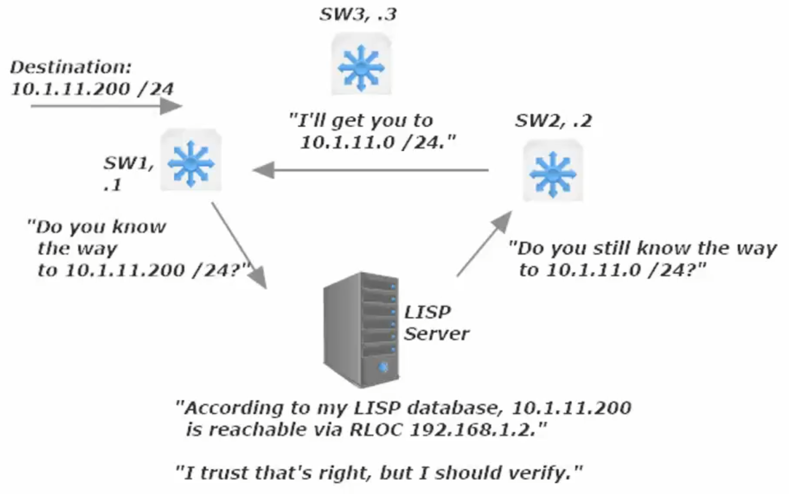 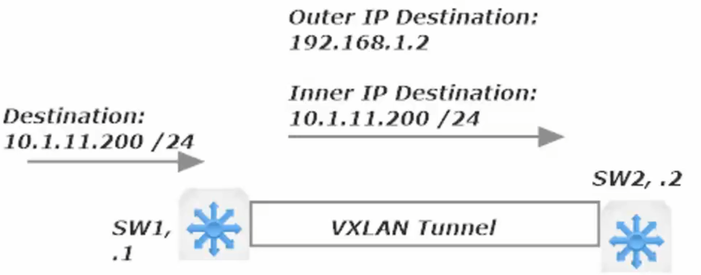

Note: how there will be two IP destinations in the packet being sent from SW1, 1 to SW2 (the RLOC) and the other to the destination IP address 10.1.11.200.

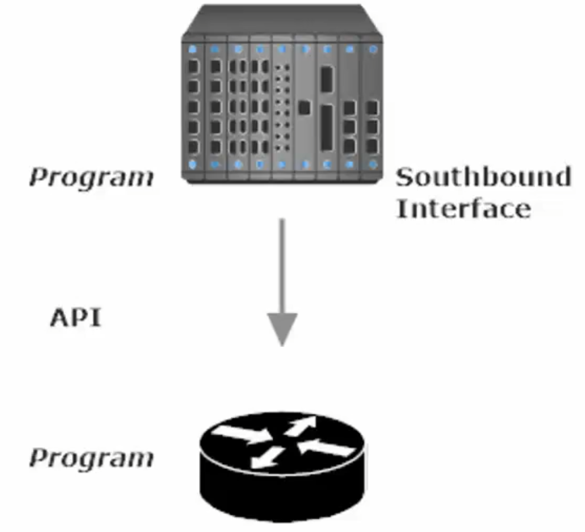

SDN Controller’s SBI will need to be able to communicate with the router.

The SDN Controller and the Router run different software from each other, so an intermediary layer is needed to translate between the devices. This intermediary layer is called an API (Application Protocol Interface) (def - software intermediary that allows two applications to talk to each other… on remote devices or within the same device)

**REST APIs Guiding Principles**

Representational State Transfer (REST)

1.  Client-Server architecture: Separates user interface from data storage

2.  Stateless: a client-to-server request is a standalone conversation. That request must contain all the info needed for the server to understand what the heck the client wants.

3.  Cacheable: Data inside the response is either cacheable or it is not. If the info is cacheable, the client can save it and use that same response data again (For the same query)

4.  Uniform Interface

5.  Layered system

6.  Code-on-demand (optional)

**Client-Server architecture**

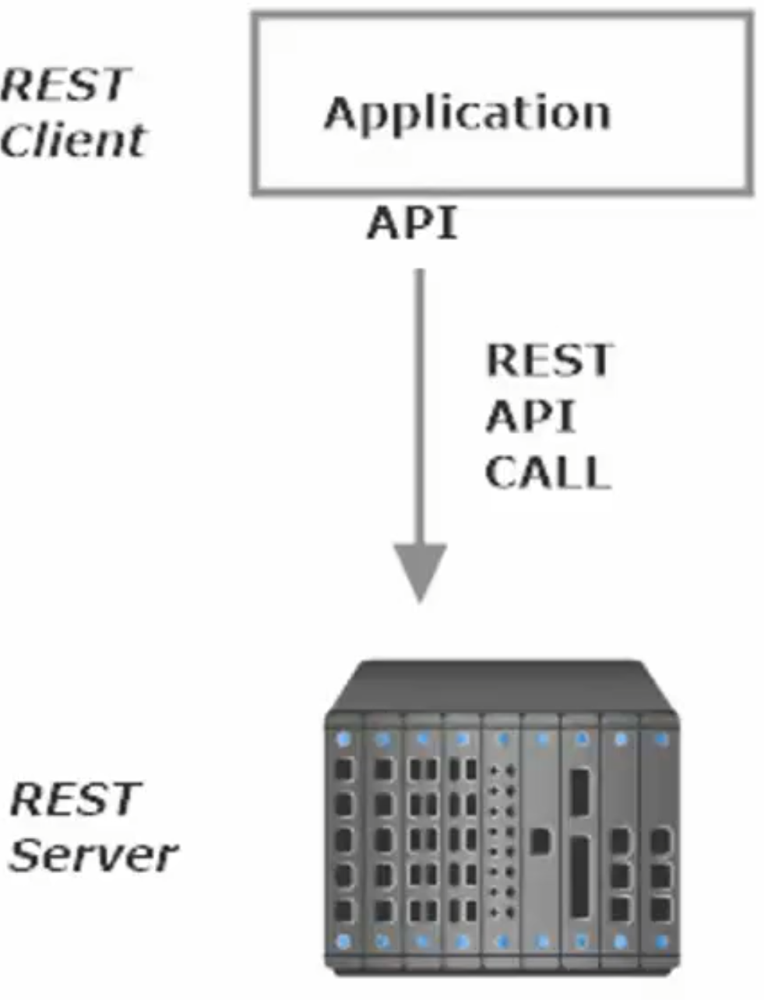

Client is requesting information (via a REST API Call)

from the REST Server (part of the SDN Controller)

The Server then replies to the client’s request (REST API Call) with a Reply (REST API Reply).

Many REST APIs use HTTP, as REST is very similar to HTTP. HTTP is likewise utilizing a Client-Server arch, is Stateless, and Cacheable

CRUD Acronym - These are the actions available using the

**REST API Actions**

- **Create**: create new variables and data structures

- **Read**: read the present variables and data (note read data only, not write)

- **Update**: update existing variables

- **Delete**: delete existing variables that will no longer exist upon their deletion.

**HTTP Actions** are similar, yet distinct

- **GET**: Supply information requested “Here’s the info you wanted”

- **POST**: Create something new

- **PUT**: Update Data

- **Delete**: delete/erase

- **Patch**: Modify data

- **Head**: Similar to GET, but only retrieves header info

CRUD to HTTP Action Mapping

> **Create = Post**
>
> **Read = Get / Head**
>
> **Update = Put / Patch**
>
> **Delete = Delete**

<u>Uniform Resource Locator (URL) vs the Uniform Resource Identifier Syntax</u>

Uniform Resource Identifier Syntax: Protocol / Hostname (IP address) / Resource

<https://api.example.com/device-management/managed-devices>

The URL is the complete web address

The URI Syntax is the individual components of the address

Protocol: HTTPS (TCP port 443)

Hostname: api.example.com (links via DNS to an IP Address)

Resource: the individual HTTP/Rest API website (device-management/managed-devices)

We can add a query to the end of the URL (comes after the ?), the website will get the information based on parameter entered after the ?. That’s a URI

<https://api.example.com/device-management/managed-devices>**?region=USA**

**JSON -** Java Script Object Notation

Communications go much more smoothly when all involved parties speak the same language.

Data Serialization Language: When devices need to communicate, they both likewise need a common language to communicate.

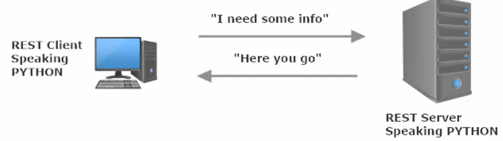 Works fine

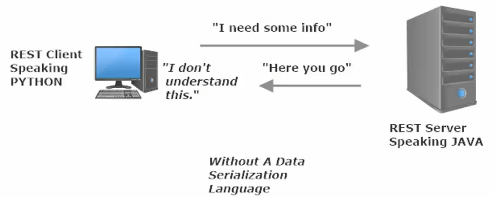 Does NOT Work

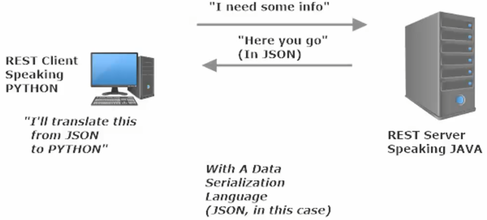 Works because JSON is used as a Data Serialization Language. So the reply back to the REST Client comes in as JSON and is understood by the REST client which then translates the JSON reply into Python.

JSON Syntax

JSON objects are surrounded by “curly braces” {}

JSON objects are expressed in key/value pairs

Key:Value – when you see a colon, you see a key:value pair. The key comes before the colon, the value comes after the colon.

Text, found in double quotes

Numeric, found in no quotes

Array, a series of values using regular brackets

Object, a series of key-value pairs w/curly brackets

Automation: Ansible, Puppet, and Chef

*Configuration Drift* – the (sometimes) slow move of the configuration from its original state and purpose to it current state and purpose. Can cause issues is there if original configuration is backed-up, but the current config is not-backed up.

Example of issues with restoring the OG config. Say multiple changes occurred to the OG config over many months and a significant user error on the current config called for a a restore from backup. The issue is, the OG back-up is missing many revisions made since the OG backup was made and thus there are still issues to resolve even after restoring from a backup.

Roles of configuration management tools

*Configuration provisioning* – provide configs to multiple devices (routers, switches, ip phones, Windows Desktops – PXE boot a custom windows install with features disabled and enabled, users created etc. )

- Create templates for devices with similar roles, (variables would be configured later)

- Roll back changes if the changes do not work out

- Edit configs at a central point and put that config into action from that same central point

**Ansible**

*Template* - preset format for a config file, used so that the config does not have to be recreated each time it is used.

*variables -* the values placed into templates that will differ between templates (ex. IP addresses).

*Playbook* – outlines the actions Ansible should take

*Inventory* – file that provides info about hardware ansible is in charge of

No Ansible agent is necessary on the device being configured

The config is pushed to the client; this default behavior can be changed

**Puppet**

The config is pulled from the server by the client; this default behavior can be changed

*Manifest* – a term specific to Puppet. The client pulls its config from the “Puppet Manifest”, which declares how resources are configured/allocated

*Agent-oriented* – Puppet uses an agent-oriented setup where the *Puppet Master* orders around the *puppet agent* running on a managed device. The communication between Master and Client (*agent*) is an SSH session.

*Agentless Setup* – has an additional device between the Puppet Master and the Puppet Client called the Puppet Proxy. The Puppet proxy is put in place as sometimes the Puppet Client is unable to run puppet itself and needs a proxy device to communicate for the puppet client device (that is incapable of running a puppet agent directly). Many IOS devices can not operate as a puppet agent and require an agentless setup with a Puppet Proxy in place between the Master and Client (puppet-incompatible IOS device).

**Chef** *Cook up some router configs and serve them this way*

Clients (ex. routers) <u>pull</u> configs from the Chef Server

*Workstations* and *Nodes* are terms used with Chef and are not synomous as is the case with other networking terminology

*Workstations* – location where *recipes* (code) are configured. (Chef Server)

*Nodes* – Chef-managed devices, such as routers

Cookbook - a collection of *recipes* (code)

*Knife* – a CLI tool used to upload the cookbook to the server (the server then acts as a *cookbook library*)

“ohai” (pron. Oh-Hi) – an agent that runs on a chef node, collects info about the clients, and sends that info to the Chef client on that device. This client info is then sent from the Chef client to the Chef server for a consistency check against the Cookbook (which already has info about these particular client devices.

If the info received from the matches the cookbook, no changes are made / no action is taken

If the info received doesn’t match the cookbook, the client will “pull” the cookbook from the server and the node then reconfigures itself so that it will match the cookbook definition.
