OSPF is a Link State Protocol

D-V protocols (distance-vector) (RIP, EIGRP) have a default behavior of sending their routing updates on a regular schedule (RIP updates every 30 seconds \| RIP V1 Broadcast \| RIP V2 multicasts to 224.0.0.9).

This behavior is a drawback, as these updates are unnecessary and eat into router overhead (RAM + CPU) and bandwidth for both the sender of RIP routing table and the receiving router.

Other downsides to RIP

Max of 25 routes per RIP Update Packet (so to send 51 routes in a RIP tables it would take 3 RIP Update Packets \[25\|25\|1\]

Link State (LS) protocols don’t send updates containing actual routes. LS routers that have exchange Link State Updates (LSUs), which contain Link State Advertisements (LSAs). These LSAs are placed into a link-state database (LSDB), such as the one shown below via the cmd: R1# show ip ospf database

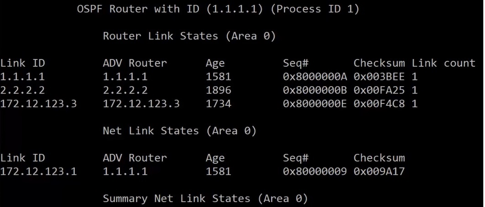*show ip ospf database* results

Algorithms used to fill LSDB

Dijkstra algorithm – aka the ‘Shortest Path First’ (SPF) algorithm runs against the contents of the database to create the OSPF routing table. (See image below). Recalculation of routes due to a network change is so fast that routing loops have NO time to form.

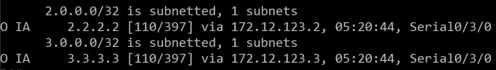

Before LSA exchanges begin, OSPF speaking routers must first become neighbors by forming an adjacency. Routers must agree on the following to become neighbors in OSPF:

- Area Number

- Hello and dead timer settings

- Whether the area is a *stub* area

- Network mask

> Note OSPF process number does NOT need to be agreed upon

OSPF process number itself is *locally significant* only – that is, it only matters to the local router

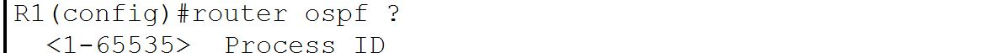

If link authentication is configured, it must be configured on both sides of the adjacency, and the involved password must match. (Not part of CCNA)

To verify OSPF Adjancencies: use the following commands

Cmd: R1#show ip ospf neighbor (this command will show you the status of database loading)

and cmd: R1#show ip ospf interface (will <u>not</u> show the status of db loading)

Show IP OSPF Neighbor continued

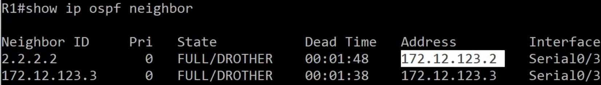

Note that the Neighbor ID and the Address do NOT match

State Entries

FULL – represents that the DB process is concluded \| that the DB is stable and synced

DROTHER – pron. D-R-other role of the interface that we are looking at

Dead Time = Four times the Hello time (max is 2 minutes of four times Hello packets time - 30 seconds)

OSPF relies on Hello packets for <u>Dynamic discovery of potential neighbors</u> and <u>renewing existing adjacencies</u>

Hello Packets on OSPF-enabled interfaces are sent at different intervals depending on network type

- Ethernet – every 10 seconds (broadcast network)

- Serial – every 30 seconds (NBMA)

Note: OSPF Hello and Dead times must match for LSA exchange, so if you have both ethernet and serial connections, set the serial times shorter or the ethernet times faster. (Except broadcast net have serial set to 10/40 instead of 30/120 (2min)

Regardless of how often hello packets are sent, OSPF Hellos have a dest IP address of **224.0.0.5 (Class D)**

OSPF Hellos use **IP protocol type 89**

RFC 1131 (OSPF v1) – “the values of the Network Mask, HelloInt, and DeadInt fields in the received Hello packet must be checked against the values configured for the receiving interface. Any mismatch causes processing to stop and the packet to be dropped.”

**Adjacency States \| Adj States (abbr.)**

**Down**

**Init**

**2-way**

**ExStart**

**Exchange**

**Loading**

**Full**

Down: No Hellos received from that neighbor

Attempt: Unicast Hello packets are being sent to the specified neighbor.

Usually only see *Attempt* stage on the hub router in an NBMA network (Non-Broadcast Multi Access)

Init: The router multicasts a Hello packet to 224.0.0.5

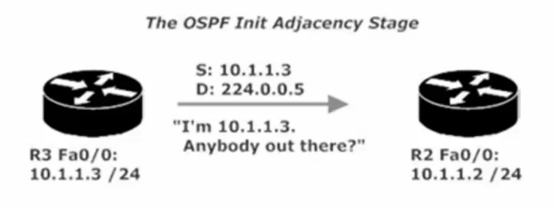

2-Way: The router that received the Hello in the Init stage now unicasts a Hello back to the source of the OG Hello, indicating it is willing to become neighbors and exchange LSDB content.

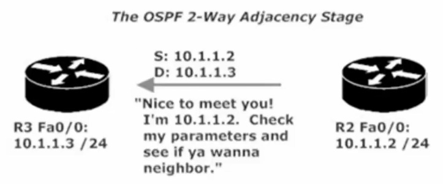

Exstart: Following the DR/BDR election, the exchange of LSDB info begins. The router with the highest RID will begin the exchange and increment the initial sequence number, which is determined during this stage.

Exchange: <u>Database Descriptor (DBD) packets</u> are exchanged. DBD packets contain a description of the Link-State Database (LSDB). The DBD packets <u>contain a list of the LSAs</u> the transmitting router has in its LSDB.

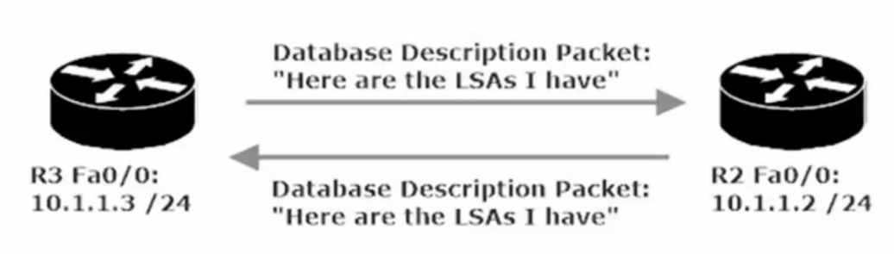

Loading: Each router receives that DBD and <u>checks the list of LSAs</u> from inside the DBD against its own LSDB. Each router will then send <u>Link State Requests</u> to the almost-neighbor, <u>asking for the LSAs it doesn’t already have</u> in its LSDB.

FULL: the requested LSAs have been received by each neighbor, their <u>router databases are synched</u>, and the adjacency has been formed.

When looking at the debug info for cmd: R1#*debug ip ospf adj* (note: adj is adjacency abbreviated, but the command must be typed in the short for \| i.e. adj), seeing *Synchronized with* and an message of ADJCHG (adj change) from LOADING to FULL represents that the OSPF state is now FULL

**  
**

**LSA Sequence Numbers**

LSAs are assigned sequence numbers. When an OSPF-enabled router receives an LSA, that router checks its OSPF database for any pre-existing entries for every link in the incoming LSA.

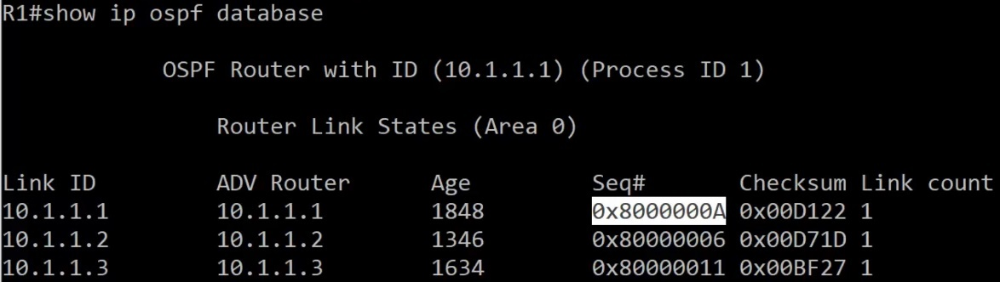

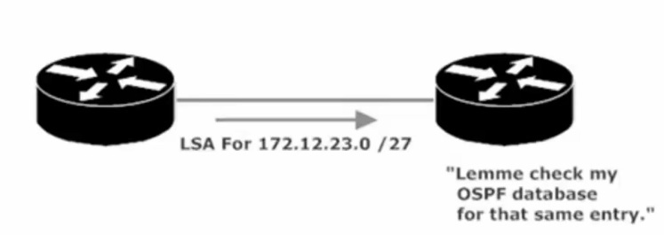 This is the beginning step in the process

If there is NOT an entry for that link, the receiving router will make one in its LSDB and will then flood that LSA out of every OSPF-enabled interface *except* the int the LSA came in on.

If there IS an entry for that link, then LSA sequence numbers come into play and 1 of 3 outcomes will occur

1.  LSA seq \#’s match – LSA is ignored, no additional action taken

2.  LSA seq \# is lower – LSA is ignored, then the router transmits an LSU containing an LSA back to the OG sender. This is the REC Router’s way of saying to Sender Router, “that’s old info, heres the latest info for that link.

3.  LSA seq \# is higher – LSA is added to its LSDB and sends an ack back to the OG router/sender. The router floods the LSA and updates it own routing table by running the SPF algorithm against the now-updated database.

Once the initial exchange of LSAs takes place<u>, there will not be another exchange unless there’s a change</u> in the network topology – with one exception (exception: LSA’s are updated every 30 minutes/1800 seconds)

If an LSA seq \# is higher it gets added to the LSDB – ask sent

**6 Types of OSPF LSA**

- Type1 is a Router LSA.

- Type2 is a Network LSA.

- Type3 is a Network summary LSA.

- Type4 is the ASBR summary.

- Type5 is an external summary.

- Type7 is therefore written to the OSPF standard.

**Type1 is a Router LSA.**

All OSPF speaker types generate LSAs of this type. They are only advertised in the area, including the router's own topology information and routing information.

** **

**Type2 is a Network LSA.**

Type 2 LSAs that occur only on the MA network are generated by the DR and include all network information that is connected to the DR. They are only advertised in the area.

 

**Type3 is a Network summary LSA.**

It is generated by the ABR and advertises routing entries outside the router in the area. When there are multiple ABRs, the cost is used to determine the route summary. This cost is a simple sum of external route cost and internal cost generated by the router in the area. metric-Type 1), instead of running the SPF algorithm, it can be said that OSPF is a link state protocol in the area, and a distance vector protocol is between areas. Inter-regional route transfer

**Type4 is the ASBR summary.**

It is generated by the ABR to broadcast the location of the ASBR. The show IP OSPF database shows that the Type4 LSA is always a host mask 255.255.255.255, and Type4 is the only LSA with no Area attribute in the database.

 

**Type5 is an external summary.**

It is generated by an ASBR and is the routing information of non-OSPF devices. Generally, in a large network, there are a large number of such LSAs in the router's database, which imposes a heavier load on the router. Therefore, we can use stub areas to limit the spread of such LSAs. However, consider the following scenario. If a router running OSPF needs to connect to a non-OSPF network, net1, and advertises the route entries in the non-OSPF network to OSPF, and does not want to store a large number of external networks advertised by other routers in the database. Routing, then we can not use STUB, because this will block all the External routes, OSPF network will lose the routing information of net1,

 

**Type7 is therefore written to the OSPF standard.**

In order to solve this problem,[ CISCO](http://www.router-switch.com/cisco.html?utm_source=toproduct&utm_medium=infaq&utm_campaign=ospf-lsa-types) stipulates NSSA. Type7 advertises the External Route in NSSA. On the ABR of NSSA, Type7 is converted into Type5 (of course, Type7 LSA P-bit=1), and then these routing entries are notified by the ABR. Backbone.

224.0.0.6, the *All Designated Routers* address, where both the DR and BDR will hear it and DROthers will not

<u>Designated Router and Backup Designated Router (DR and BDR)</u>

Distance Vector protocols (RIP) are slow to reach a state of convergence (network state where every router has similar and *accurate view of the network*). Slow convergence leads to suboptimal routing and routing loops.

Link State protocols (OSPF) <u>converge</u> almost immediately upon a <u>change in the network</u>. OSPF uses *designated routers* and *backup designated routers* to make network convergence a fast and orderly process.

When a router on an OSPF segment with a DR and BDR detects a change in the network, the detecting router will NOT notify ALL of its neighbors. Rather the detecting router will send a multicast to 224.0.0.6, the *All Designated Routers* address, where both the DR and BDR will hear it and DROthers will not.

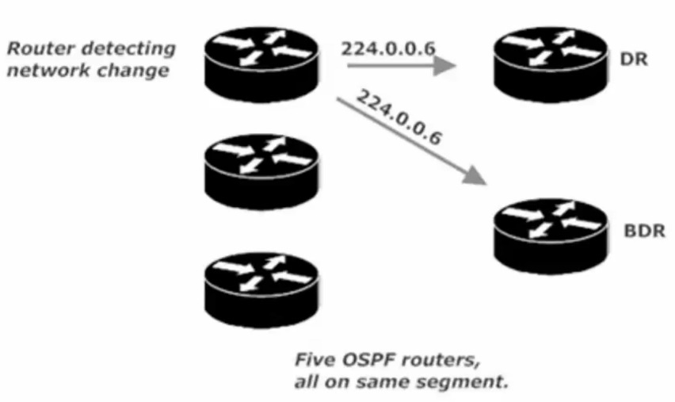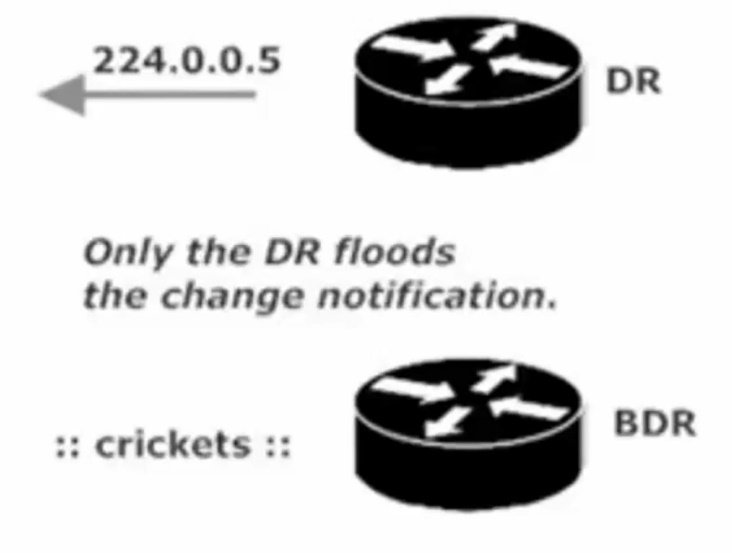

Example of 224.0.0.6 Multicast ^ the DR in given OSPF segment will then flood the change over the standard multicast (224.0.0.5)

**DR and BDR Election Procedure**

In a 4 Router OSPF segment (one DR one BDR and two DROthers) (See example Below)

- All router interfaces on the segment with an <u>OSPF int priority of **1 or greater** are eligible to participate in the election</u>.

<!-- -->

- The priority default is 1, so by default, all router interfaces will participate in the election.

- The router with the highest interface priority is elected DR, if there is a tie in priority, the OSPF RID (Router ID) is the tiebreaker. Highest RID wins.

- The process is then repeated to elect a new BDR. A single router cannot be the DR and BDR for the same segment. May be a DR for Area 0 and BDR for Area 2

- The RID of any given router will be the highest IP address assigned to a loopback interface on that router, regardless of whether that loopback is actually OSPF-enabled.

- If there is no loopback, the OSPF RID will be the highest IP address assigned to a physical interface. The interface does not need to be OSPF-enabled for its IP address to serve as the RID (provided the interface is up both physically/logically)

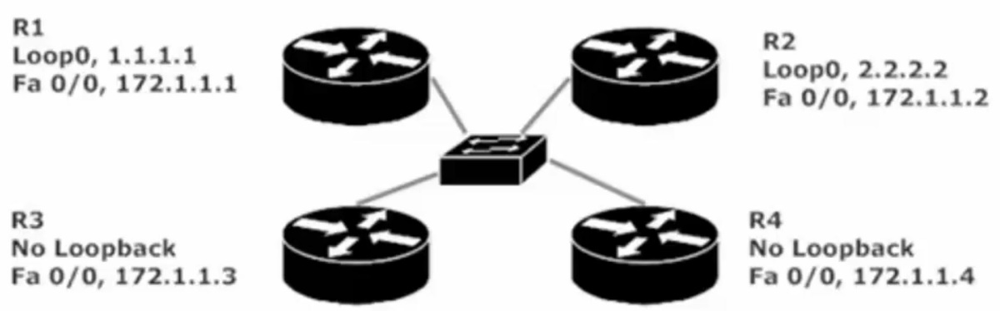

What is the RID of each Router?

Which is DR? Which is BDR?

R1 RID: 1.1.1.1 R2 RID 2.2.2.2 R3 RID 172.1.1.3 R4 RID 172.1.1.4

DR is R4 because highest RID (RID = 172.1.1.4)

BDR is R3 because 2nd highest RID (RID = 172.1.1.3)

Should you want to choose a specific router as DR, you can hardcode the router’s RID.

(Note: once the RID is changed you must reload or “clear ip ospf process” for change to take effect)

(Note: OSPF DR and BDR elections are not always going on in the background, like elections happening with STP)

**BIG OSPF Build LAB**

Area 0 is the backbone area of any OSPF deployment. Every single non-backbone area in your network must contain an interface on a router that also has a physical or logical connection to Area 0.

Lab has 5 Routers – each router has a single loopback that uses the router number for each octet

(R1 Loopback 1 = 1.1.1.1/32 \| R5 Loopback 5 = 5.5.5.5/32) (Initially, these loopbacks will not be OSPF-enabled, they will be later) (The loopbacks will not appear in the illustrations until they’re enabled with OSPF).

Process Number = R1(config)#router ospf \# - the \# is our process number. Process number is locally significant only,

it is not advertised between potential neighbors and <u>OSPF \# does NOT need to match between potential neighbors</u>).

Multiple OSPF processes can be run on a single router, and routes are not exchanged between multiple processes on the same router by default. (Note: running multiple OSPF process hammers a router’s CPU).

The *network* command always uses a wildcard mask to identify the interfaces to be enabled with OSPF. (with OSPF the mask is not optional) Using the wildcard mask of 0.0.0.255 means any interface that begins with 10.1.1.x on either router will begin running OSPF.

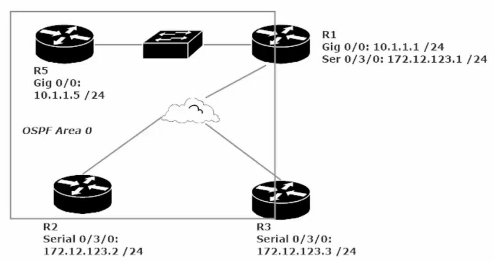Initial stage of our large OSPF Lab

**OSPF NBMA Network (Non-Broadcast Multi-Access)**

The hub router must become the DR and there should be no BDR. IT is vital for both the DR and BDR to get multicasts to all other routers on the segment

With a Hub-and-spoke topology, a spoke router cannot send multicasts directly to the other spoke. All spoke-to-spoke traffic goes through the hub router, and routers do not forward broadcasts or multicasts, Therefore, our hub router must become the DR and no BDR should be elected.

We can make this change by setting the Interface with cmd: R2(config-if)#ip ospf priority 0

(We do this command for Routers 2 and 3, as <u>we want Router 1 to be named the DR</u> and want these two routers to not participate in the election, leaving them in a DRother state.

This change to R2 + R3 can cause R1 to not show an OSPF neighbor relationship between R1 and R2 + R1 and R3

To fix this we manually add R2 and R3 to R1’s OSPF neighbor chart.

Cmd: R1(config-router)#neighbor 172.12.123.2 (R2’s IP) and R1(…)#neighbor 172.12.123.3 (R3’s IP)

**Adding a Point-to-Point link to our Big LAB**

When adding a serial point to point connection between two routers you need to utilize a DTE to DCE cable

Both ends of this cable look the same and will fit in any HWIC-2T serial interface, the connections DTE/DCE need to have a matching clock rate (usually set at 128000 by default) show can see this parameter by cmd: show running-config \| section interfaces. From there you will see Serial0/1/0 followed by shut or no shut ip address and then clock rate *speed*

Remember the DCE supplies the clock rate to the DTE. Pay attention to the cable to see which end is plugged into which router. R1: DTE ---🡪 R3: DCE

**Configuring a PTP Network (Point-to-point)**

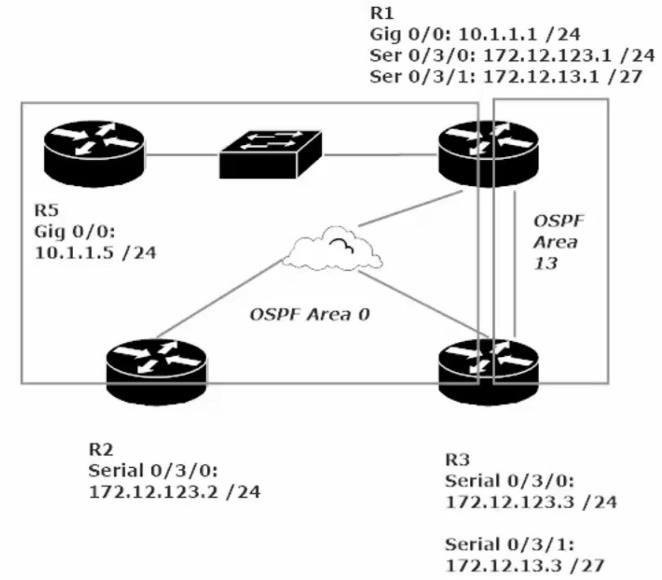In this LAB we are adding a PTP network (area 13) between R1 and R3

Note: When adding a non-backbone ospf area/segment to our network, we must make sure that the non-backbone network has a physical/logical interface connected to the backbone OSPF area (Area 0)

see above diagram, area 13 is good as R1 (a member of area 13 has interfaces connected to the backbone area (area 0)

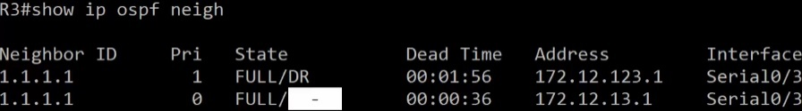

Notice the highlighted “-“ that is there because this PTP link is not a Dr/BDR/DRother

Since there is only 2 point in a PTP link (no matter who announces the change, they only have the other router to inform

Because of this no election takes place (again no DR, no BDR, no DRother)

There is also a Point-to-multipoint link in OSPF, this is just a collection of PTP links and follows the same rules as a PTP

One other item to note about a PTP OSPF network is that the Hello-time and Dead-time are set differently than a standard OSPF link

Standard OSPF on serial – Hello = 30s Dead= 120s

PTP OSPF over serial – Hello = 10s Dead= 40s

Verify that Area 0 can ping to area 13. See if R5 can ping 172.12.13.1 (R1 OSPF area 13) / 172.12.13.3 (R3 OSPF area 13)

R5#show ip route ospf

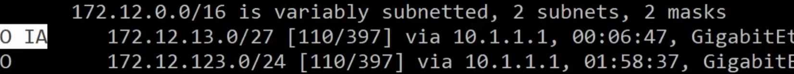

(Notice the “O IA” for 172.12.13.0/27 – IA represents an OSPF inter area route. This notation represents that R5 is pinging a separate OSPF area. R5 belongs to OSPF area 0, while 172.12.13.0/27 belongs to OSPF area 13

**Big Lab continued (Adding Broadcast Segment + Loopbacks**

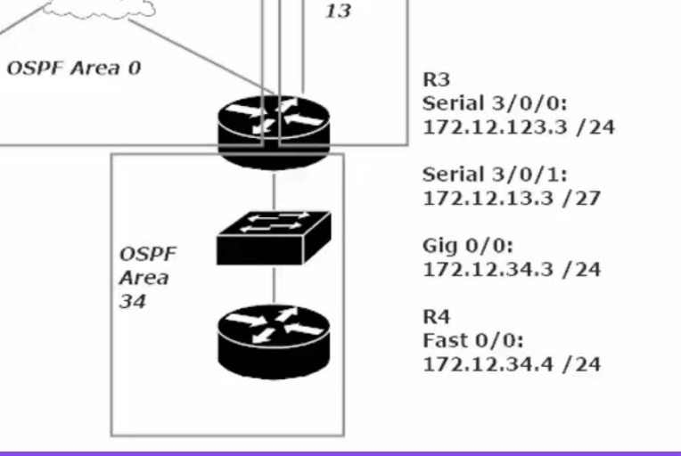 Note OSPF area 34 connects R3 to a new router (R4)

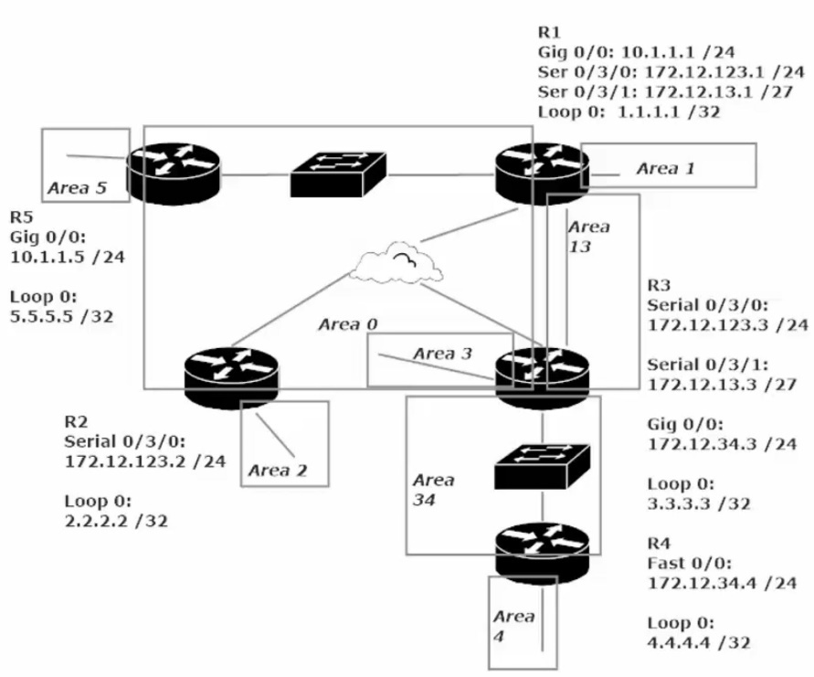

With the OSPF network in this state each OSPF area is sharing LSAs about their particular state with all OSPF enabled interfaces.

This manifests with an OSPF routing table as “O IA” connection vs a C (Connected) or L (Local) or S (Static) or O (OSPF) by itself. (See image below) “O IA” stands for OSPF Inter-Area route

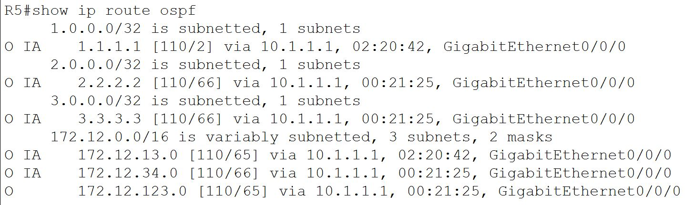

Compare this to the show ip route CMD for R5 (see image below)

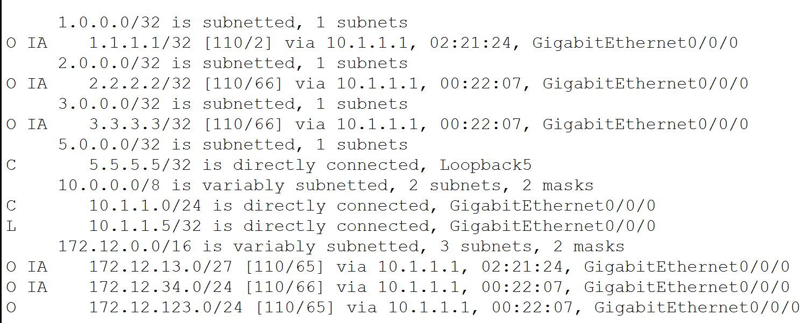

This is the complete routing table for Router 5 (R5) note that there is NO “O IA” entry for Router 4’s Loopback

This is because Router 4 has no interfaces physically connected to Area 0. To resolve this we need to a virtual OSPF link between R4 and Area 0, essentially increasing the boundaries of Area 0 to include Area 4 (R4 loopback OSPF Area)

Adding a Virtual Link

‘Area 0’ gets extended to add ‘Area 4’ (note all areas are located in OSPF Process ID 1)

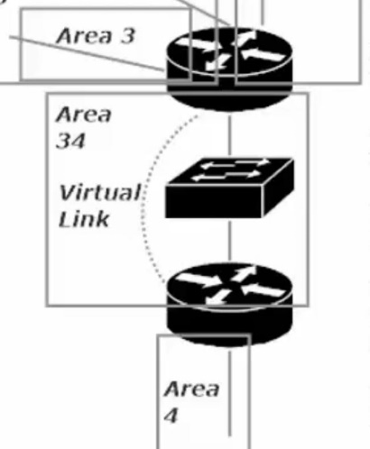

The virtual link command will need to be made on Router 3 and Router 4. The commands will be given within the OSPF-process ID 1 config

R4(config)#router ospf 1

R4(config-router)#area 34 virtual-link 3.3.3.3 (note: 3.3.3.3 is the RID of Router 3, not its Gig 0/0/0 Ip address. The command help (..#area 34 virtual link ?) asks for “ID” with a description saying IP address, bit it is looking for R3’s RID)

(Note: when we switch to Router 3, we then see the error message mentioned in rule 1 above)

R3(config-router)#area 34 virtual-link 4.4.4.4 (note: 4.4.4.4 is the RID of Router 4) (note: OSPF RID should default to the highest Loopback address for the router, or if no Loopback then the highest interface IP address. This was not the case on my router’s, older IOS?, so I had to set them manually with CMD: R3(config-router)#router-id 3.3.3.3 )

CMD to note: R3#show ip ospf virtual-links (gives details about the Virtual-Links on the router)

Should your Virtual Link not work, it is likely 1 of these 3 culprits. 1) using the wrong RID in the V-L cmd. 2) Trying to use a stub area as the transit area. 3)Failure to configure authentication on the V-L when auth in use on Area 0
