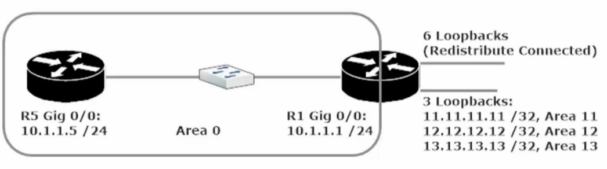
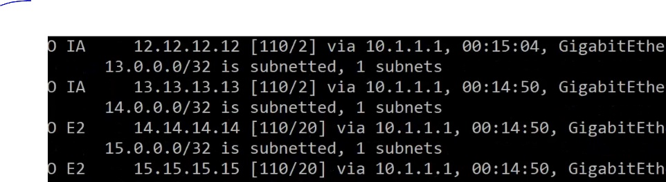
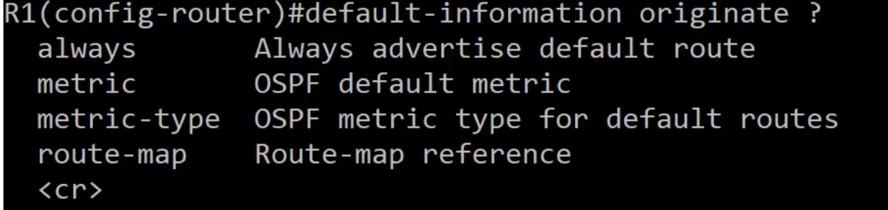
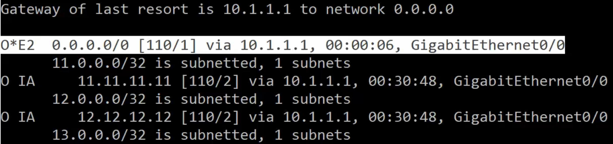
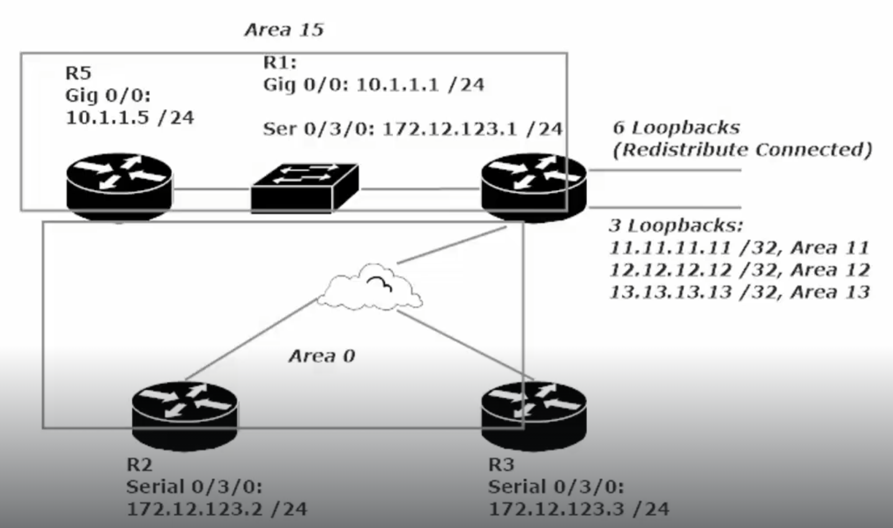
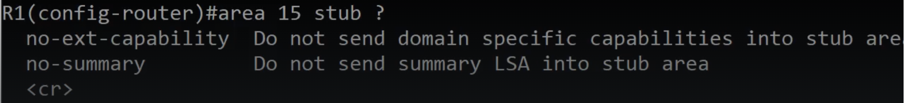
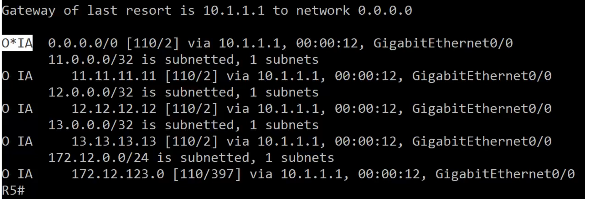
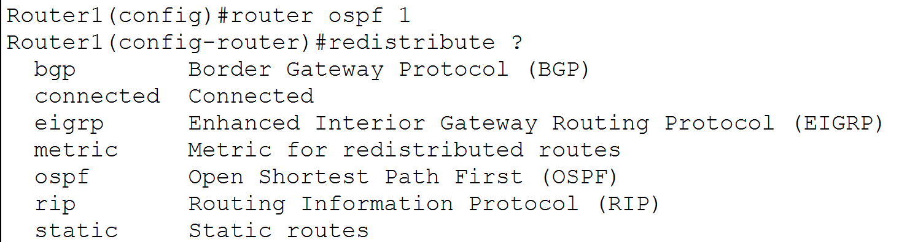
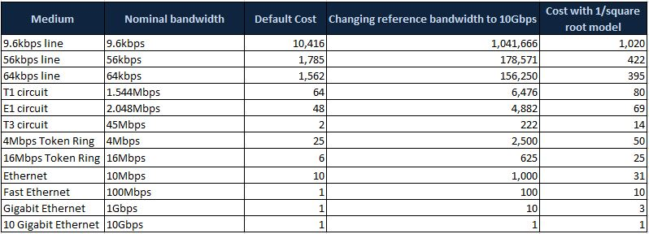

OSPF Notes 2

**Passive Interfaces with OSPF**

Recall that passive interfaces in D-V protocols, such as RIP, were set to <u>not send routing update packets</u>

**OSPF Passive Interfaces will NOT send Hello packets** (hello packets are the “heartbeat” of OSPF adjacencies, <u>disabling them is advantageous when they are being sent unnecessarily</u>, as is the case in particular topologies. Ex. Below)

To enable a passive-interface go to the ospf routing config

R1(config)#router ospf 1

R1(config-router)#passive-interface interface Gig 0/0/0 (this will make the Gig 0/0/0 into a “passive-interface”)

You can also set all interfaces as passive-interfaces as the0 default for your router.

R1(config)#router ospf 1

R1(config-router)#passive-interface default (sets all OSPF-enabled interfaces to passive-interface)

The purpose of the passive-interfaces is to eliminate unnecessary hello packets from being sent out an interface that will not be forming ospf adjacencies. As these hello packets can be sent up to 9000 times per day per interface.

**OSPF Area Notes**

Area 0 is the backbone of an OSPF deployment, every non-backbone OSPF area on your network must contain an interface directly connected to Area 0 (physical or logical, logical = ‘virtual-link’)

The reason we don’t put every router into Area 0 is because using separate areas creates a hierarchy with the OSPF deployment

**Hierarchical** – (classified according to various criteria into successive layers or levels.)

- Using OSPF areas allows us to build a layered network, which helps to reduce strain on router resources (CPU + RAM). Thanks to the layered approach, situations where a router does not need a huge routing table can occur.

- We always aim for routes to reach their destination with the most concise routing table possible.

- Logically dividing an OSPF deployment to areas helps to limit LSU and LSA traffic.

- Notifications of changes in a multi-area OSPF network can be limited to the area in which the change took place.

- This helps to limit the overall number of routing table recalculations;

thus, less CPU overhead is utilized.

Follow these rules to keep OSPF efficient

- No router should be in more than three areas.

- No area should contain more than 50 routers.

- No router should have more than 60 neighbors.

- A router can be a DR or BDR for more than one network segment, but monitor the CPU resource allocation to avoid overtaxing the CPU.

- Do not run more than one OSPF process on an Area Border Router (ABR)

> (ABR) – a router with at least one interface in Area 0 and another in a non-backbone area

**  
**

**Default-Information Originate Command**

The first 3 loopbacks on R1 Gig 0/0/0 (Areas 11 to 13) are all provided to the routing table via OSPF inter-area, however the additional 6 loopbacks (labeled redistribute connected) (areas 14 -19) have been provided to the routing table via the **‘redistribute connected subnets’** command (cmd entered at config-router prompt).

These 6 redistributed routes are seen in the OSPF routing table as O E2 – (R1#show ip route ospf)

‘O E2’ classification (defines routes brought into the routing table via route redistribution),

all the routes have the same next hop address 10.1.1.1.

This can be done more efficiently with the ‘default-information originate’ command (cmd entered at config-router prompt).

the ‘default-information originate’ command can be entered four ways.

1)  Always

2)  Metric

3)  metric-type

4)  route-map

***default-information originate*** - The purpose of this command is to advertise the default route.

Why would we not always want to advertise the default route?

The ‘**default-information originate always**’ command - the **router** **advertises a default route ALWAYS**, <u>**even if it doesn’t have a default route**.</u>

In our case above, R1 will advertise area 11 ‘1.1.1.1’ as its default route, but the more specific routes will still be in the routing table as well. This is how the command works. You have to filter the more specific routes.

Default-information originate tells other routers that we have a default way of getting out to the internet.

When you run the ‘default-information originate’ command on a router, that router will advertise a default route, provided it has a default route to advertise.

**Stub Areas**

Area (0) (Backbone Area) <u>cannot</u> be a stub area

**The stub flag has to be set on both routers (R1 + R5)**

When you configure a stub area on the first router, you **will lose your adjacency** (**stub flag must match**),

<u>until you configure the stub area flag on the other router</u>.

To fix this go to **R5(config-router)#area 15 stub (now the sub flag matches and adj is UP)**

**What is the effect on the routing table for R5?**

R5#sh ip route ospf

A stub area will replace all of the routes learned via route-redistribution (O E2) are gone and

replaced with a candidate default route (O\*IA)

Stub area will replace the external routes with a default route

**Total Stub Area –** (the no-summary flag) R1(config-route)#area 15 stub <u>no-summary</u>)

The two routers in the stub area, both need the stub flag set,

But on Router 1 (the router that is going to be advertising the default route) we need to add this command

cmd (R1(config-router)#area 15 stub no-summary

The **no-summary** flag removes the external routes (O E2) and the inter area routes (O IA), and replaces them with a single default route. This means that the stub area (Area 15) is now a “Total Stub area) Should there be any regular OSPF routes (O), they would still show in the routing table

**Stub Area –** Routing Table will contain routes to networks in the same area (O) and inter area routes (OI A). It will replace the external routes (O E2) with a default inter-area route (O\*IA)

**Total Stub Area** (no-summary) **–** Routing table will contain routes to netwroks in the same area (O) and a single default route for all other route (O\*IA).

**OSPF Router Roles**

*Internal Router*—A router with that has OSPF neighbor relationships only with devices in the same area.

*Area Border Router* (ABR)—A router that has OSPF neighbor relationships with devices in multiple OSPF areas. ABRs gather topology information from their connected areas and distribute it to the backbone area.

<u>One interface in area 0 and another interface in a non-backbone area</u>

*Backbone Router*—A backbone router is a router that runs OSPF and has at least one interface connected to the OSPF backbone area. Since ABRs are always connected to the backbone, they are always classified as backbone routers.

*Autonomous System Boundary Router* (ASBR)—An ASBR is a router that attaches to more than one routing protocol and exchanges routing information between them.

A router that injects routes into the OSPF domain via “route redistribution”,

(Note: You can redistribute routes from other Routing Protocols or Static Routes or Connected routes (Connected local interfaces)

**Multiple Routers on a Broadcast Segment / Multiple DRothers**

**DRother routers will have a Full Adjacency between the DR and BDR, but only a 2-way adj between them and other DRothers.**

**<u>OSPF Cost</u>**

The OSPF path cost is determined by the cost of the outgoing interfaces along the full path. Outgoing interfaces. ONLY  
The default OSPF metric is calculated by dividing the reference bandwidth by the bandwidth of the interface.

**Method 1: Set the Auto-cost reference bandwidth metric**

**Default Reference-Bandwidth is 100M**

To change the OSPF path cost you can change the auto-cost reference-bandwidth metric \<1-4294967\>

R1(config)#router ospf 1

R1(config-router)#auto-cost reference-bandwidth 1000

(setting this to 1000 will change the value of the path cost equation) (default = 100)

**OSPF Interface Cost Equation:** (reference-bandwidth 1000M / speed 100M)

A 1000M value for the auto-cost reference-bandwidth, for an interface running at 100M, will have a cost of 10.

**1000M** (reference bandwidth) **/** **100M** (interface speed) **=** 10 (OSPF Path Cost)

Cost = 10 when 1000M/100M (reference-bandwidth=1000M / interface bandwidth/speed=100M)

**Method 2: Change the Link speed**

For instance, if a serial connection has its bandwidth set at 1544k, the resultant cost will be 64

Cost = 64 when 1000M/1544k (1000/15.44)

Cost = 500 when 1000M/200k (1000/2)

**Method 3: Explicitly set OSPF port cost**

R1(config)#int serial 0/2/0

R1(config-if)#ip ospf cost \<enter value 1-65535\> set below 200 to have any real affect in a lab environment

**Port Cost**

| 100 Gbps        | 1   |
|-----------------|-----|
| 40 Gbps         | 1   |
| 10 Gbps         | 1   |
| 1 Gbps          | 1   |
| 100 Mbps        | 1   |
| 10 Mbps         | 10  |
| 1.544 Mbps (T1) | 64  |
| 768 Kbps        | 133 |
| 384 Kbps        | 266 |
| 200Kbps         | 500 |
| 128 Kbps        | 781 |

All interfaces faster than 100 Mbps have the same default cost metric of 1.

Port Cost Default for 100M and Default for 10Gigabit (10,000M)

**OSPF Path Cost**

The OSPF path cost is determined by <u>the cost of the outgoing interfaces along the full path</u>.

Outgoing interfaces ONLY!

**All interfaces faster than 100 Mbps have the same default port cost metric of 1.**

**Loopbacks have a value of 0. No bandwidth is associated with the loopback interface.**

Why Path Cost Matters

The representation of the network is incorrect when links are not correctly costed. This means that the algorithm may not be able to be trusted to give you the "best" path through the network, as lower bandwidth links are preferred. This in turn diverts traffic over sub-optimal or unintentional paths through the network towards its destination. At best, this means that traffic flows are unpredictable, which is a significant issue for planning and troubleshooting.

If you stick to the default configuration, and have a single-vendor network, then this situation should not arise. But there are a couple of primary causes of this situation which are common in complex networks.
