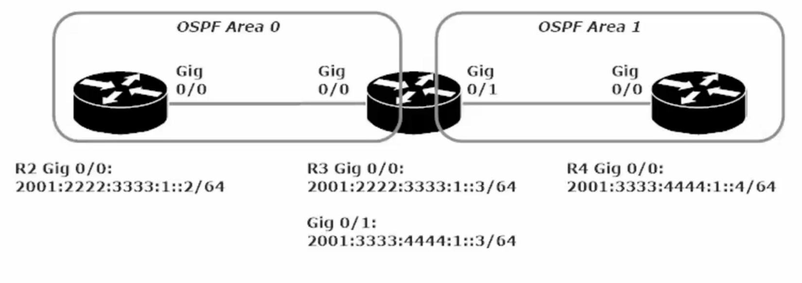

**OSPF version 3 / OSPF for IPv6**

With OSPFv3 you wont necessarily start a config with ipv6 router ospf. One major difference between v2 (ipv4) and v3 (ipv6) is that v3 is enabled on a per interface basis, rather than the router config mode used in v2.

The following command starts an OSPFv3 process:

R1(config)#int gig 0/0

R1(config-if)#ipv6 ospf 1 area 0

OSPFv2 (IPv4) vs OSPFv3 (IPv6)

RID determination is done the same way

1)  Use Highest Loopback address

2)  If no Loopbacks, then use highest IPv4 address

3)  OSPFv3 only, if no IPv4 address then you must statically set RID (use IPv4 format still)

Important Similarities

1)  Neither OSPFv3 nor v2 point-to-point or point-to-multipoint networks elect DRs or BDRs

2)  Hellos are still sent, LSAs, area 0, stub and total stub area,

3)  Neighbor Discovery and Adjacencies are the same. NBMP topology still requires the neighbor’s to be statically set.

Important Differences

1)  OSPFv3 – allows a single link to be part of multiple OSPF instances.

whereas OSPFv2 allows a single to *ONLY* be part of <u>one</u> OSPF instance.

The OSPFv3 Reserved Addresses

FF02::5 – All OSPF Routers (DR,BDR, DRother)

FF02::6 – All OSPF Designated Routers (DR)

The OSPFv2 Reserved Addresses

224.00.5 – All OSPF Routers (DR,BDR,DRother)

224.00.6 – All OSPF Designated Routers

The most important thing to note about this lab is that ipv6 unicast-routing must be enabled, and a router-id needs to be set in the config (#ipv6 ospf 1) if there is no ipv4 address set, Then you simply enable the ipv6 ospf 1 area 0 command of R2 g/0/0 and R3 g0/0 and ipv6 ospf 1 area 1 on R3 g0/1 and R4 g0/0.

Otherwise OSPFv3 is very much the same as OSPFv2
