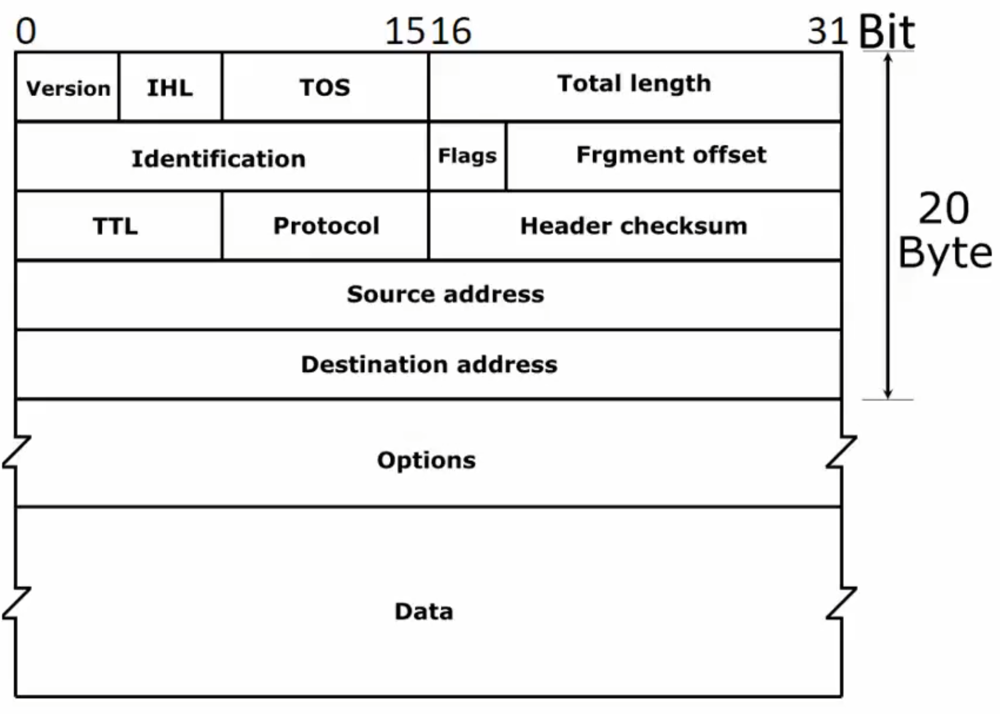
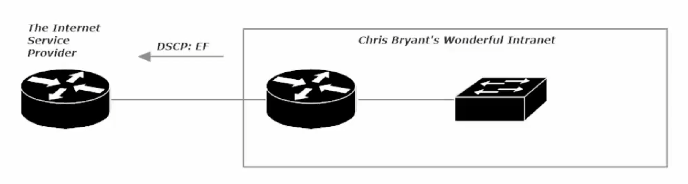
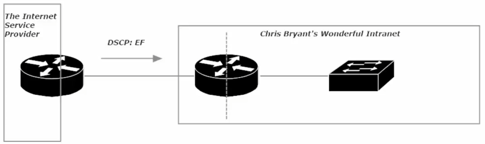
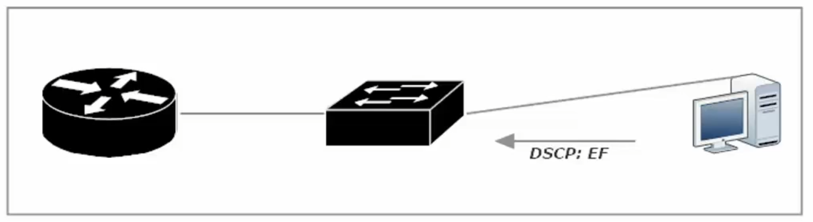
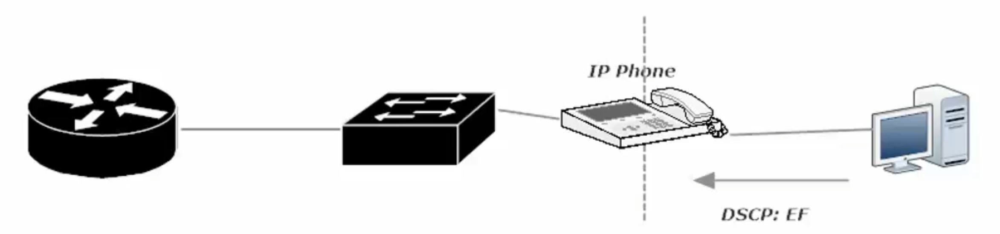
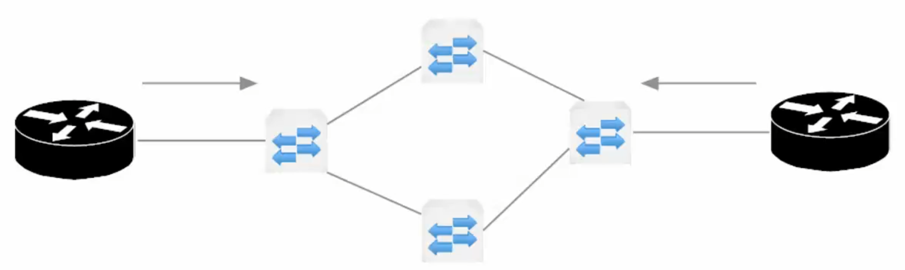
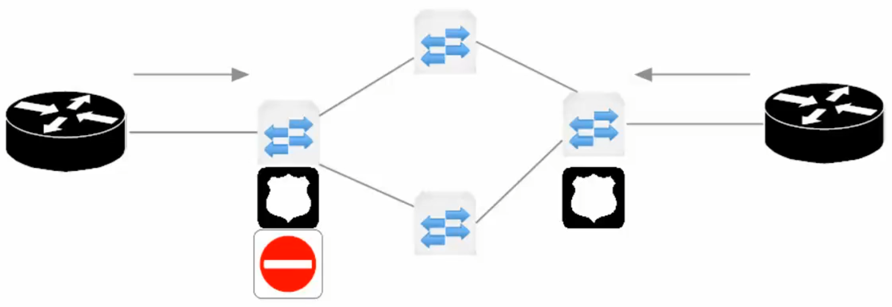
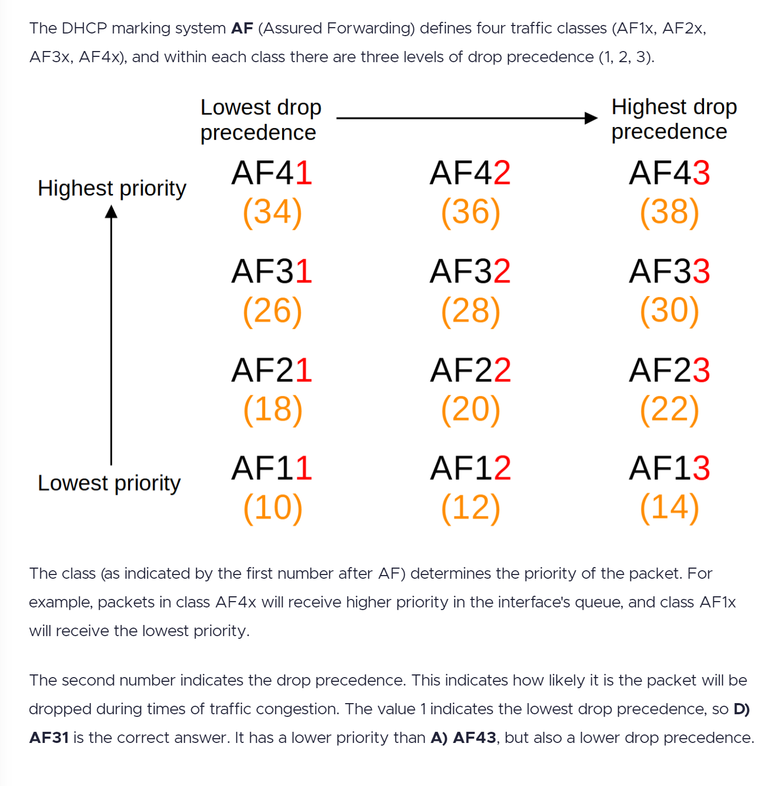

QoS Quality of Service Notes

QoS is about determining how certain traffic flows should be treated, or whether they should be treated specially at all.

You may decide that a certain flow of traffic should be the first to have packets dropped when network congestion is encountered.

QoS can take place at L2 (frames) or L3 (packets).

QoS is especially important with voice and video traffic. QoS can be used to avoid *jitter*, the variation in time between packets arriving at their destination. Jitter causes a breakup in sound and/or video, jitter is caused by network congestion.

Jitter tolerance is at a minimum in today’s networks. Depending on which vendor (or network admin), acceptable jitter rates vary from 30 – 60 ms.

An acceptable rate of overall packet loss for voice/video ranges from (0.1% - ~1%).

*Classification*

Similar to how people are seated on a plane, we can classify traffic as having the highest priority (first class), a slightly higher priority than normal (biz class), or normal priority (coach). Traffic can be classified with the lowest classification level (cargo hold).

<u>Example of Classification</u>

“all telnet traffic” = Class A

“all SSH traffic” = Class B

“all traffic from 210.1.1.1 /24” = Class C

“all other traffic” = Class D

With Classification done, we need some way to mark these traffic types, so downstream devices will know how to handle them.

*marking* - The process of changing a value inside a frame/packet with a new *marked value*.

*marked value* - indicates how the frame/packet should be handled from that point on.

In short, the *marked value* indicates the class to which this particular traffic type belongs, and it’s the *marking* that indicates to downstream routers and switches how to treat the specific/specified traffic.

<u>Marking example:</u>

The dot1q tag contains a value called the Priority Code Point (PCP). We can use that value to indicate a priority between 0 and 7 (7 being the highest priority).

There is also a simple 1-byte field called the Drop Eligible Indicator. If the bit is set the frame/packet is eligible to be dropped.

*Class of Service* (CoS) – **a 3-bit field that is present in an Ethernet frame header when 802.1q (VLAN) tagging is present**. The field specifies a **priority value (0-7)** that can be **used by QoS disciplines to differentiate and shape / police network traffic.**

**CoS operates only on 802.1Q VLAN Ethernet at the data link Layer (Layer 2).** Networking devices can be configured to use existing CoS values on incoming packets (trust mode) or can rewrite the CoS value to something completely different. Most ISPs do not trust incoming QoS markings from their customers, so CoS is generally limited to use within an organization’s intranet.

*Differentiated Services Code Point* (DSCP) – a 6-bit value found in the “8-bit Differentiated Services field (called Diff Serv) in the IPv4 header”.

TOS field – this is where the DSCP is kept

With 6-bit there are dozens of values for the DSCP field

<u>DSCP per-hop behaviors (PHBs)</u>

Default Forwarding (DF)

Expediated Forwarding (EF)

Assured Forwarding (AF)

Class Selector (CS)

DSCP PHB Definitions

*Default Forwarding* (DF):

- The only required Per Hop Behavior (PHB).

- It does not fall into another class of traffic; it only falls into this one.

- Generally, uses best-effort delivery (like UDP).

*Expediated Forwarding* (EF):

Best to place low-delay, low-loss, low-jitter-tolerant traffic here (such as voice/video traffic

*Assured Forwarding* (AF):

Traffic is assured of delivery IF the transmission rate does not exceed the subscribed rate

AF Traffic that does exceed the subscribed rate has a higher chance of being dropped due to network congestion, when compared to other traffic.

*Class Selector* (CS):  
Used for backward compatibility for devices using the IP Precedence (IPP) field to indicate priority traffic

(IP Precedence (IPP) field is a legacy standard)

**Trust Boundaries**

<u>Example</u>

What if a high-priority frame came into a switch under your administrative control, but the switch that sent the frame is no under your control? Should that high-priority from the non-local switch be given its set priority? I.e. Should we trust the frame?

Note: ISPs generally do not trust incoming QoS markings from their customers, so CoS is generally limited to use within an organization’s intranet. As such, the trust boundary would end at the ISP router, but this boundary occurs after the interface that is receiving the packets. It is not the packet that the ISP would distrust, the packet still comes into the ISP router and it outbound interface (interface facing our network), but the DSCP information will not be trusted.

The same distrust for DSCP information is true, should the ISP send us packets with the DSCP bit set.

In that case the trust boundary is in the middle of our edge router, after the interface facing the ISP’s Router. The trust boundary is denoted by a dotted-line

Another example of a reason to set a Trust Boundary within your intranet, is a situation where an

end-device/host is tagging all their traffic as EF (Expediated Forwarding). To fix this situation, you would set the trust boundary in the middle of your switch (between the interfaces going to hosts and interface going to the router). The packets will still be accepted from the host, but the DSCP markings will be ignored.

In this example the trust boundary is place in the “middle” of the IP Phone, so the IP phone’s VOIP traffic can still be designated as EF, but the attached PC (host) will not have any DSCP markings forwarded.

*Policing Traffic*:

- Can drop offending traffic; can also re-mark traffic so it’s the first to be dropped upon network congestion being encountered

- You configure a “*policing rate*” and traffic is measured against that rate

- Periods of inactivity and exceeding the subscribed rate (“*burst traffic*”) are allowed for

- Traffic can be policed as it enters or exits an interface

(shaping can only happen when traffic is exiting an interface)

A policing rate is arrived at and the traffic is continuously measured

This diagram shows Left Router (Edge of another network) connected to an ISP cloud (the 4 switches) and Right Router (Our Edge Router). The ISP would police traffic on their two edge switches to be sure that neither network is pushing traffic at speed outside of what the clients have paid for. Burst traffic would be allowed within reason, the over-subscribed traffic would be marked, so when network congestion occurs that over-subscribed traffic would be the first to be dropped.

In the diagram above, policing on the ISP edge switch closest to the Left Router will block any traffic that is a byte faster than the subscribed-line’s paid for speed (i.e. over-subscribed). In this scenario (strict ISP rules on over-subscription), the network admin of the Left Router could institute traffic shaping. The left router’s traffic would be shaped as it leaves its exit interface toward the ISP’s service cloud, pausing and queuing the transmission of certain traffic so the transmission rate is not exceeded.

Analogy: shaping traffic is like being at a fast-food drive-in, your food is not ready yet and there is a line of cars behind you, so the restaurant staff asks you to pull to the side, so they can continue to serve the line, while they work to finish preparing your order.

Traffic Shaping

- Shaping is generally a kinder/gentler method of handling excess traffic as compared to policing

- Shaping places packets into a queue for later transmission to ensure a configured transmission rate is not exceeded

- Shaping is done by the sender on the exit interface

<u>Queuing Strategies</u>

FIFO – First In, First Out

- One queue and one queue only

- No traffic classification

- Not used often today (Legacy)

Round-Robin:

- Queues are serviced in a round-robin format (q1 – q2 – q3 – q4 – back to q1…)

- No priority queue, no “queue starvation” - a queue is not getting service, as a priority queue has priority

- Each queue sends one packet at a time

Weighted Round-Robin (WRR):

- Weights can be assigned to queues, and the bandwidth each queue receives is in accordance with the weights.

- Used by Class-Based Weighted Fair Queuing (CMWFQ) to ensure each class of traffic gets a minimum amount of bandwidth

- This is helpful, until voice/video traffic gets involved, as these packets require a priority queue

Low Latency Queuing

- Has a priority queue, the contents of which are transmitted before any traffic in another queue

- Priority queue – leads to a higher likelihood of “queue starvation”

Custom Queuing

- 16 queues

- Round-robin and FIFO

Priority Queuing

- Four queues – High, Medium, Normal, Low

- “queue starvation” is of concern, as a queue is only serviced when all queues above/before it are empty

