**Rapid Spanning Tree Protocol (RSTP)**

Spanning Tree Protocol has a 30 second delay built into STP convergence via the Listening and Learning States (LIS + LRN). This is an old protocol and that had been an acceptable delay for older networks and many current networks. The RSTP makes things much faster and avoids certain errors caused by the delay in convergence.

STP’s “Forward Delay Timer” has a delay of 15 seconds for the LIS State and the LRN state. (equaling 30 seconds)

Lab Diagram 1: RSTP

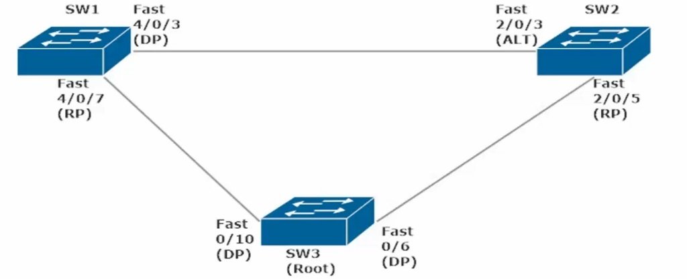

Should SW2 disable int Fa2/0/5 (currently set as Root Port going to SW3, the root bridge),

Then SW2 Fa2/0/3 (Current Role: Altn aka Alternate Current Status: BLK aka Blocking) will change its role to Root and its status will go from BLK to LIS (wait 15s) to LRN (wait 15s) finally to FWD (30 total seconds waiting).

SW2#show spanning VLAN 1

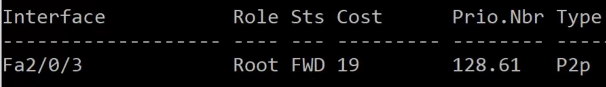

(Note: Fa2/0/3 now has the role of Root and its state changed from BLK to FWD after 30 seconds)

Now when we reenable Fa2/0/5, Fa2/0/3 switches back to Alternate/Blocking, but Fa2/0/5 needs to go from BLK to LIS to LRN to FWD (eating 30 seconds, in which time this switch SW2 has no frames being forwarded and thus no traffic can go thru the switch until the interface reaches the FWD State

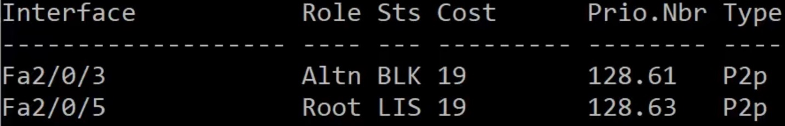

To eliminate this delay in STP Convergence we can change the Spanning-Tree mode to RSTP

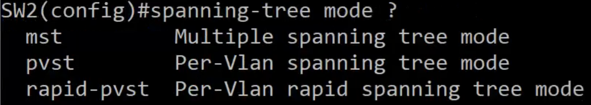

Sw2(config)#spanning-tree mode rapid-pvst

(note: Each Switch in the Spanning-Tree needs to likewise be changed to Spanning-tree mode rapid-pvst

However, a network can have some switches set to rapid-pvst and others set with IEEE pvst)

**RSTP And Multiple Trunks**

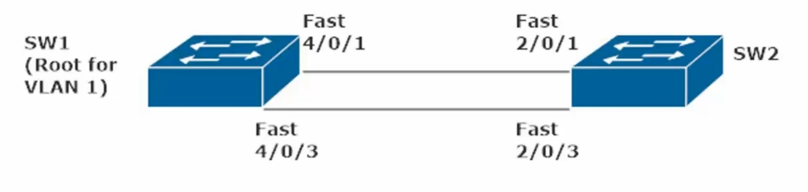

**SW2 Fa2/0/1 is set to Altn/BLK**

**SW2 Fa2/0/3 is set to Root/FWD**

**If you disable Fa2/0/3, Fa2/0/1 becomes Root/FWD instantly**

**If you reenable Fa2/0/3 with Fast-PVST enabled**

**Fa2/0/3 comes back online instantly as Root/FWD (skipping the LIS + LRN and the 15 seconds each)**

**Fa2/0/1 is instantly back to Altn\BLK**

**This example (multiple trunks) is much the same as the 3 switch example on the prior page, a port coming online as will change from BLK to FWD without first going thru LIS + LRN modes**

**Rapid-Per VLAN Spanning Tree (RPVST): Nuts and Bolts**

RSTP is defined at IEEE 802.1w, it is considered an extension of 802.1dSTP

RSTP is also referred to as 802.1q

**RSTP Port States**

***discarding*:** the initial RSTP port state, is a combination of STP port states (*disabled, blocking, listening*)

***learning:*** incoming frames that are *discarded* but the MAC addresses are still “learned” by the switch

***forwarding*:** the equivalent of STP’s forwarding state

**  
**

**RSTP Root Port Types**

In addition to the familiar root port concept, RSTP has two unique port types (<u>*Edge* + *point-to-point*</u>)

***Point-to-point Ports*** – any port running in full-duplex mode. (Any ports running half-duplex are considered shared ports and must run STP rather than RSTP)

***Edge Ports*** – a port on the edge of the network (likely to a single host). To configure a port as an RSTP Edge Port, just run Command: “spanning-tree portfast”

Edge ports play a huge part in RSTP’s determination of when a topology change has occurred.

RSTP considers a topology change to have taken place when a port moves into forwarding mode (FWD), unless that port is an edge port). RSTP will not consider that change in the network, since only a single host will be connected to that particular port.

When a *non-edge port* moves into forwarding mode, RSTP sends BDPUs out all non-edge deginated ports and the TC (Topology Change) bit is set on those BDPUs)

<table>
<colgroup>
<col style="width: 17%" />
<col style="width: 24%" />
<col style="width: 58%" />
</colgroup>
<thead>
<tr class="header">
<th>Edge Port</th>
<th>Switches to FWD state</th>
<th>No change is Topology (No TCN BDPU)</th>
</tr>
</thead>
<tbody>
<tr class="odd">
<td>Non-Edge Port</td>
<td>Switches to FWD state</td>
<td>
TC occurs, sending BDPUs out all non-edge ports and

TC bit is set on in those BDPUs (TCN BDPU sent)
</td>
</tr>
</tbody>
</table>

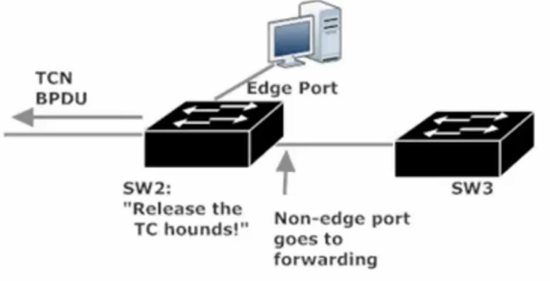

Switches that receive TCN BDPUs remove all entries from their MAC Tables except the port that received the TCN BDPU. They then forward BDPUs (with the TC Bit set) out their non-edge designated ports (DPs)

And this continues until the entire network is notified of the change.

BDPU Generation (STP vs RSTP)

STP BDPU Generation – the root bridge generates and sends BDPU every 2 seconds, non-root bridges read them and forward them.

RSTP BDPU Generation – RSTP enabled switches generate a BDPU every 2 seconds, regardless of whether they’ve received a BDPU from the root in that period of time. As such, all switches root and non root will send out a BDPU every 2 seconds (Hello Time).

The slight changes in BDPU Generation, between STP and RSTP, allows all switches to play a role in detecting link failures, meaning the discovery of those failures is faster. Every switch (RSTP enabled) expects to see a BDPU from its neighbor every two seconds. If 3 BDPUs are missed, the link is considered down. The switch then immediately ages out all information concerning the port that was receiving the BDPUs.

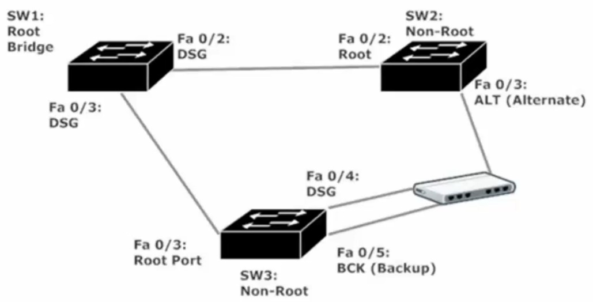

The non-switch device is a hub

SW1: Root Bridge has ports Fa0/2 + Fa03 set to Desg/FWD just like in a standard IEEE STP Config

SW2 Fa0/2 and SW3 Fa0/3 are both connected to the root bridge and are thus set to Root/FWD

SW2 Fa0/3 is set to Altn/BLK as its BID is higher than SW3 (lowest BID wins election)

SW3 Fa04 is set DSG/FWD Since this switch has a lower BID than SW2 (lowest BID wins election)

SW3 Fa0/5 is set to BCK(Backup)/BLK and is ready to become a DSG/FWD port should SW3 Fa0/4 go down. If both SW3 Fa0/4 and Fa0/5 both go down, Sw2 Fa0/3 (currently Altn) will be set to Desg/FWD.

If there were no hub between SW2 and SW3, then SW2 Fa0/3 would stay as Altn/BLK as it would still go SW3 Fa0/4 port which would likewise stay Desg/FWD

RSTP Multiple Trunks (2 Switch Topology)

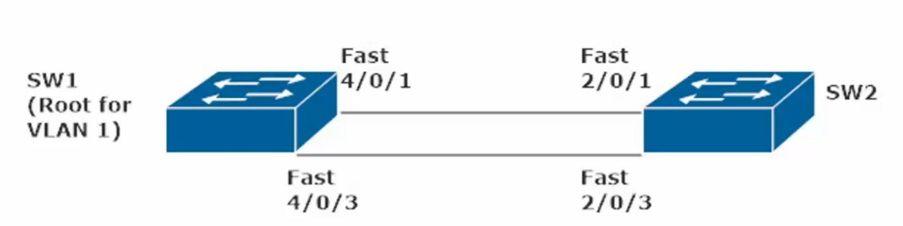

If there are two trunks, four trunks, or even 8 trunks between the 2 switches, only 1 Trunk will be used to FWD traffic. We can load balance these multiple trunks by using *Etherchannels* (ie making logical couplings of 2 to 8 trunk interfaces into one EtherChannel)

**  
**

**EtherChannels**

*EtherChannel* – a logical bundling of two to eight parallel links between two switches. This bundling of Fast Ethernet (100Mbps), Gigabit Ethernet (1000Mbps), or 10 Gig Ethernet (10G) is also called *aggregation.*

Ports inside an EtherChannel (EC) should have same speed + same duplex + same Native VLANs

EC is considered a single link by STP, regardless of how many physical links make up the EC. If one or more physical links in an EC go down, STP will give the EC a higher cost due to the lost bandwidth, but the link between switches is still considered up.

If there are two trunks, four trunks, or even 8 trunks between the 2 switches, only 1 Trunk will be used to FWD traffic. We can load balance these multiple trunks by using *Etherchannels.*

Commands to use if unknown topology and complaint of Trunk or EtherChannel not working

Sw1#show cdp neighbor

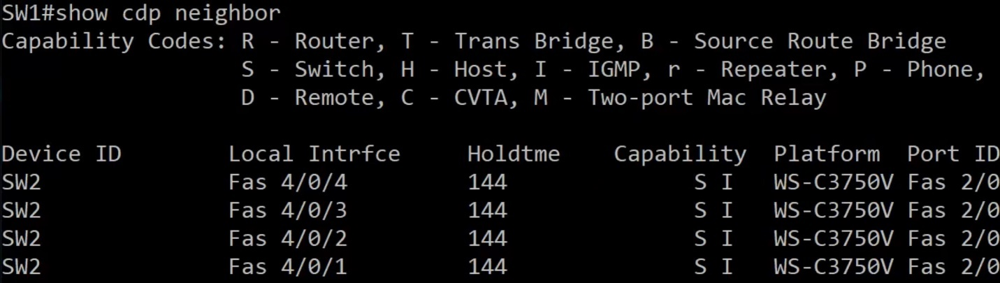

**show cdp neighbor –** shows us information about connected Cisco Devices, but does not show if these interfaces are Trunks. (port ID is the Local interface of the remote/connected Swith)

show int trunk – shows us information about trunk ports (if blank result, then there are no trunk ports)

One reason there could be no trunks set despite a cross-cable plugged between each link) is that both switches are set to dynamic auto (meaning no trunk will be set as both switches are waiting for the other interface to initiate trunking). Changing the interfaces (all 4) on one switch to dynamic desirable will cause trunking to initiate on the interfaces set to: “switchport mode dynamic desirable”

Using the interface range command allows us to set multiple interfaces at once to the same mode

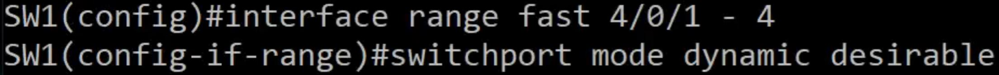

**  
**

**EtherChannel Static Build**

EtherChannel is not built until built on both sides (SW1 and SW2)

To set an EtherChannel Configure Interface Range (choice interfaces) and then type the channel-group CMD

Note: you must choose a group number between 1-48 here (48 would be lowered to 24 on a 24 port switch)

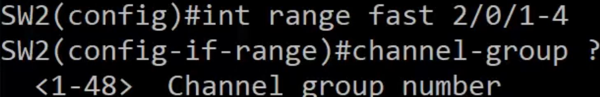

Even with a port number configured the command will still be incomplete as you need to set a mode

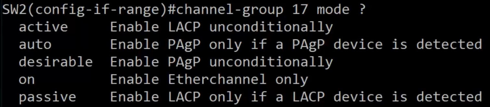

Finalize the command by adding “on” at the end

SW2(config-if-range)#channel-group 17 mode on

Run the same command on the connected switch (int range needs to be specified)

SW1(config-if-range)#channel-group 33 mode on

Note: the channel-group was set to 1 on SW2 and to 2 on SW3, the channel-group numbers do not need to match to establish an etherChannel

Use Show Spanning Vlan command to see the results of your statically configured EtherChannel

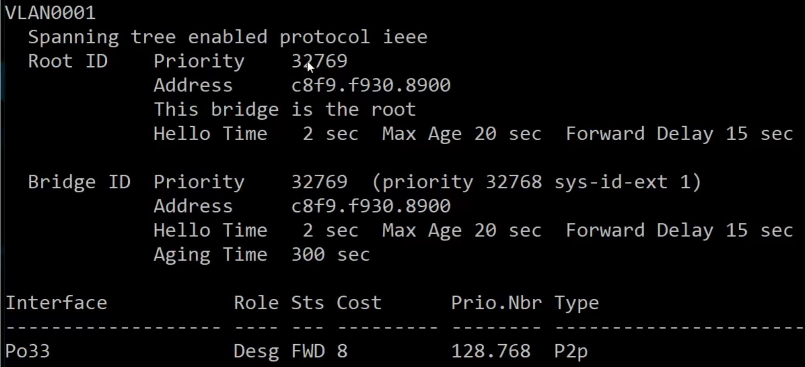

Notice that this Switch (SW1) has its interfaces listed as Po33 (aka Port-Channel 33) with a lower cost compared to an individual Fast Ethernet port (set to 19 by default). Multiple interfaces in 1 EC means a lower port cost

As this Switch is the root bridge, the EC will be set to Desg/FWD

Sw2 (the non-root bridge) will show it EC (port-channel 17) set to Root/FWD

CMD: show etherchannel detail, will show a lot of info for the indiv int making up the EC, as well as the EC itself

Important to note the age of the port in the EC in this detail, as that can tell you if a long running EC has interfaces flapping (going down and up)

**EtherChannel** – What happens if a port in the EtherChannel goes down?

EtherChannel on SW2: channel-group 17 (Po17) has four linked interfaces (int range Fa 2/0/1 – 4) Cost of 8 when all lines are up

Sw2#show spanning VLAN 1 (After Disabling 1 member of the channel-group (Fa 2/0/1)

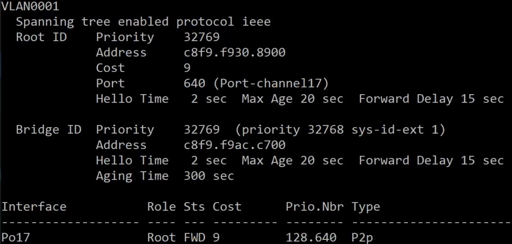

Note: IEEE PVST is the STP Type (Even though this is set to RSTP, there is no cutoff delay waiting for BLK to cycle to FWD

Also Note: the Port Cost went up by 1 (from 8 to 9)

Should we disable a second linked interface(no shut Fa 2/0/2) in the EtherChannel (channel-group) (Po17)

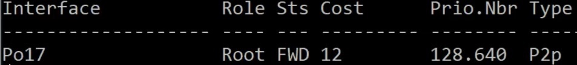

Just as before the Port Cost went up reflecting a slower link. Now only two ports make up the EtherChannel.

Removing a third port from the etherChannel will not cause the channel-group to go down, rather the Port Cost will increase to 19 (the default for a Fast Ethernet Port). EtherChannels need only one device to operate, but at least two interfaces to be made. One advantage of an etherChannel is that if any interfaces in the channel-group go down, the channel-group will stay up (redundancy) and there is no cutoff delay waiting for a link coming back online (does not need to go from BLK to Lis to LRN to FWD mode, just straight from BLK to FWD).

**  
**

**EtherChannel Negotiations**

***Link Aggregation Control Protocol*** (LACP) **–** Industry Standard Link Aggregation Protocol

- Defined in IEEE 802.1ad

- LACP assigns a priority value to each port with EC capability

- Able to assign up to 16 ports to an LACP-negotiated EC, but only 8 ports (the ports with the lowest priority value) will be part of the EC. Remaining Ports will be bundled only if one or more of the already-bundled ports fails (up to 8 hot spares/stand by ports)

***Port Aggregation Protocol*** (PAgP)

- Cisco-proprietary Link aggregation protocol

- PAgP dynamicallt changes all of the other ports in an EC when you change the properties of just one port statically (speed, duplex, etc.)

**EtherChannel / channel-group modes**

LACP and PAgP use different terminology to express the same modes.

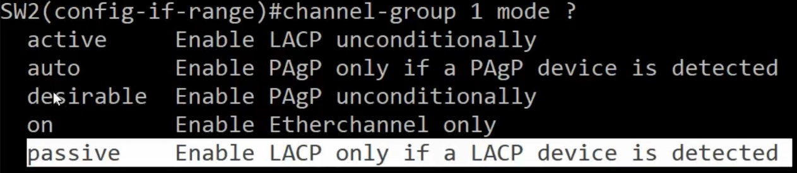

**PAgP auto** – With PAgP, a port in *Auto* mode will wait for a port on the other end of the trunk to initiate creation of a PAgP channel-group. If both ports at each endpoint are set to *auto*, a PAgP link will not initiate

**PAgP desirable –** With PAgP, a port in *desirable* mode will initiate bundling with a remote port

**LACP active – similar to PAgP desirable, active mode initiates bundling**

**LACP passive** – similar to PAgP auto, waits for port at other endpoint to initiate the creation of LACP EC. If both ports at each endpoint are set to *passive* mode, no LACP EC will form.

**Channel-group mode on –** does not specify a mode (neither LACP nor PAgP)

**Using PAgP to Build an EtherChannel**

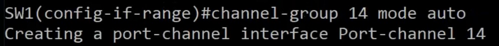 (Note Int Range is Fa 2/0/1 – 4)

The above command run on SW1, takes interfaces Fa 4/0/1 – 4 and sets them to automatically create a PAgP EC when initiate by a port on one of the would be EC’s endpoint (ie from the other switch, provided the other switch has a channel-group set to mode: desirable (PAgP desirable)

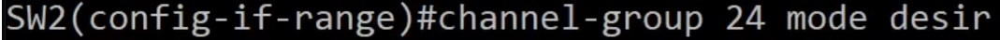

Setting the other Switch (SW2 int range fast 2/01 – 4) to PAgP desirable mode, initiates the creation of the 4 port EC, as the connected Switch (SW1) is set to PAgP auto, making it ready to join a new PAgP EC.

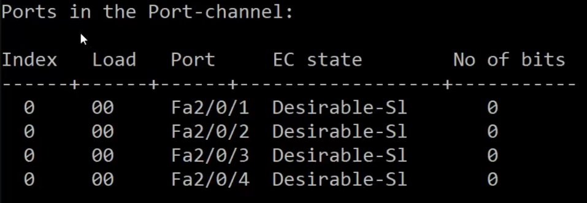 SW2#show channelgroup detail

This is neat the end of the detail results and shows each port in the EC and their EC state

**Disable PAgP EC and erase the channel group**

To disable the port channel you need to more than disable desirable mode on SW2 with CMD

SW2(config-if-range)#no channel-group 24 mode desirable

(note: the above command will cause the PAgP EC to go down but the channelgroup will still exist on SW1, to resolve this go to SW1 and run the command below)

SW2(config))#no int port-channel 24

(the above command will erase channelgroup 24 from the Switch, this is mainly a housekeeping task, so you will no longer see port-channel 24 listed as down (physically/logically) in detail and summary view)

SW1(config-if-range)#no channel-group 14 mode auto

(the above command will cause the PAgP EC to go down, but port-channel 14 will still appear in show channelgroup summary and show channelgroup detail)

SW1(config))#no int port-channel 14

(the above command will erase channelgroup 14 from the Switch, this is mainly a housekeeping task, so you will no longer see port-channel 14 listed as down (physically/logically) in detail and summary view)

**LACP Configuration**

**Note: at least one switch needs to be set to active mode to initiate creation of LACP EC, the other endpoint switch can be set to passive or active. If both endpoints are set to LACP passive mode, no EC will be made.**

**SW1(config)#int range Fa 4/0/1 – 4**

**SW1(config-if-range)#channel-group 35 mode active**

(the above command creates a LACP EC with 4 interfaces, and mode active allows this switch to initiate the creation of the EC upon finding interface(s) on an end point switch set to “channel-group mode passive” or “mode active”)

**SW2(config)#int range Fa 2/0/1 – 4**

**SW2(config-if-range)#channel-group 34 mode passive**

(the above command will now initiate the creation of a logical coupling of interfaces (aka an EC), in this case since LACP active is designated on SW1 and LACP passive is designated on SW2, the EC will be made with 4 interfaces on each switch and the EtherChannel protocol will be set to LACP)

**How to wreck an EtherChannel** – Got to know how it broke to know how to fix it

Channel-Group numbers for an EtherChannel do <u>not</u> have to match, however they also can match.

So SW1 and SW2 can have channel-group 1 on SW1 and channel-group 2 on SW2 or both switches can be set to channel-group 1

Every detail of ports on an EtherChannel <u>must</u> match (when **trunks** are involved)

- Speed and Duplex

- Allowed VLAN list and the Native VLAN

- STP port settings (port costs, etc.)

- All ports must be trunk ports with the same encapsulation (ISL or dot1q)

Items that must match when **access** ports are bundled

- All ports must be access ports

- Speed and duplex

- STP port settings (port cost, etc.)

What happens if you have all four ints on an EC for SW1 set to 10Mand all four ints on an EC for SW2 set to 100M?

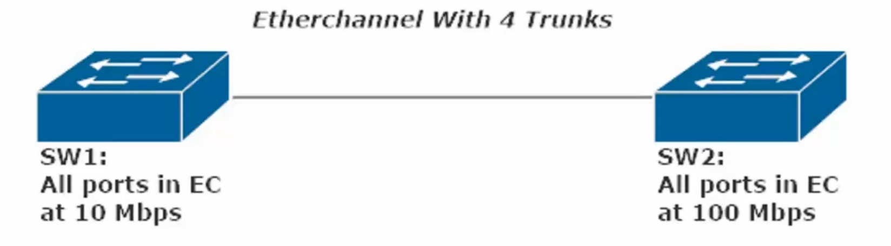

Since the EC on SW1 all have the same speed, this channel-group can bundle

Since the EC on SW2 all have the same speed, that channel-group can bundle

As such, the Channel-Group does not go down, rather it goes up at the lower of the two speeds (10Mbps)

The main affect this has is on the EC Port Cost (Higher Port Cost = Slower Link)

You can witness this by running a “show spanning Vlan 1” command on either SW1

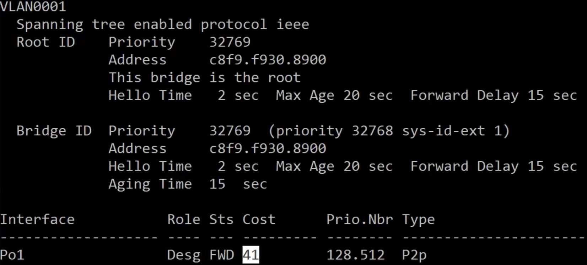

Show Spanning Vlan 1 on SW2 – Note the high Port Cost for Po1

(The Port Cost for Po1 would likely be set at 8 if both ends of the EC were at 100Mbps)
