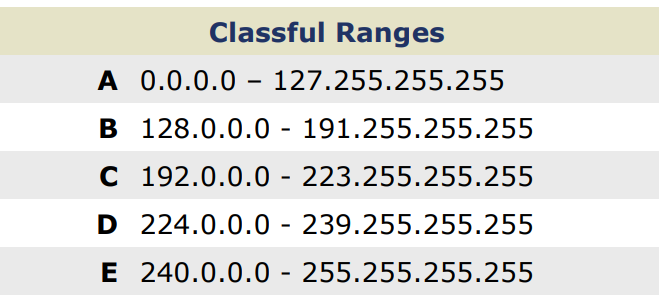
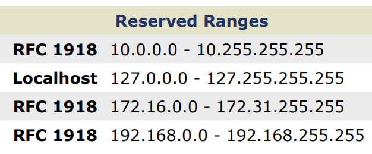
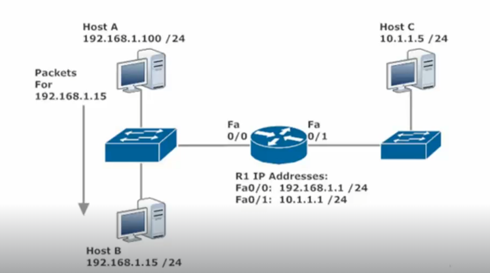

Routing – Chris Bryant Course

Loopbacks (127.x.x.x)

127.0.0.0 is reserved for host loopbacks, not for cisco router loopback interfaces.

127.0.0.1 – on windows is localhost

Class D: First octet of 224-239. Reserved for multicasting

Multicast – a multicast is traffic destined for a particular group of hosts. It’s a middle ground between unicasts and broadcasts.

Class E: First Octet 240-255. Reserved for Future Use… “experimental addresses.”

**RFC 1918 Reserved Private Address Space**

Private address space is reserved for internal networks. Not globally routable. Private address must be NATed to become a routable. NAT and/or PAT (Port Address Translation)

10.0.0.0 /8

172.16.0.0/12

192.168.0.0/16

Routing

If the destination is on the same subnet as the source, the router really doesn’t need to get involved

Here, Host A is sending packets to 192.168.1.15 /24, a host on the same subnet (192.168.1.0/24)

No routing is necessary. In effect, these packets go straight to 192.168.1.15.

