**Port Security**

Port security uses the source MAC address of incoming frames as a kind of password. A port enabled with port security will expect frames sourced from a particular MAC address or group of addresses known as *secure MAC addresses*.

If frames with non-secure source MAC addresses come in on that port, the port takes action. Ranging from shutting down to simply alerting the network admin.

In short, port security entails having the switch look at the source MAC address of an incoming frame and check if the source it trustworthy (aka named as a secure MAC address).

Show commands

R1#show port-security

R1#show port-security address - brings up the secure MAC address table

R1#show port-security interface \<fa or gi\> \#

When the setting for **Maximum Allowed** Secure Address is greater than that of number of **Statically Configured** Secured Addresses, the switch has room to learn secure addresses dynamically.

The current port is allowed one secure MAC address by default.

Since there are no statically set secure MAC addresses, the current port considers the next source MAC address it sees as a dynamically learned secure MAC address.

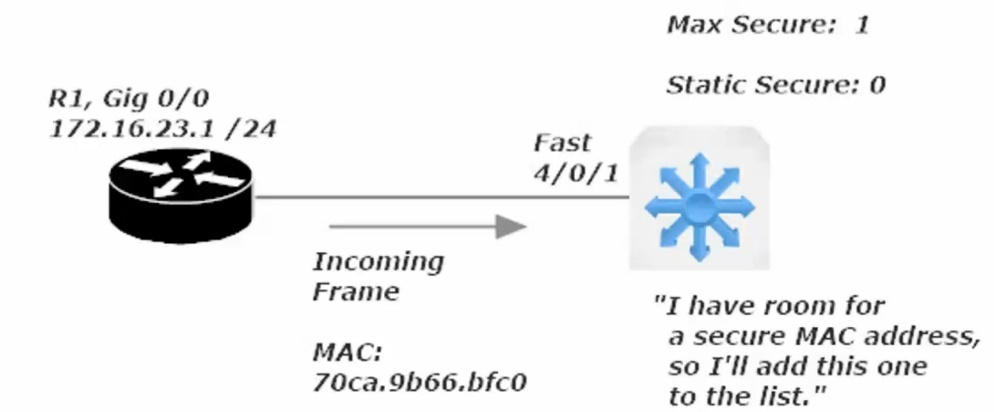

There is no limit to this scheme. If a port is allowed five secure addresses and only two secure addresses are configured, the port will consider the next three different source MAC addresses it sees as secure.

Should a port-security configuration issue put a port into err-disabled mode, it is best practice to resolve that issue before bringing the port back up (shut then no shut). This is important because the port will go back into err-disabled mode if any frames are received by that port.

Sw1(config)#

Sw1(config-if)#switchport port-security violation \<shutdown\> \<protect\> \<restrict\>

\<shutdown\> - when the violation action is configured to shutdown mode the port will go into an err-disabled state if the incoming frame’s source-mac address isn’t in the secure address table. A SNMP trap message is also generated, notifying an SNMP server on your network that this particular even has taken place.

\<protect\> - simply drops the offending frames and no other action is taken.

\<restrict\> - considered to be the middle-ground between shutdown and protect. The offending non-secure frames are dropped and an SNMP trap notification and syslog message are generated, and the port remains open.

**Port Security Aging**

Sw1(config-if)#switchport port-security aging ?

time Port-security aging time

Note that the instructor’s live switch (mine is packet tracer virtualized) had options for static and type.

Setting aging on a statically configured secure port/interface will be rarely done, but the effect is that any timer set for dynamic and static secure mac addresses reaches zero that entry will be removed from the secure mac-address table.

You can also set by type and there were two options under type on the instructor’s switch

1)  Absolute (default) – has the address removed from the secure address table absolutely

2)  Inactivity – has the address removed from the secure address table, after X number of minutes of inactivity. Denoted next to \# of minutes remaining with an (I) in the show port-security address screen

**Port Security Sticky**

Saves all configured and dynamically configured secure mac addresses even across reloads (ie rebooting the switch)

Automatically recover port from err-disabled mode

Just because you can doesn’t mean you should, at least when dealing with port-security. It may be helpful to have an interface auto-recover from an err-disabled state when dealing with other settings

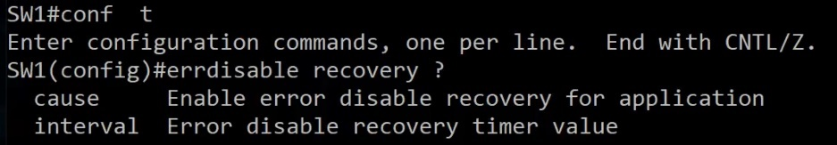

Cause: listed below

Interval: how long before

Command: show errdisabled recovery (Note: My virtual switch did not have these settings)

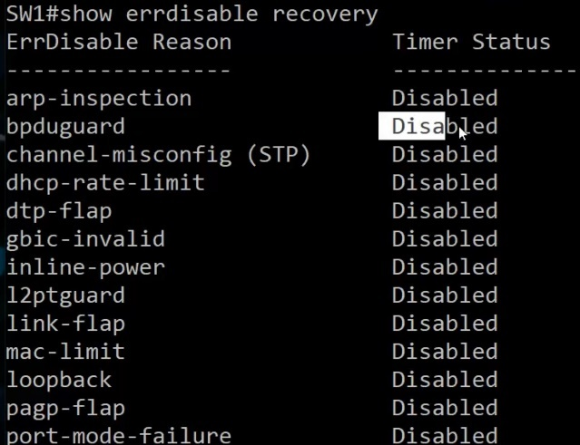

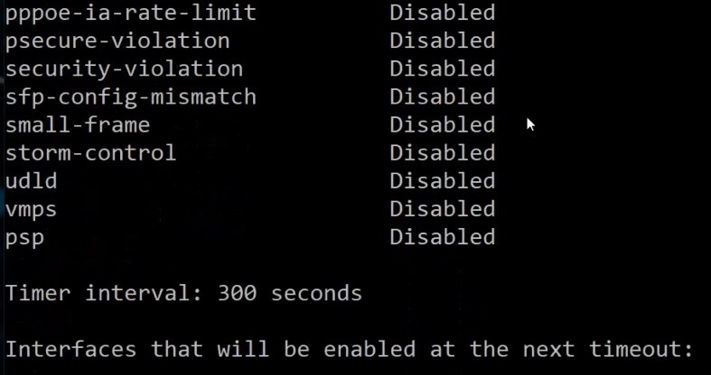

psecure-violation – would show up if a port were disabled due to a port-security shutdown response to non-secure frame

<u>RAM, ROM, Flash, and NVRAM</u> (Remember only “RAM” is volatile)

*ROM* *(Read-Only Memory)*: Stores the switch’s bootstrap startup program, operating system software, and power-on self-tests (POST). ROM content is retained on reload.

*Flash Memory*: Generally referred to as just “flash”. Stores IOS images and the vlan.dat file. Flash is erasable and reprogrammable ROM. Flash content is retained on a reload.

*RAM (Random Access Memory)*: Stores operation information such as routing and switch tables and the running configuration file. RAM contents are lost when the switch is powered down or reloaded. RAM is Volatile meaning it only stores information when it has an electric current.

*NV-RAM (Non-Volatile RAM)*: Stores the switch’s startup config file. NVRAM contents are retained on reload.

The running config is the most recent version of the config

The startup config is the most recent *saved* version of the config.

The running config is copied to the startup config with ‘wr’ command or ‘copy run start’ commend

**The Boot Process**

When a Cisco switch powers ip, it runs POST (Power-On Self-Tests). A POST is a diagnostic designed to verify the basic operation of the network interfaces, memory, and CPU. After POST tests pass…

A switch will look for a source from which to load a valid IOS image.

A router will have 3 sources from which it can load an IOS image. The sources are looked for in a specific order.

1st choice for Source of IOS Image: Flash Memory

2nd choice for Source of IOS Image: TFTP Server (must be configured on remote server)

3rd choice for Source of IOS Image: ROM (Read-Only Memory)

(Note: this order can be altered with a change to the *configuration register*.)*.* (Do not alter a configuration register setting unless you are certain of the result)

Once the IOS image is found, the router/switch will look for a valid start up configuration file.

There are two sources for the startup config.

1st source location for startup config: NVRAM

2nd source location for startup config: TFTP Server

**Setup Mode: System Configuration Dialog**

This option occurs when a new router/switch is first powered on or after factory defaults are loaded. Essentially the device cannot find a startup config file and offers to set basic parameters that cisco has programmed into this dialog.

Can also be gotten to by entering the command: "setup” from enable mode (prov exec mode).

Can be exited at any time, discarding all changes, by pressing “control + C”

**No Setup Mode: Good commands to set manually**

Switch\> User Exec Mode

Switch# enable mode: is called privileged exec mode (official name, as would show up on the exam)

Switch(config)# config mode: is called global configuration mod

from global config mode:

Sw1(config)#no ip domain-lookup

This command prevents the switch from broadcasting to (255.255.255.255) searching for host with the name you mis-entered. Disabling IP Domain-lookup will prevent you from quickly jumping between routers and switches as the instructor does, but will prevent an annoying error message from popping up whenever you enter an incorrect command (in the same pattern as a hostname)

Example of the error

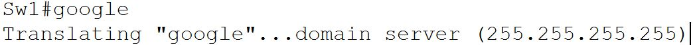

Sw1(config)#no service timestamps

Removes the date and time from syslog messages and debug messages. Can be disabled for both or one-or-the-other (log / debug)

**Enable Password vs Enable Secret**

These are two options to password protected enable mode (priv exec mode).

Secret is encrypted by default (with MD5 level encryption)

The enable password and enable secret cannot be the same.

The enable secret takes precedence over the enable password.

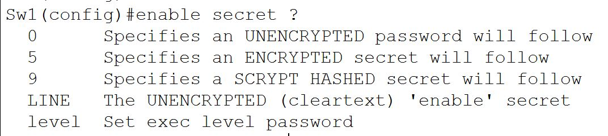

Option 5 is used by default with enable secret. The 5 stands for message-digest 5 (MD5), an encryption protocol, but it is a weak encryption method.

**Securing the Console Port**

Sw1#conf t

Sw1(config)#line con 0  
Sw1(config-line)#enable password or secret LINE

This sets a user access verification prompt when you first connect to the switch and will then take you to user exec mode. To jump past user-exec mode and go straight to priv exec mode enter this command at the config-line prompt:

Sw1(config)#line con 0  
Sw1(config-line)#privilege level 15 (can be set 0-15) (0 is the lowest and 15 the highest)

**Securing the Console Port continued**

The issue with just setting an enable password/secret on the console port is that any person with that password will have access and there will be record of who entered the password (which user) meaning there is no accountability

Sw1(config)#username LINE password LINE (where LINE is the username / password respectively)

This only makes the user and sets a pass for the user, you need to choose where to enable this option

To enable for the Console port set this command:

Sw1(config)#line con 0  
Sw1(config-line)#login local (local refers to the local database of users and user passwords)

Note: when setting the console port to *login local* the previous password and privilege level you set for *line con 0* will no longer be used, and proper housekeeping dictates that we remove the password and privilege level.

When you choose to include a privilege level as part of the username/password database, you must indicate the privilege level after the username but before the password in the same command.

Sw1(config)#username LINE *privilege level 15* password LINE

With the config set above the user set will be able to login from the user access verification prompt and jump directly to privilege exec mode (enable mode)

**Telnet**

By default a Switch has one SVI (switched vlan interface) set by default (VLAN 1)

(Note: two rules for an SVI to be up/up. 1 there needs to be at least one interface set to that SVI and the interface needs to be up/up)

Telnet runs on TCP port 23

If you are able to ping to remote device you aim to connect to logically via telnet, and have set the telnet password and the transport input protocol correctly on your vty lines, it is possible that telnet (TCP 23) is being blocked by an ACL (set with sequencing).

**SSH (Secure Shell)**

Both the password and data are encrypted. Defeats man-in-the-middle attacks.

SSH runs on TCP port 22

Configuration required to setup SSH is more than the config needed for Telnet

Step 1: Define the Device hostname

Step 2: Run the command *ip domain-name* and name the domain

Step 3: Encrypt using the command *crypto key generate rsa* (then follow the on-screen commands)

Note: key size needs to be greater than 768 for SSHv2. You will want to run v2 whenever possible as it is far more secure.

Sw1(config)#ip ssh version 2

Please create RSA keys (of at least 768 bits size) to enable SSH v2.

To delete SSH keys

Sw1(config)#crypto key zeroize rsa

To force SSHv2 (first be sure the RSA key is set to 768 or higher)

Sw1(config)#ip ssh version 2

**Telnet vs SSH**

Telnet allows the use of a single password with no username on the VTY lines for authentication.

SSH requires a username and password, set via remote auth server or a local database (*login local*)

16 VTY lines on a Switch (0 15) and 5 VTY lines on a router (0 4)

**VPNs (Virtual Private Networks)**

VPNs creates an encrypted private tunnel across a shared channel**.** IPSec protects data origin authenticity, data integrity, data confidentiality.

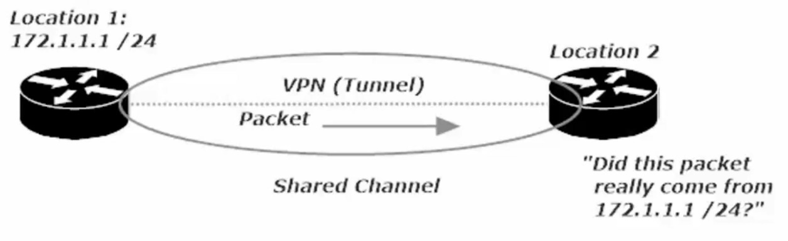

***Data Origin Authentication*** – allows the recipient to guarantee the source of the packet

***Data Confidentiality*** - encryption makes the contents of packets unreadable during transmission; even if someone intercepts them.

***Data Integrity*** – refers to the ability of a recipient to ensure that the contents on an incoming packet were not tampered with during transmission.

***Replay Protection*** - prevents an attacker from capturing packets and then attempting to use those same packets later to bypass IPSec.

**VPN Creation Checklist (Configuration and phases of the VPN auto-build)**

1.  **Process Initialization:** We don’t want just any traffic triggering a VPN build, so we **use a *crypto access list* to define *interesting traffic***, the traffic that will actually signal to the VPN device that its time to get to work. We **use an ACL to identify traffic that should be sent over the VPN.**

2.  **IKE Phase 1:** This phase uses the <u>Diffie-Hellman key exchange algorith</u>m to **generate the shared secret key** that will be used to <u>create a secure and authenticated channel</u>.

This is where **the *Internet Key Exchange Association*** is negotiated. (Thankfully, we’ll call it IKE SA from here on out.) When IKE Phase 1 is successful, the result is one bidirectional IKE SA.

3.  **IKE Phase 2:** There’s a negotiation here as well, but in Phase 2, we’re using the secure channel constructed in Phase 1 to negotiate the IPSec Security Association (IPSec SA).

When Phase 2 is successful, the <u>result is two unidirectional IPSEC SAs</u>.

4.  **Data Transfer:** The data is transferred. Duh.

5.  **Tunnel Termination:** Once the data is sent and the tunnel is no longer needed, we don’t want extra overhead to be used keeping the tunnel up. We can configure the tunnel to be torn down after a certain amount of data has gone through, or once the tunnel has been idle for a given amount of time, among other options. (Usually set to idle time)

**IPSec**

IPSec uses two distinct protocols:

**Authentication Header (AH)** and **Encapsulating Security Payload (ESP),** which are defined by the IETF.

**AH**: Only offers **a*uthentication*** (data integrity, data origin authentication, and optional replay protection).

- Data integrity is ensured by using a message digest algorithm (HMAC-MD5 / HMAC-SHA)

  - Hash Based Message Digest (HMAC)

    - provides data integrity

    - The sender creates a hash value from the data being sent using a symmetric key

    - The hash is appended to the data

    - receiver hashes the data with the same shared key

    - if the hashes match, the data has not been altered in transit.

- Data origin authentication is ensured by using a shared secret key to create the message digest

- Replay protection is provided by using a sequence number field within the AH header.

- <u>**AH**-style authentication</u> **authenticates the entire IP packet**

- AH authenticates IP headers and their payloads.

**ESP**: ***Data confidentiality*** (encryption) and ***authentication*** (data integrity, data origin authentication, and replay protection)

- ESP can be used with confidentiality only, authentication only, or both

- Authentication functions use the same algorithms as AH, but the coverage is different

- <u>**ESP** authentication mechanism</u> **authenticates only the IP datagram portion of the IP packet**

**  
**

**Building a site-to-site VPN**

**Step 1: Writing the ISAKMP Policy**

In our Lab we will be using a 3-router frame-relay setup and the site to site VPN will be configured with these parameters:

- Authentication: Pre-shared key

- Encryption: 3DES

- Diffie-Hellman Group: 14 (Note: my virtual router only had 1 2 5 as options and I used 5)

- Hash: SHA

- Lifetime: 24 hours (86400 Seconds)

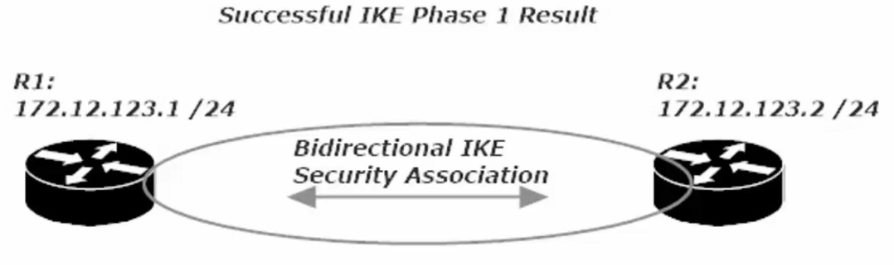

To configure an ISAKMP policy you need to get into ISAKMP config mode

R1(config)#crypto isakmp policy \<#\> (# is the policy priority value, lower numbers have higher priority)

R1(config)#crypto isakmp policy 100

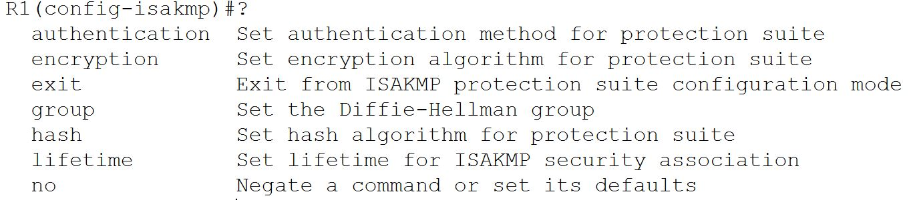

As we see above, we will need to set parameters for each config (auth, encrypt, group, hash, and lifetime)

**Encryption**

- DES: uses less router resources, but it’s the least secure method. It doesn’t deliver strong data confidentiality. Cisco recommends you avoid its use.

- 3DES (Triple DES): Similar to DES in operation, but each block of data is processed 3x rather than 1x. 3DES is a legacy algorithm and had adequate strength encryption.

- AES (Advanced Encryption Standard): Much stronger overall security. Recommended

All three of these are *symmetric encryption algorithms*, since they yse a single key that performs both encryption and decryption.

*Asymmetric encryption algorithms*: use two keys, a public key and a private key.

The public is used for encryption, the private key for decryption.

Authentication: Pre-shared key

Encryption: 3DES (used just for the lab, use AES or better in a production environment)

Group: Diffie-Hellman Groups – 1 2 and 5 are all considered to be insecure and are not recommended. My router only had these options, and I used 5 as it had the longest bit length (1536 bit)

Hash: Use SHA (Secure Hash Algorithm)

Lifetime (in seconds): Note this is in seconds, 24 hours = 86400 seconds

<u>Phase 1: IKE Match</u>

- R1 has is ISAKMP policy set and R2 will look among its ISAKMP policies for a match,

starting with the lowest number policy (priority policy number)

- If the lowest number policy does not match, the next lowest numbered policy is checked.

- If a match is found, then we proceed to Phase 2

**Step 2: Configuring IPSec Transform Sets**

*Transform set*: defines both encryption and authentication for any IPSec-protected traffic, using the following

- At least one of the two IPSec security protocols AH (Authentication Header or ESP (Encapsulating Security Payload). You can use AH or ESP or both

- The algorithm to be used by AH and/or ESP.

**Command to Configure IPSec Transform Set:**

R1(config)#crypto ipsec transform-set CCNA esp-3des esp-sha-hmac

(once configured on R1, move to R2 and configure in the same way)

R2(config)#crypto ipsec transform-set CCNA esp-3des esp-sha-hmac

When Phase 2 is successful, the result is two unidirectional IPSEC SAs. Leading to phase 3

**<u>  
</u>**

**Phase 3: Int Traffic and Keys**

Authentication – Configuring the Pre-shared Key

R1(config)#crypto isakmp key LINE address A.B.C.D (LINE = cleartext pass) (A.B.C.D = ip address of remote VPN partner)

R1(config)#crypto isakmp key CCNA address 172.12.123.2

(Note: instructors router allowed him to place a 0 or 6 before the passcode \| 0 – cleartext , 6 – encrypted)

**Step 3: Creating Interesting Traffic to initiate the tunnel build process**

*Int Traffic* – aka interesting traffic. We have to define the traffic that initializes the build process, otherwise we won’t build the VPN tunnel.

The *crypto access-list* is used to identify interesting traffic. Int traffic is the traffic that puts the entire VPN build operation into action.

*Cypto Access-list* (crypto ACL) – is simply an extended ACL, but not for the permit / block traffic functions.

In a crypto map, the function depends on whether the ACL is applied to outbound or inbound traffic.

- Outbound: an ACL ***permit*** indicates traffic that will be protected by IPSec.

> an ALC ***deny*** indicates traffic that will not get such protection,
>
> but will still be transmitted.

- Inbound: an ACL ***permit*** <u>allows</u> traffic that **is** IPSec protected,

> <u>denies</u> it if it **is not** IPSec Protected

You will not be indicating *in* or *out* when you apply a Crypto ACL (as would be the case with regular ACLs)

When an extended ACL is used as a *Crypto ACL*

- Outbound Traffic reads the ACL forwards (left to right)

- Inbound Traffic reads the ACL Backwards (right to left)

<u>Example</u>

(Outbound = ACL read \>\>\>) (Outbound *Permit* = IPSec protection \| Outbound *Deny* = no IPSec protection)

R1(Config)#access-list 102 permit ip host 172.12.123.1 host 172.12.123.2

Forwards the ACL read: ACL \# 102: allow traffic from source host R1 when destination is host R2

Host indicates that this is a single host only.

(Inbound = ACL read \<\<\<) (Inbound traffic must be IPSec-protected or it is dropped)

R1(Config)#access-list 102 permit ip host 172.12.123.1 host 172.12.123.2

Backwards the ACL read: ACL \# 102: allow traffic from source R2 to destination R1

**Warning**: Using *permit host* in your crypto ACL is fine, but it’s not a good idea to use *permit any*,

> especially *permit any* for Source and Destination.

Two bad things occur:

1.  Outbound: Way too much traffic has to be encrypted at the source and decrypted at the destination.

2.  Inbound: Incoming control traffic, protocol keepalives, etc. may arrive unencrypted and as a result be dropped, which leads to lost adjacencies and other issues.

**Crypto Map Writing and Application**

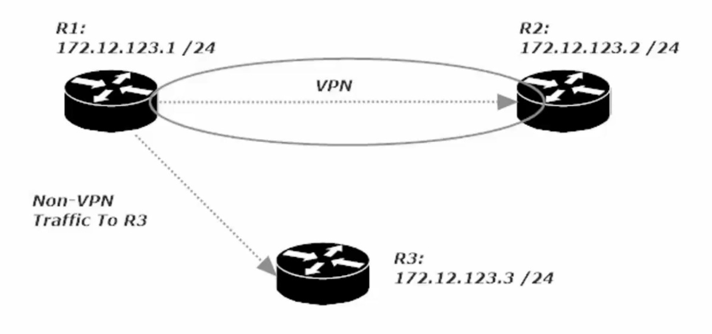

This is a diagram of the configuration we are in the middle of configuring.

R1 to R2 with a VPN

R1 to R3 – no vpn

R2 to R3 – no vpn

<u>Commands used for to write *crypto ACL*</u>

R1(config)#access-list 102 permit ip host 172.12.123.1 host 172.12.123.2

Now complete a similar crypto ACL on Router 2 swapping the Source and Destination

R2(config)#access-list 102 permit IP hist 172.12.123.2 host 172.12.123.1

Commands used to write *crypto map*

R1(config)#crypto map CCNA 100 ipsec-isakmp

% NOTE: This new crypto map will remain disabled until a peer

and a valid access list have been configured.

Note this command created a new crypto map named CCNA with a seq \# of 100 and using ipsec-isakmp policy

We will now have to **match** (values) and **set** (values for encryption/decryption)

R1(config-crypto-map)#match address \<ip access-list \#\> \<standard or expanded\> \<WORD – ACL name\>

Notice that the access-lists available are only extended-ACLs, as crypto ACLs cant be written using a standard ACL

Command to enter for the Lab

R1(config-crypto-map)#match address 102

(this indicates that if there is a match for crypto ACL \# 102, then certain things will be set.

We ***set*** the *peer* (VPN partner router, R2’s IP add) and the *transform-* (

R1(config-crypto-map)#set peer 172.12.123.2 \<only option is A.B.C.D/ip address or WORD/host name of the peer\>

R1(config-crpyto-map)#set transform-set \<WORD – proposal tag, aka the transform-set we named CCNA in phase 2

Now we need to set the crypto map to the interface that is hosting the VPN connection, in my case se 0/1/0

R1(config)#int s0/1/0

R1(config-if)#crypto map CCNA

CRYPTO-6-ISAKMP_ON_OFF: ISAKMP is ON (notice this message pops up)

<u>Now configure Router 2 in the same way except name R1 as its peer</u>

Write the Crypto Map, configure (match and set (peer and transform-set)) and then apply to interface

R2(config)#crypto map CCNA 100 ipsec-isakmp

R2(config-crypto-map)#match address 102

R2(config-crypto-map)#set peer 172.12.123.1

R2(config-crypto-map)#set transform-set CCNA

R2(config..)#int Se 0/1/0

R2(config-if)#crypto map CCNA

CRYPTO-6-ISAKMP_ON_OFF: ISAKMP is ON

Now when any traffic even a ping is sent from R1 to R2 or vic versa, the VPN tunnel will be created and will live for 24hours based on this config. If we choose a different config (such as idle time) the tunnel would go down after x number of seconds of idle time

**Firewalls: an Introduction**

Firewalls bring additional security to a network by monitoring incoming and outgoing flows of traffic in accordance with the rules configured on the firewall.

Many firewall security features depend on the configuration of zones, where certain data sources are more (or less!) trusted than other sources. Data sources under our control are more trustworthy than data sources not under our control.

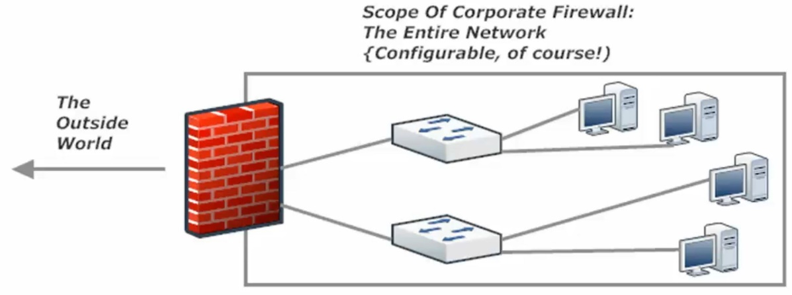

Above: is a visualization of a hardware based network firewall, Configured at the Edge of the Network, just before access to the internet

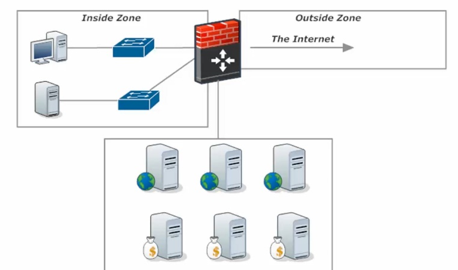

Left: is a visualization of a firewall with one zone, ‘inside zone’ being firewalled and another ‘DMZ section’ being wide open (all ports open) to the ‘outside zone’.

DMZ

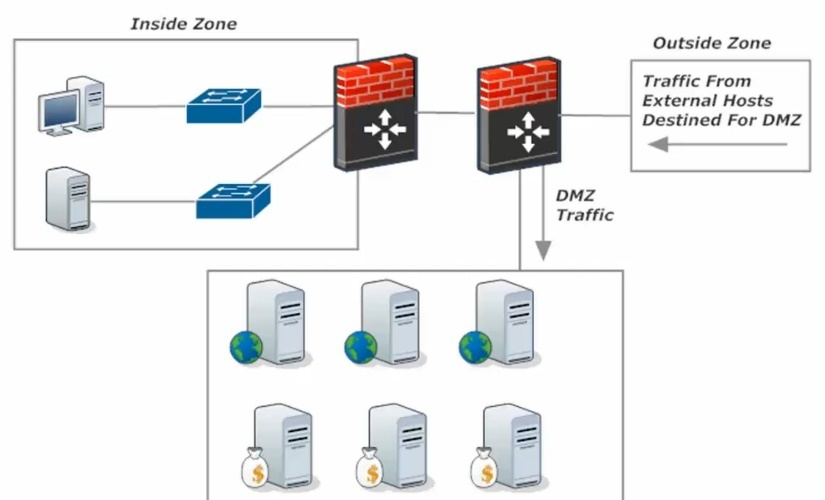

Dual Firewall Approach:

Outside traffic comes through the first filewall that determines whether it goes to the DMZ or if it continues to the second firewall that is configured to protect the inside zone only.

DMZ

*Next-Generation Firewalls* – combines a traditional firewall with other networking device(s) with filtering function such as an IDS or IPS (Intrusion Detection System \| Intrusion Prevention System).

The goal of the NG-Firewall is to include more layers of the OSI model, improving filtering of network traffic that is dependent on the packet contents.

*IDS* (Intrusion Detection System): analyzes traffic looking for signs of intrusion, but only alerts and logs, and takes no action on its own (like an IPS). One method of putting an IDS into your network is to mirror all traffic to the IDS device. This is not a good setup as by the time the IDS recognizes and alerts network admins, the malicious traffic has already gone through and entered the network.

*IPS* (Intrusion Protection System): analyzes traffic patterns long for known patterns of attack, by comparing packet values to its database of signatures (exploit signatures). Generally sits between the firewall and the internal network, or is part of a NG-firewall.

The IPS can be configured to take several actions at the sign of malicious traffic:

- Alert the network admin (like an IDS)

- Have the packets mirrored to a separation device or application to further examine the suspected traffic separate from normal traffic.

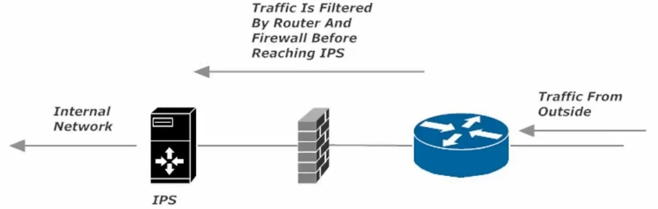

IPS Diagram:
