**Spanning Tree Protocol (STP)**

Basic purpose is to create valid (loop free) paths and to prevent switching loops (aka bridging loops) while still allowing for redundancy to avoid a single-point-of failure potential.

single-point-of failure – a point in the network, where if one host, switch, router, or service goes down the whole network will fail.

Loop Free Network is handled by putting ports in the most desirable path in to FWD mode, and putting ports in the less desirable paths into BLK Mode.

**STP Convergence occurs when every port on every switch is put into FWD or BLK states, leaving only one path between any two points, the ports set to BLK state are given an Alternate Designation (Altn Mode), while ports in a FWD state continue to forward BDPUs and frames. With only one path between any two points, a switching loop cannot occur.**

**Layer 2 Redundancy vs Layer 3 Redundancy**

- Intermediate modes between blocking and forwarding (**BLK to LIS to LRN to FWD**) (30 seconds)

- Redundant paths may be identified, block ports to unfavorable (slower path)

- *Port cost* – a value to indicate which port is faster (say 10 vs 100 vs 1000 Mbps); Default Value of 19 for Fast ethernet)

Every path to every port in the network is identified and set to either FWD or BLK modes (Forwarding mode and Blocking mode)

*State of convergence:* All switches agree on the bests and all ports will be in forwarding or blocking. At which point a switching loop cannot occur on layer 2

Unstable MAC table –

- some or all frames may not make it to their destination

- Causes unnecessary frame flooding

- Larger and larger chance of a broadcast storm

- Why not use all switching paths?

When a switch is first turned on it believes that it is the root bridge for every VLAN on the network. As such, a selection process is needed to determine the true root bridge for each VLAN (These selections are called an <u>election</u>) You elect which switch is the root bridge for a VLAN. The election process is carried out via the exchange of Bridge Protocol Data Units (BPDUs)

**  
**

**Bridge Protocol Data Units (BPDUs)**

Two major types of BPDUs

**Configuration BPDU** – Called Hello BPDUs, The root bridge (aka root switch) will originate these config/hello BPDUs; the non-root switches will receive and forward a copy of them, but will not create them. The root bridge is the switch that will set STP timers, this occurs after we have an election.

These Config BPDUs are multicast to MAC address 01:00:0C:CC:CC:CD

**Topology Configuration Notification BPDUs (TCN BPDUs)** – Tells switches a change has occurred (updates state of STP )

TCN BPDUs are sent by bridges towards the root bridge out of its root port

**Acknowledgement BPDU** – Used to confirm receipt of a topology change in a notification.

Each bridge between the bridge that sent the initial TCN and the root bridge, will send a TCA BPDU back to the previous bridge acknowledging TCN reception and then will generate a new TCN BPDU on its root port upstream to the root bridge

**Bridge ID (BIDs) –** each switch will be assigned a BID. The BID is a combination of a 2 byte (priority value) and the switch’s 6-byte (6 octets) (6 x 8 = 48bit) mac address. Default priority value is 32768.

Example of BID with Default Priority value – 32768:11-22-33-44-55-66

If the priority value is left at default on all switches, then the **<u>switch with the lowest MAC address wins the root bridge election</u>** and becomes the default bridge.

Mac address hex values (01 is lower than AA is lower than BA is lower than FF)

Ensure that your primary and secondary root bridges are your most powerful switches!

**<u>lowest MAC address wins the root bridge election -when priority is the same</u>**

**The switch with the lowest BID becomes the Root Bridge**

**BID = (Priority Value \| 2 bytes \| default of 32768: MAC Address (6 bytes)**

**If BID has equal priority than lowest MAC wins**

**Root Bridge Election process** – each switch reads the root bridge BID information from incoming BPDUs and compares that BID against their own. If the incoming root bridge BID is lower than that of the receiving switch, the receiving switches realizes that the switch that sent the bid is actually the root bridge, and forwards the BPDU to let other switches know about it. The arriving BPDU is a superior BPDU, has a lower BID than the current switch and is forwarded on .

***Superior BPDU*** - shows a lower BID – either a lower ‘priority value’ or an equal priority value but a lower MAC. Superior BDPUs inform the switch that the sender is the Root Bridge and forwards the BDPU to other switch

***Inferior BPDU*** – is one that will not overrule the root bridge election, i.e. it is from a switch with a higher BID (priority value or MAC is higher than the root)

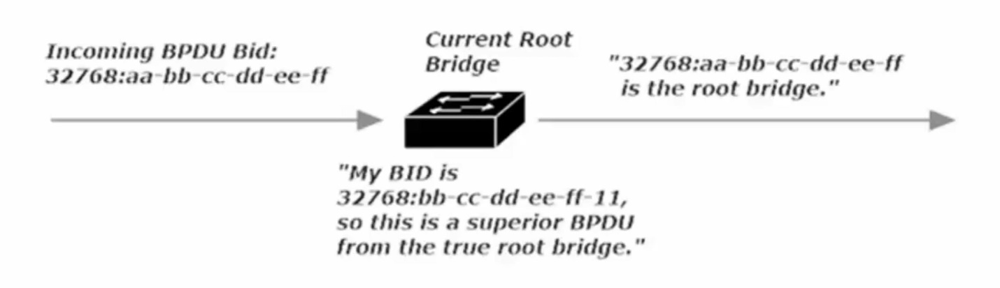

The process of sending BPDUs and comparing BIDs continues until every BID has been compared between all switches.

Through the BPDU elections process, a *root bridge* and a *secondary root bridge* will have been identified. (These should be your two most powerful switches. If the two most powerful switches are not set to root and secondary root, change their BID priority value, so they will win the election process.)

**STP Convergence** has occurred <u>when this BPDU election has concluded</u> and <u>every involved port on every switch is in forwarding mode or blocking mode</u>.

All switches in the network agree on which switch is the root bridge, all ports involved in the STP are set to forwarding or blocking mode.

Switches do not change the STP Port state from Forwarding directly to Blocking in standard STP, rather there are intermediate states. This is because changing directly could cause a switching loop

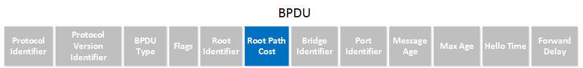

**STP Port States**

**Disabled** (abbr DIS) – the port has been administratively shut down. Abbreviated DIS – you will not see this notation under a *show Spanning VLAN* command. A disabled port is not forwarding frames or even officially running STP.

**Blocking** (abbr BLK) – A blocking **port <u>cannot receive frames</u>** and therefore wont dynamically learn MAC addresses. A BLK port will still accept BPDUs from neighboring switches, allowing the port to participate in the root bridge election. When STP brings a port out of BLK mode it goes into an intermediate mode known as listening mode.

**Listening** (abbr LIS) – intermediate STP port state listening for BPDUs. Listening mode can listen for and forward BPDUs, allowing the port to participate in the root bridge election. **Cannot forward or receive frames**, thus cannot learn MAC addresses. BDPU– Receive+Forward \| Frames – None Received

**Learning** (abbr LRN) – Learning mode can listen for and forward BPDUs. **Receives Frames** (thus MAC Addresses) **and while it does <u>not</u> forward frames**, LRN mode **can still learn MAC addresses** and add them to the switch’s MAC address Table. BDPU – Receive+Forward \| **Frames – Receive only, Does NOT forward**

**Forwarding** (abbr FWD) – Allows port to send and receive frames, send and receive BPDUs, and continue to learn MAC address. <u>Only STP port state that actually forwards frames</u>, thus the FWD.

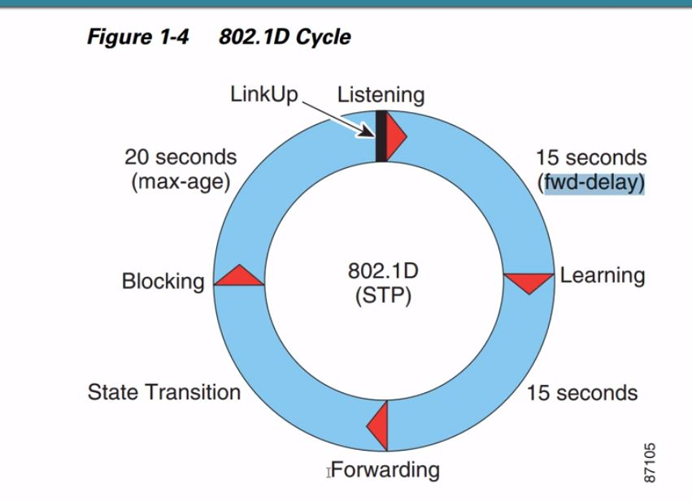

**Root Bridge Election Walkthrough**

Note: Root Bridge Election is an ongoing process, always comparing Bridge Protocol Data Units (BPDUs).

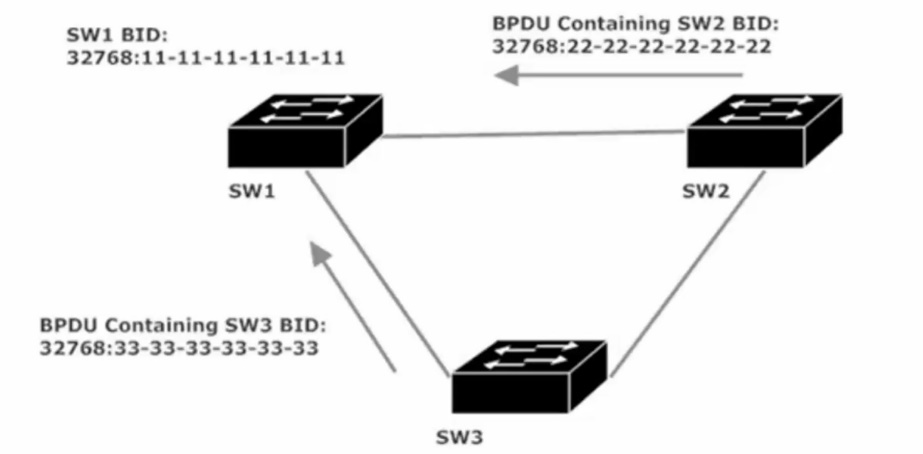

SW1 receives BPDUs from SW2 and SW3 and sees that BIDs from both Switches have inferior BPDUs

Next SW2 will get BPDUs from SW1 and SW3.

SW1 has a lower BID and thus a superior BPDU,

SW3 has a higher BID thus an inferior BPDU.

Lastly SW3 will compare BIDs with SW1 and SW2. SW1 has lower BID than SW3 thus SW1 has a superior BPDU. SW3 compare BIDS with SW2 and sees that SW2 also has a lower BID than SW3 and thus it has received a superior BPDU. i.e. SW3 receives two superior BPDUs.

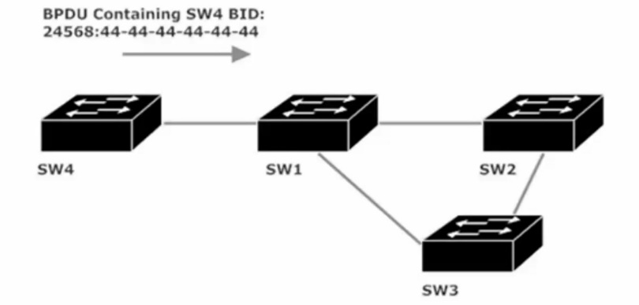SW4 gets added to the mix and while it has a higher MAC Address the two-byte priority value is lower, thus it is sending superior BPDUs has a lower BID and becomes the root bridge in this example. SW1 then forwards SW4’s Superior BPDU and the election process continues.

The above examples took you through a walkthrough of 3 switches coming on at once and completing the root bridge election. It is important to be able to tell which switch is the root bridge on an already running network.

**  
**

**Identifying Root Bridge in IOS (4 methods)**

Command to make in Enable mode (priv exec mode):

SW1#show spanning vlan 1

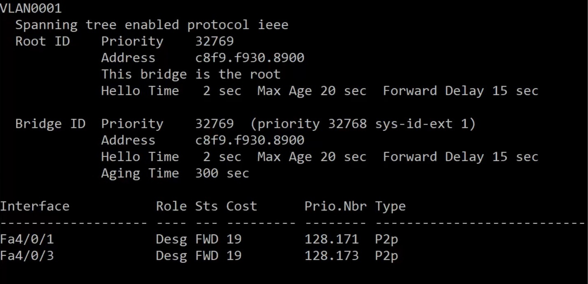

1\. Easiest way to identify is “This bridge is the root” note under root ID

2\. If the MAC Address match for Root ID and Bridge ID, then you are on the root bridge

> Root ID – – this information pertains to the root bridge
>
> Bridge ID – this information pertains to the switch that you are actually on

3\. Under Interface Section.

- No such thing as a root port on the root bridge.

- Every non-root port needs a root port (indicated under interface/role as Root), but since the root bridge is it’s the root bridge it doesn’t need a root port to reach itself.

Fa4/0/1 Role: Desg Sts: FWD

Fa4/0/3 Role: Desg Sts: FWD

4\. Root bridge <u>will not have any blocked ports</u> under interface/status.

**  
**

**SW2#show spanning vlan 1**

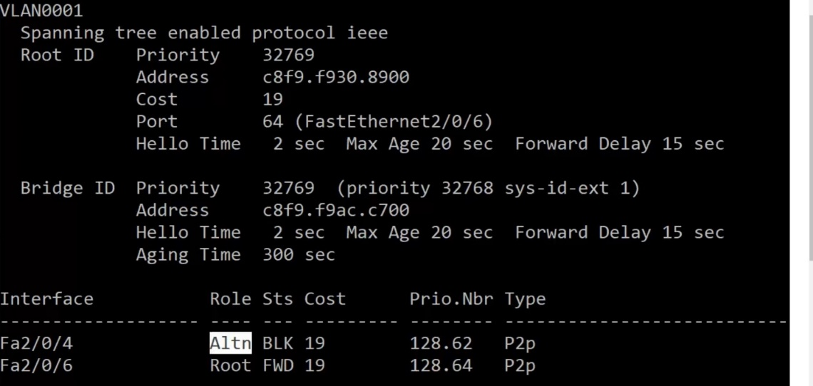

**Four methods to show this is not the root bridge**

1.  Does not state “This bridge is the root”

2.  MAC addresses do not match under Root ID and Bridge ID

3.  One of the Interface Roles are set to root. Meaning that interface directly connects to the root bridge

4.  The interfaces status is Blocked (Sts: BLK) for one of the interfaces. Root port status(es) will always be set to FWD (Forwarding

Note: Interface Role (**Altn**) stands for **Alternate**. This port would be the root port back to the root bridge should the other interface or switch its connected to (which is currently the root bridge) go down<u>. Eliminates a single-point-of-failu</u>re (key purpose to STP)

**STP Timers** (value of the timers are highly efficient allowing a STP to perform its job with minimal delay while preventing switching loop formation during port status transitions. Do not change values without having good reason to do so. Any changes to default STP timers will only have an effect if made from the root bridge.

**Hello Time –** defines how often the root bridge originates BPDUs (Default is 2 Seconds)

**Forward Delay –** the length of the listening and learning states (Default is 15 Seconds for each individual stage. Setting Time be the same length of time for both listening and learning, cannot make the states have different delay periods).

**Maximum Age (Max Age)** – is how long a switch will retain the superior BPDU’s contents before discarding it. \*Default setting: 20 seconds)

**Port Cost and Root Cost**

**Port Cost** – Every STP-enabled port has an assigned *port cost* and that cost is used to arrive at the switches *root cost*. The port cost is strictly a local value and is not advertised to upstream or downstream switches**. The faster the port, the lower the port cost.**

default of 19 for fast ethernet ports/interfaces

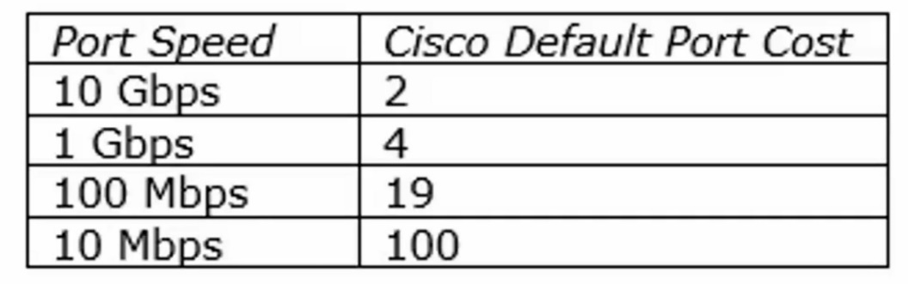

Value is found under Spanning VLAN info \> Interfaces \> Cost

**Root Cost** – is a cumulative value reflecting the overall cost for a given switch to reach the root. The configuration BPDU carries the root cost, and that cost increments as that BPDU is forwarded throughout the network

Sw1#show spanning vlan 1 root

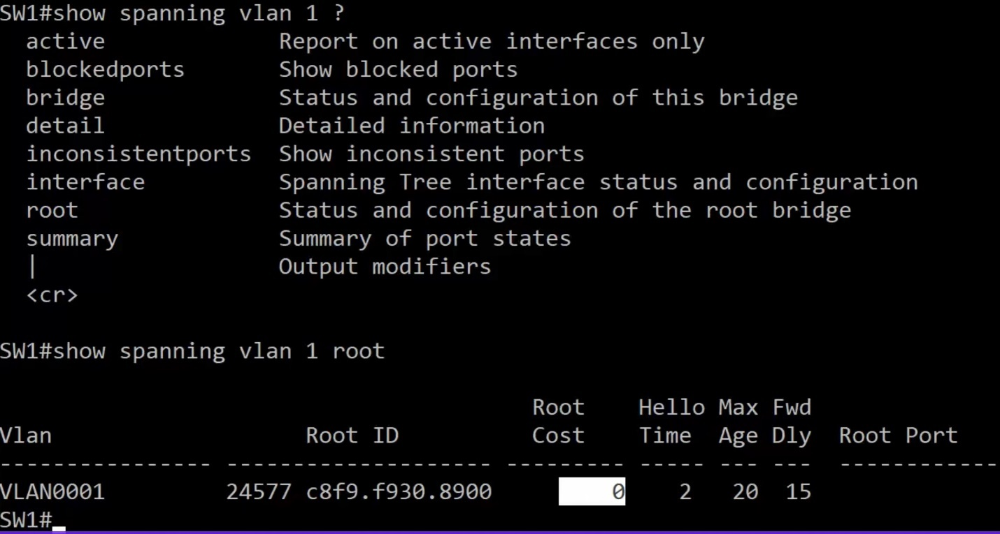

Root cost value is 0 on the root bridge (See above)

Determining Root Cost / Path Cost

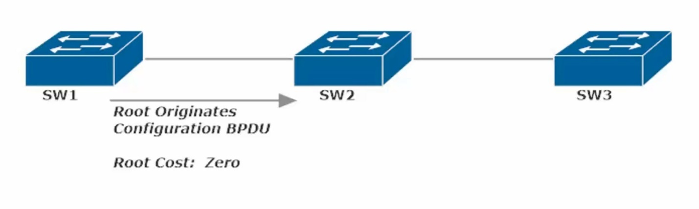

Root cost value is 0 on the root bridge

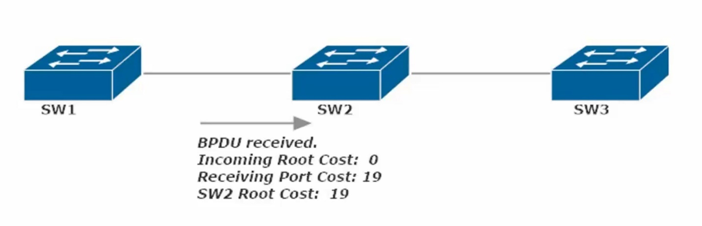

**Root cost is calculated by adding the Incoming Root Cost from the incoming BPDU to the Receiving Port cost of the Switch**.

**Value is incremented from when the BPDU <u>enters the switch</u>, not when it leaves (is forwarded)**

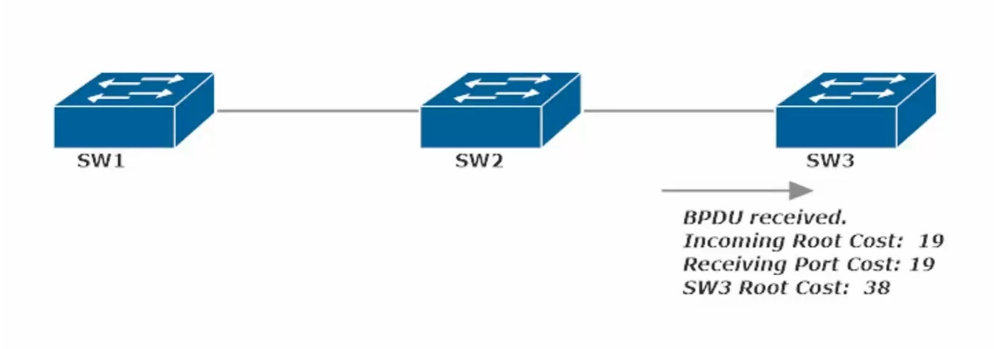

> **STP \> Bridge Protocol Data Unit \> Root Bridge Election \> Picking the root port**

SW1 is root bridge (both ports are in FWD mode)

SW2 chose Fa2/0/6 as its root port (indicated by its port status of FWD)

**The root port is chosen by determining which port/interface has the lowest root cost**

1.  Choose the port connected to the path with the **lowest root cost**. If tied go to 2

2.  Choose the port receiving the BPDU with the **lowest BID**. If multiple switches were involved, this would be the one and only tiebreaker you’d need. Since both ports received their BPDUs directly from SW1, there is also a tie. If still tied go to 3

3.  Choose the port receiving the BPDU from the port on the remote switch with the **lowest port priority**

4.  Choose the port receiving the BPDU from the port on the remote switch with the **lowest port ID**

> IOS Command: SW2#show spanning VLAN 1 detail
>
> 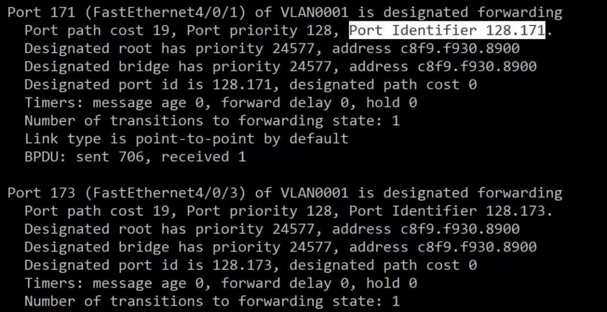
>
> **Root Port determined by lowest root cost, lowest BID, lowest Port Priority, lowest port ID**
>
> SW2 sets the root port to Port 171 (Fa4/0/1) since both ports are receiving from SW1 meaning the root cost, BID, and port cost are equal. With Port ID being the tie breaker. **Lower number wins and the corresponding port is set to the root port**.
>
> **STP \> Bridge Protocol Data Unit \> Root Bridge Election \> Picking the Designated Port**
>
> 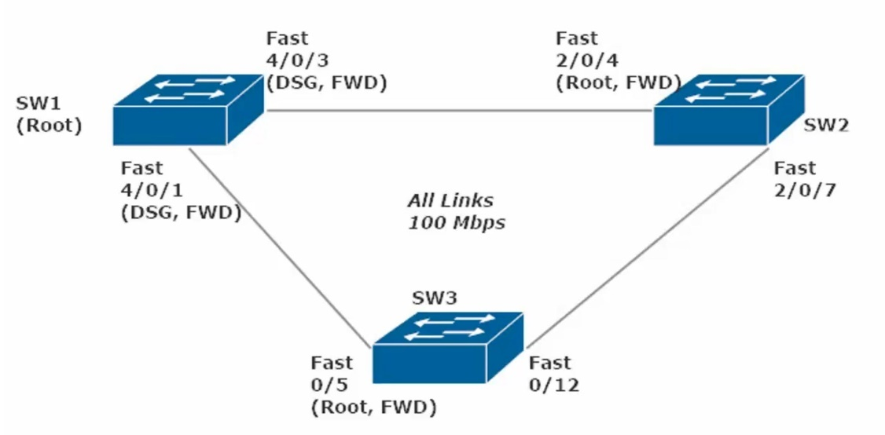
>
> Note: the above diagram needs blocking ports set on SW2 or SW3
>
> To prevent switching loops, STP needs to put one of the two remaining ports into a blocking state, with the other becoming a *designated port (DP)*. The switch with the lowest root cost will have its port shared on this shared segment named the designated port, and the other port of the segment will be put into blocking state.
>
> If both SW2 + SW3 have a root cost of 19, a tiebreaker is needed and the Switch with the lowest BID becomes the designated port of this segment.
>
> SW1 is root
>
> SW2 has a BID of 32768:c8:xx:xx:xx:xx:xx
>
> SW3 has a BID of 32768:00:xx:xx:xx:xx:xx
>
> As such SW3 has the lower bid and gets the Desg port and the interface on SW2 get its port set to BLK (Status: Blocking Mode)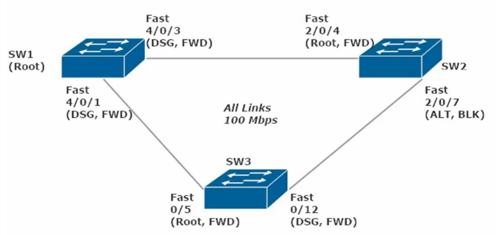

**STP BPDU Election with varying link speeds**

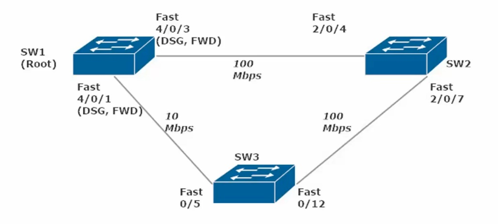

**SW1#show spanning vlan 1**

> 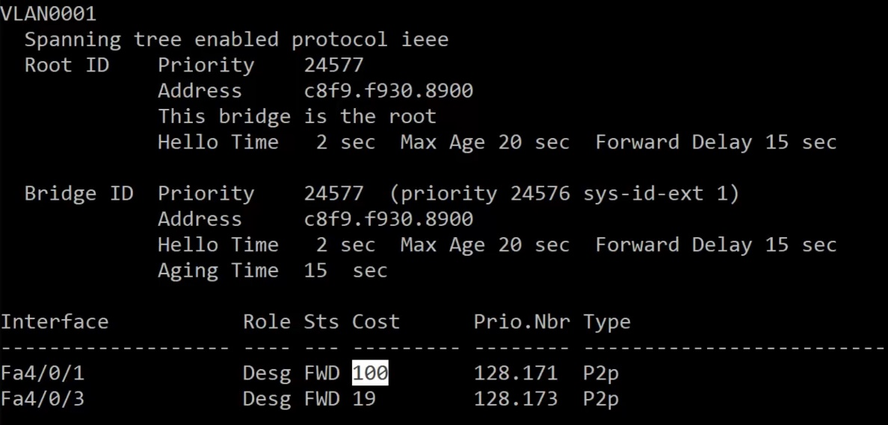
>
> Notice that the port cost is higher for the link going to SW3 over 10Mbps (default cost for ethernet (note: not fast ethernet) is 100)

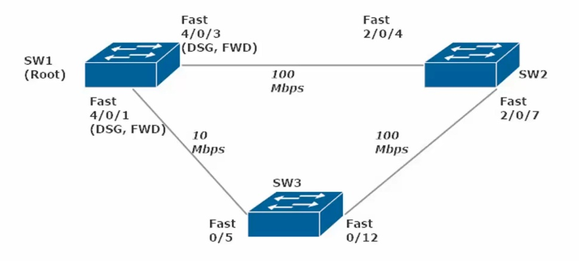

> **SW3#show spanning vlan 1**
>
> 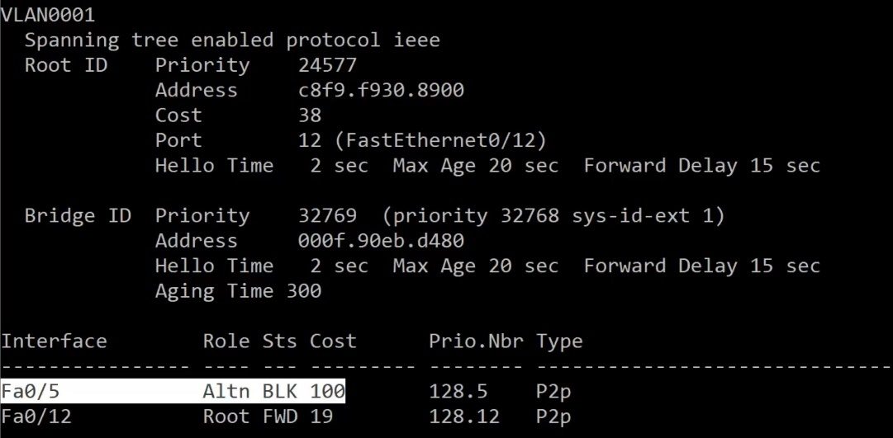
>
> Notice the change in interface roles and status due to the change in port cost
>
> Int Fa0/5 (going to SW1) is set to blocking mode and made an Alternate
>
> Fa0/12 (going to SW2) is now set to Root with a FWD status
>
> Notice that the Root ID cost is 38 (19 + 19 – fast ethernet default x2) when SW3 goes through SW2 to SW1. Where as the port cost is 100 going from SW3 directly to SW1 on Fa0/5.
>
> 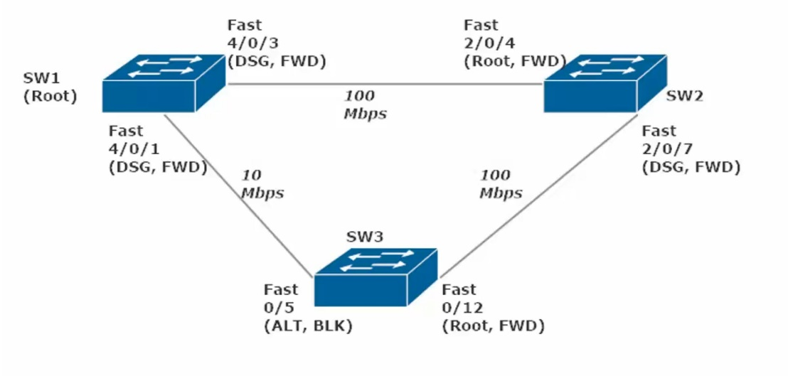
>
> **Default Port Cost by Link Speed (IEEE 1998)**

IEEE was revised in 2004 to show port cost for faster ports (10 Gbe +)

To use this version in your IOS implementation type the Command:

Sw1(config)#spanning-tree pathcost method long

> 
>
> **Changing a Port’s Cost**
>
> 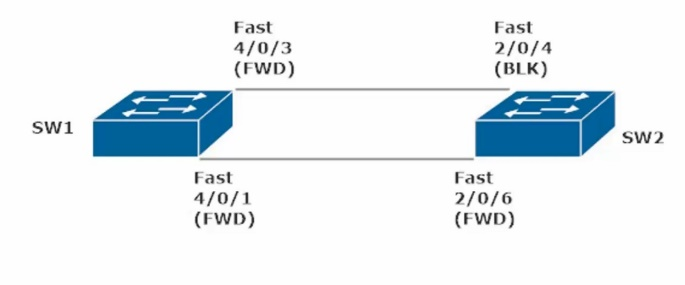

SW2#show spanning vlan 1

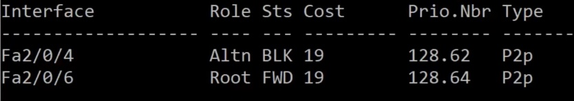

**Notice: Fa2/0/4 is set to Altn/BLK By lowering the interfaces port cost below the default of 19, we would reverse which port is set to Root/FWD and which is set to Altn/BLK**

**CMD to change port cost.**

Firstly, go to interface config mode for the port

SW2(config)#int Fa2/0/4

SW2(config-if)#spanning-tree port cost (\_\_)

(enter number lower than 19 to make it the root port, higher than 19 to make it non root based on above example)

**PVST+Extended Bridge ID**

For Spanning Tree to work, every switch needs a unique BID (Bridge ID)

Extended BID’s are used in place of unique MAC addresses,

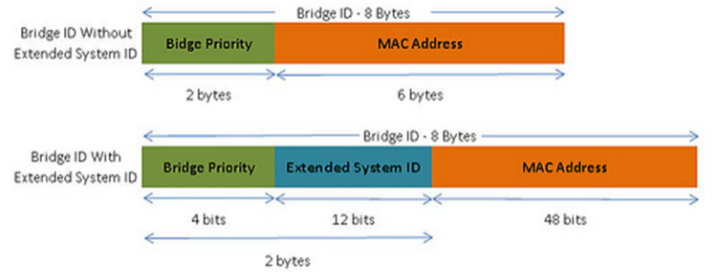

The extended system ID was implemented as without it every switch would need 4096 mac addresses, one for each potential VLAN. That would mean that manufacturers would run out of usable 6-byte Mac addresses very quickly (4096 times faster than necessary) The use of Extended Bridge IDs is also called MAC address reduction.

So the Extended Bridge ID was implement where the 2-byte sections of each BID is divided into a Bridge Priority of (4 bits) and the extended System ID of 12 bits. (4 bits + 12 bits = 16 bits / 2 Bytes)

Bridge Priority Value is a number you can set. (default is 32768) must be incremented by 4096

FFFF = 65,535 ,one half of that is 32768, the starting point for the default. Hex of 1000 is 4096 F000 = 61440

**0000** 0000 0000 0000 = 0 (16 bits / 2 bytes

**0001** 0000 0000 0000 = 4096

**0010** 0000 0000 0000 = 8192

The extended System ID is populated with the Vlan Number

So the full Bridge ID is the Priority Value (Default of 32768) + the VLAN ID

So a BID for an Interface with the default priority value and a VLAN 10

= 32768 + 10 = 32778

**  
**

**Per-VLAN Load Balancing**

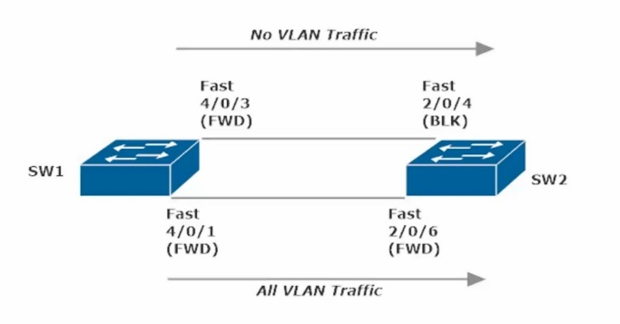

Above: Defaults for Spanning VLAN 1

Below: Diagram of VLAN Load balancing for 4 VLANs

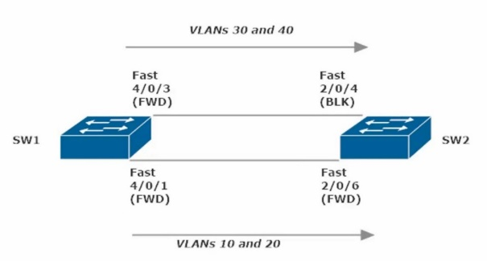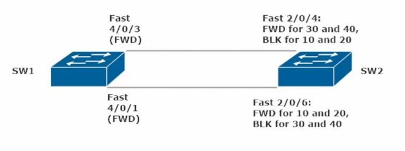

**To set VLAN 30 + 40 to FWD over SW2 Fa2/0/4, config int Fa 2/0/4 with this command**

**SW2(config-if)#spanning vlan 30,40 cost 9** (use a lower port cost than the other int on SW2)

**VLAN 10 + 20 to FWD over SW2 Fa2/0/6 both remain at their default values**

**Fa2/0/4**

- **FWD for 30 + 40 (port cost of 9)**

- **BLK for 10 + 20** (port cost stays at 19)

**Fa2/0/6**

- **FWD for 10 + 20 (port cost of 19)**

- **BLK for 30 + 40** (port cost stays at 19) (lowest priority value comes into effect)

Note: no change is made to Fa2/0/6 to any VLANs as the default values have vlans 10 and 20 in forwarding mode and vlans 30 and 40 are doing the opposite of what they are set at for Fa2/0/4

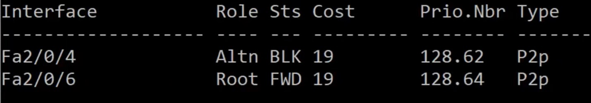

**Lowest Port Cost \>\> Lowest BID \>\> Lowest Priority \>\> Lowest Port ID**

**Changing Root Bridge Election Results**

If we leave STP to its own devices, a single switch is going to be the root bridge for every VLAN in our network. This isn’t bad depending on network topology, but root bridge election is left to chance, with the switch with the LOWEST MAC set as ROOT BRIDGE, and this isn’t always best.

We can choose to let one SW be the default bridge to ALL VLANs or only SOME VLANs, you can implement root bridge as you prefer. Such as if you have 50 VLANs and 5 SWITCHES, you could make each SWITCH the ROOT BRIDGE for 10 VLANs each.

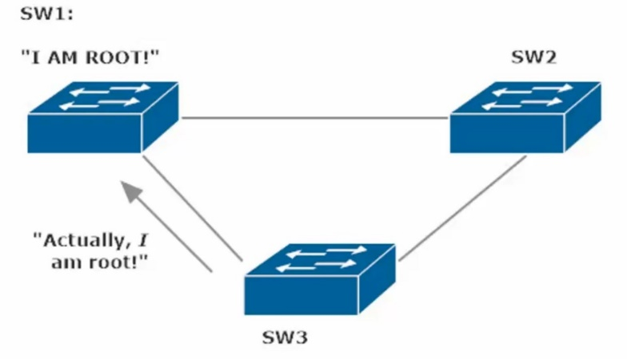

In the diagram above, I want to set SW1 as root bridge, but SW3 has won the election with the LOWEST BID, all BIDs have the default priority value (32768) so lowest MAC wins root bridge.

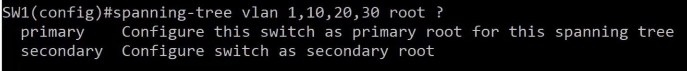

Above command: “spanning-tree vlan 1,10,20,30 root primary” will set SW1 as root bridge to all those VLANs nullifying the BPDU election

When setting the default bridge in this manner the root bridge BID priority number is set based on these criteria

Current Root bridge priority is below 24567? Priority of new root is 24567 and add the value of the VLAN ID)

Current Root bridge priority is above 24567? Subtract 4096 from the current root priority to get new root priority ID)

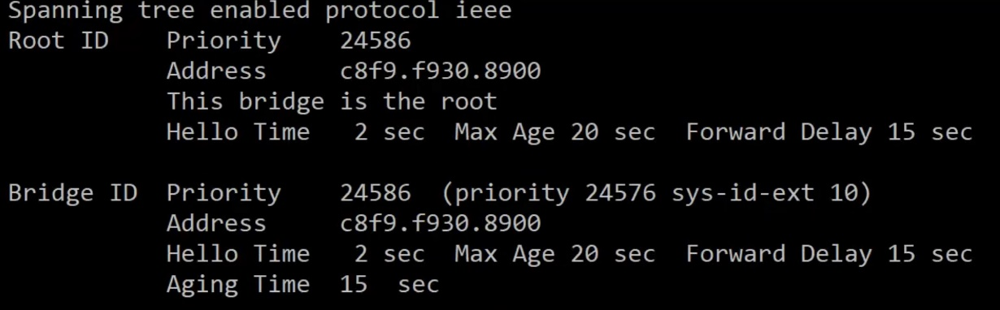

**  
**

**Configuring Secondary Roots**

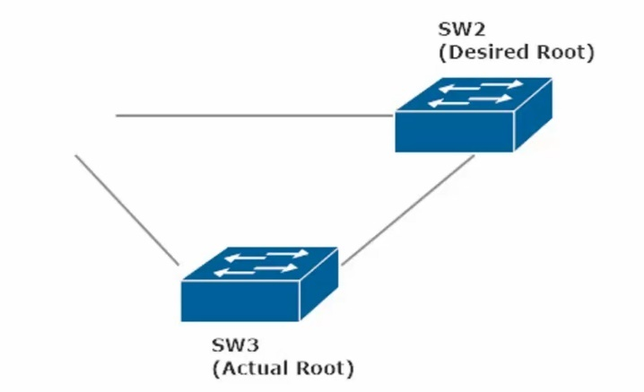

Should SW1 go down SW3 becomes default based on its lower BID, if you want SW2 to take over you need to set SW2 as secondary root

Command in IOS: SW2(config)#spanning-tree vlan 1,10,20,30 root secondary

This command will change the Bridge ID Priority Value to higher than SW1 + Lower than SW3

New Root bridge BID priority for secondary root (SW2) is 4096 added from the primary root BID Priority (24586+4096 = 28762)

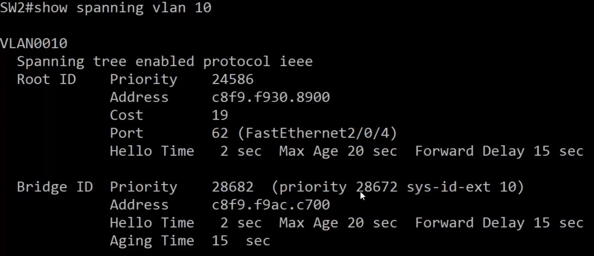

Root ID for Primary = 24586

Bridge ID for Secondary = 28682 (Value = Root ID + 4096 + 10 (the value for VLAN 10)

**Set Bridge ID Priority Manually (Bridge ID priority is the first 2 bytes of a BID)**

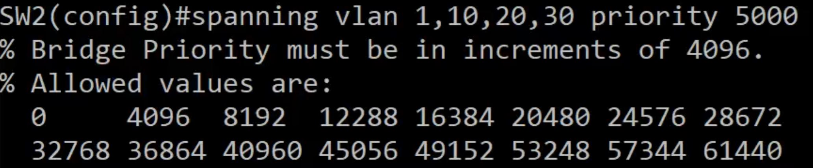

Command is entered in conf t on the switch you want to change bridge id value

SW2(config)#spanning vlan 1,10,20,30 priority \_\_\_\_ (In the blank insert a value iterated by 4096)

Three Switch array with STP (note bid is iterated by 4096)

SW1 Primary BID Default = 24576

SW2 Secondary BID Default = 28672

SW3 Default BID Default = 32768

**  
**

**Configuring Multiple Root Bridges**

Example has all switches at default BID priority, SW3 is root for all VLANs by default due to Lowest MAC address

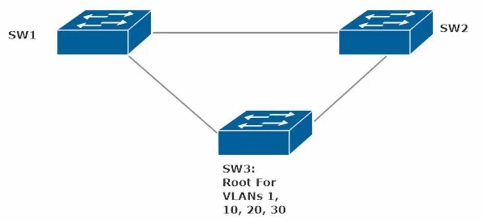

To spread around the VLAN load we can set each switch as root bridge for a specific VLAN

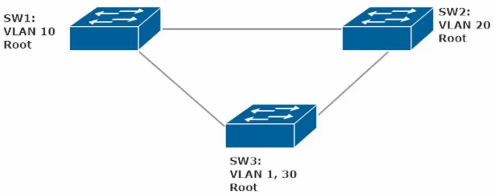

Default BID order(Low to High): SW3, SW1, SW2

SW1(config)#spanning vlan 10 root primary

SW2(config)#spanning vlan 20 root primary

SW3(config)#spanning vlan 1,30 root primary

Results of above commands

VLAN 10: SW1 is root both interface to SW2+SW3 are set to DSG/FWD

VLAN 20: SW2 is root both interface to SW1+SW3 are set to DSG/FWD

VLAN 30: SW3 is root both interface to SW1+SW2 are set to DSG/FWD

VLAN30: SW3 to SW1 is Root/FWD \| SW2 to SW1 is Altn/BLK (Higher BID than SW1)

SW3 to SW2 is Root/FWD \| SW1 to SW2is DSG/FWD (Lower BID than SW2)

Multiple Primary Root Bridges (Cont)

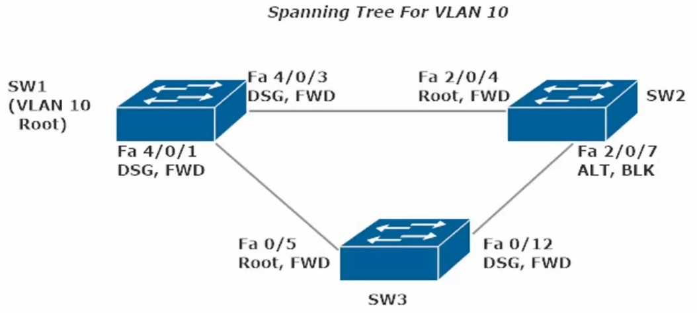

VLAN10: SW2 to SW1 is Root/FWD \| SW2 to SW3 is Altn/BLK (Higher BID than SW3

SW3 to SW1 is Root/FWD \| SW3 to SW2 is DSG/FWD (Lower BID than SW2)

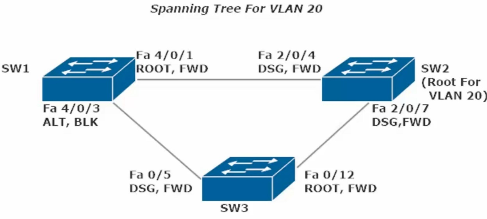

VLAN20: SW3 to SW2 is Root/FWD \| SW1 to SW3 is Altn/BLK (Higher BID than SW1

SW1 to SW2 is Root/FWD \| SW3 to SW1 is DSG/FWD (Lower BID than SW3)

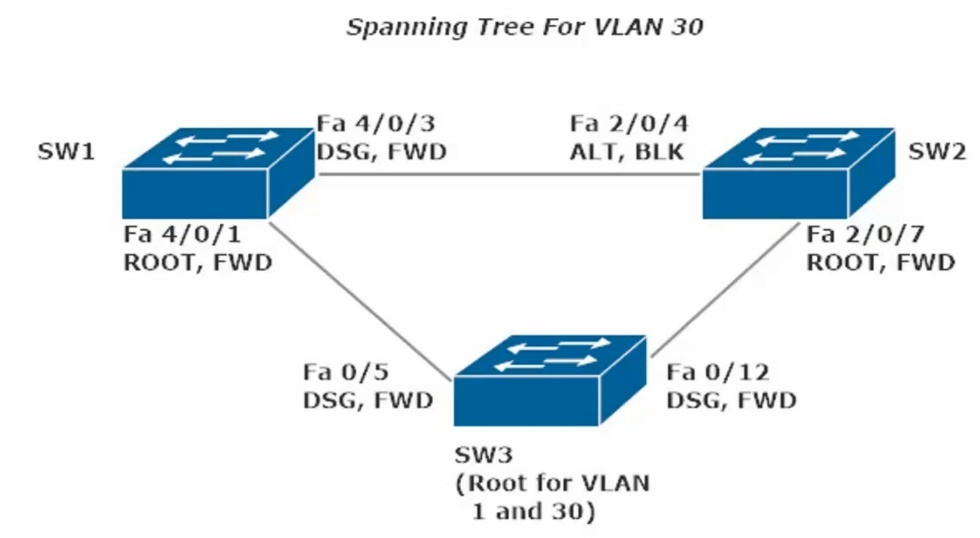

VLAN30: SW1 to SW3 is Root/FWD \| SW2 to SW1 is Altn/BLK (Higher BID than SW1)

SW2 to SW3 is Root/FWD \| SW1 to SW2is DSG/FWD (Lower BID than SW2)

**STP: Portfast**

- Portfast allows a port running STP to go directly from blocking to forwarding

- STP IEEE normally has a BLK port go to LIS then LRN before FWD, this is to prevent switch loops.

- If one port is struggling to get an IP from DHCP, configuring Portfast and that host’s switchport can fix the DHCP error, as the STP LIS + LRN states can interfere with the DHCP address acquisition process.

- Skipping the intermediate states and going from BLK to FWD instantly is okay because the chances of a switch loop happening on a single port with a single host are very small. Portfast allows the host to acquire an IP dynamically via DHCP without waiting for the BPDU election cycle.

- Portfast is off on interfaces globally by default

- Portfast is usually set on access port (configure on specific access interface) CMD: Switch(config-if)#spanning-tree portfast

- Portfast can be set to trunk port. (Configure on specific trunk interface CMD: Switch(config-if)#spanning-tree portfast trunk

- To set Portfast Globally due so from conf t CMD: Switch(config)#spanning-tree portfast default

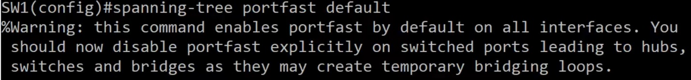

Note the Warning: Disable Portfast on interfaces going to Switches, Hubs, and Bridges

To disable Portfast on specific switchports

go to int config: Switch(config-if)#no spanning portfast (due this for each switch port leading to another Switch

The Port Fast feature does effectively disables Spanning Tree on the selected port. FALSE

**Show Spanning Summary Command**

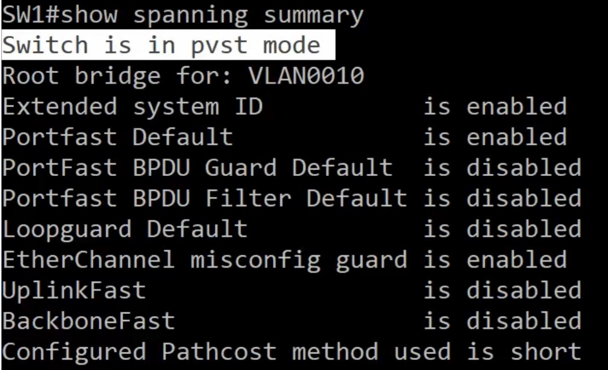

**  
**

**Root Guard –** Guards our choice of root bridge, by disqualifying downstream switches from where the root guard setting is enabled from becoming primary or secondary root bridge

**The Root Guard feature prevents a Root Port from becoming a Designated Port. TRUE**

Since we went to the trouble of explicitly setting a root bridge, we have the ability to enable root guard at the port/interface level to disqualify any downstream switch from being set as primary root bridge or secondary root bridge.

When root guard is enabled on a port any “superior BPDUs” (BPDU with a BID lower than itself) That port goes “*root-inconsistent*”. The interface receiving the superior BPDU is not totally shut off by Root Guard. It still listens for BPDUs, and once the superior BPDUs stop coming, the port will transition normally through the STP port states (BLK,LIS,LRN,FWD) and will come out of *root-inconsistent* on its own. (ie once the Switch connected to the “root guard enabled port” begins to send inferior BPDUs, then the interface will go out of root inconsistent state and toggle though intermediate states until it is back in FWD status.

BID Priority are Default \| MAC addresses Lowest to Highest SW3 \> SW1 \> SW2

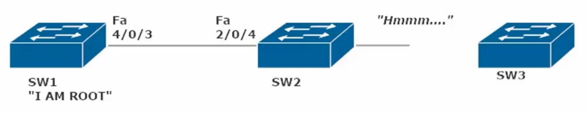

If we plugin SW3 to our network (See Above) SW3 will win the BPDU election due to its lowest MAC address. To prevent this from occurring we can enable “Root Guard” on SW2 on the interface that leads to SW3

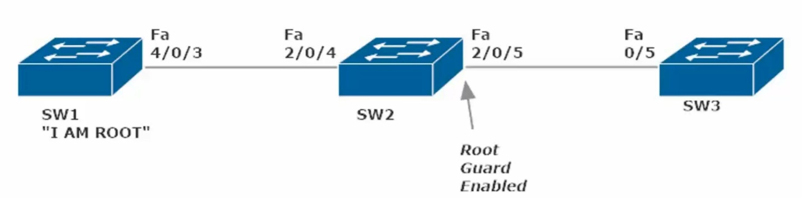

Command in IOS to enable root guard (occurs at interface config level)

SW2(config)#int Fa2/0/5

SW2(config-if)#spanning guard root

SW2#show spanning vlan 1 (note:int Fa2/0/5 has root guard enabled)

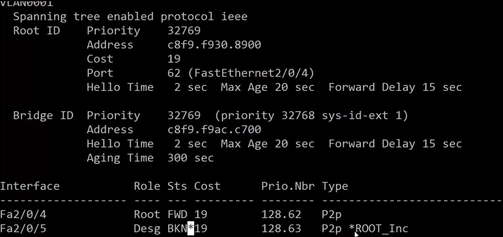

Notice the Interface/port we set to Root Guard indicates its Status as Root Inconsistent

Another method to check if a port is in root-inconsistent mode is the command seen below

SW2#show spanning inconsistent

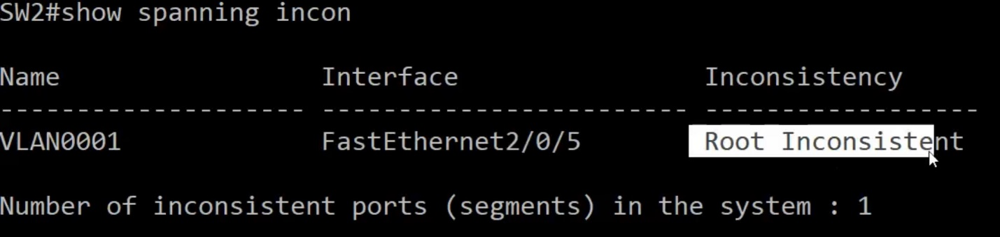

**  
**

**BPDU Guard**

Enabling BPDU Guard on a port will result in that port going into *error disabled state* (*err-disabled state*) when ANY BPDU(Superior/Inferior) is received from a downstream switch.

**BPDU Guard should be enabled on all ports with Port Fast enabled.**

This is good to enable on access mode ports as <u>it is a security feature</u> that will cause the <u>interface to disable if it receives any BPDUs</u>, which would <u>only come from Switches</u>. This will block a user in the network from removing their host device and adding in an unauthorized switch, as when the unauthorized switch begins to send BPDUs the port will automatically go into an error disabled state/down.

*error disabled state* (*err-disabled state*) – shuts the BPDU Guarded port down when any BPDU is received

SW3 would become root bridge as the BPDUs it sends will show it has the lowest BID (superior)

SW2 port Fa2/0/5 has BPDU Guard enabled (setting Fa2/0/5 into err-disabled when a BPDU is received)

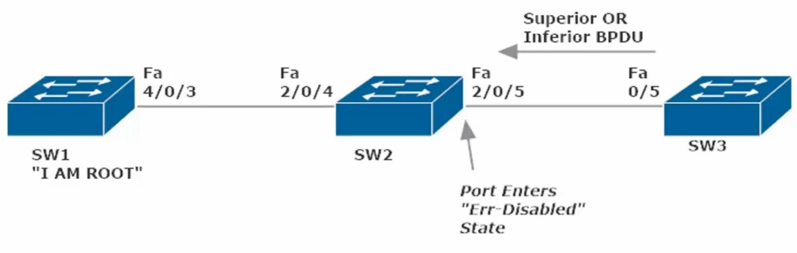

Fa 2/0/5 (err-disabled state - will block the port when it receives any BPDUs (Superior/Inferior) Causing both the line protocol (logical interface) and the physical interface to go down.

Below is the command to enable or disable BPDU Guard on a given port/interface

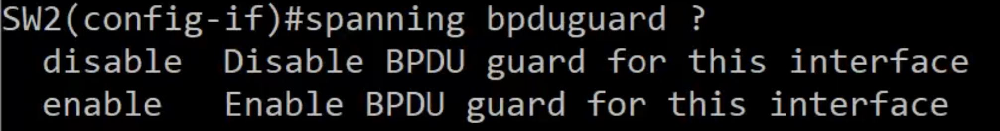

A “show vlan 1” command will not show the interface in err-disabled mode at all or show the interface as part of that VLAN at all

You will see the error-disabled status when checking the detail of Fa 2/0/5 with command

Show int Fa2/0/5 (see image below)

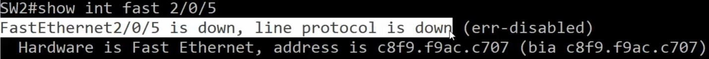

While you are NOT required to run BPDU Guard on a Portfast-enabled port, it is a good idea.

You can globally enable BPDU Guard on all Port-fast enabled interfaces via this command from global config. (Switch(config)#spanning portfast BPDUguard default)

You may want to have an err-disabled port come back on-line without having to directly intervene on the Switch (by changing a port’s BPDU Guard to disable), this can be done via

***Err-disabled recovery***

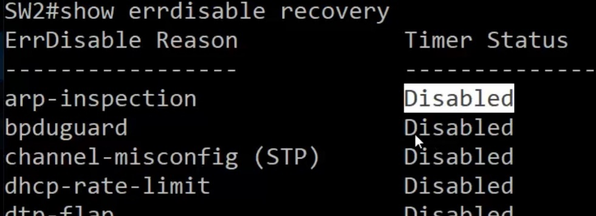

CMD (Switch# show errdisable recovery) shows ErrDisable Reason (such as BPDUguard)

Timer Status shows whether interfaces will attempt to reenable after the Timer Interval is up to allow an error-disabled interface to come back up provided the reason for errD state is resolved

(default Timer Interval 300 Seconds) (kinda long)

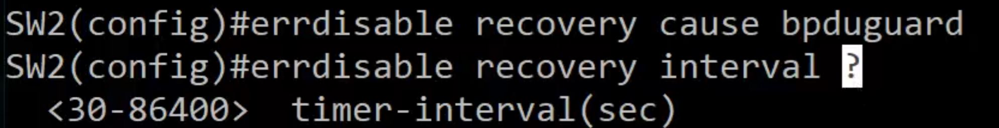

The top command (above) will set all interfaces to attempt to recovery from an error-disabled state that was caused by BPDU Guard being enabled

The bottom command will change the timer interval to your own specified time in seconds

By enabling the errdisable recovery for err-disabled states caused by BPDU Guard being enabled, after the set recovery timer interval to reenable that port, though if a switch is still sending BPDUs from a BPDU Guard enabled port, the interface will go up and then indicate an err-disabled state due to BPDU Guard and then immediately go down. Should a host (which does not send BPDUs) be plugged into that port and the errdisable recovery for BPDU Guard is enabled, after the timer interval has elaspsed the port will go back up.

3 different things are PortFast (good), BPDUguard (good), BPDUfilter (bad as disables STP). Plus 2 methods of applying those: globally or per-interface based.  
it is confusing a bit due to Guard and Portfast can go together when applied Globally.

1.  **PortFast** - when gets BPDU, it loses its Portfast status and becomes normal port and goes via STP phases. However, port is **not** Err-disabled.

2.  **BPDU Guard** – when interface gets BPDU, it will become Err-disabled port.

3.  **BPDUfilter** - ignores BPDUs completely that's why is BAD (mostly). When configured globally, BPDU Filter port will become regular stp port when gets BPDU. (Effectively disables STP)

4.  **RootGuard –** Guards our choice of root bridge, by disqualifying downstream switches from where the root guard setting is enabled from becoming primary or secondary root bridge

The Root Guard feature prevents a Root Port from becoming a Designated Port. FALSE

The Root Guard feature prevents a Designated Port from becoming a Root Port. TRUE

Quiz Questions I often miss Re:STP\\

- **RSTP is backwards compatible with STP** - TRUE

- **RSTP performs similar functions to Uplink Fast and Backbone Fast. - TRUE**

- **RSTP uses the same BPDU as STP. - FALSE**

RSTP uses a modified BPDU

Switch(config)#spanning-tree vlan 2 priority primary - wrong

Switch(config)#spanning-tree vlan 2 priority 4096 - correct

Switch(config)#spanning-tree vlan 2 root primary/secondary – correct

- The **BPDU Guard feature prevents the port from receiving any BPDUs** but does not prevent it from sending them. If any BPDUs are received, the port will be errdisabled. TRUE

- **BPDU Guard** should be enabled on all ports with Port Fast enabled. TRUE

Portfast allows a port to go into FWD immediately, this is meant for edge devices like PCs and Servers, which should not be receiving BPDUs, so if the interface running portfast (say a workstation) receives a BPDU, BPDUguard should be on and cause the interface to go into error disabled mode

- When configured at interface level **<u>BPDU Filter</u> effectively disables STP on the selected ports** by preventing them from sending or receiving any BPDUs. TRUE

The **Root Guard** feature prevents a Root Port from becoming a Designated Port. FALSE

**  
**

**The root port is chosen by determining which port/interface has the lowest root cost**

1.  Choose the port connected to the path with the **lowest root cost**. If tied go to 2

2.  Choose the port receiving the BPDU with the **lowest BID**. If multiple switches were involved, this would be the one and only tiebreaker you’d need. Since both ports received their BPDUs directly from SW1, there is also a tie. If still tied go to 3

3.  Choose the port receiving the BPDU from the port on the remote switch with the **lowest port priority**

4.  Choose the port receiving the BPDU from the port on the remote switch with the **lowest port ID**

Switches determine the best Configuration BPDU based on the following four factors: In this Order

Lowest Root Bridge ID

Lowest Root path cost to Root Bridge

Lowest sender Bridge ID

Lowest sender Port ID
