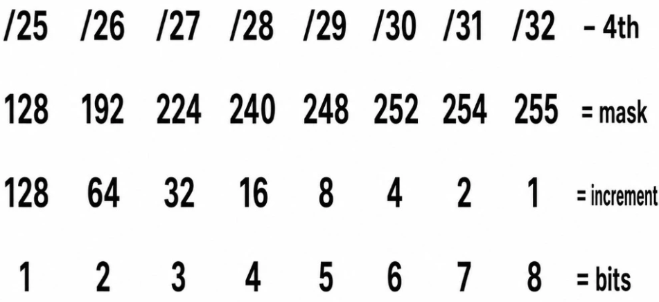
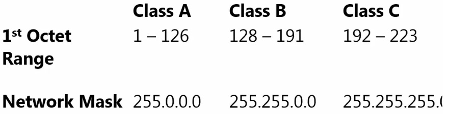
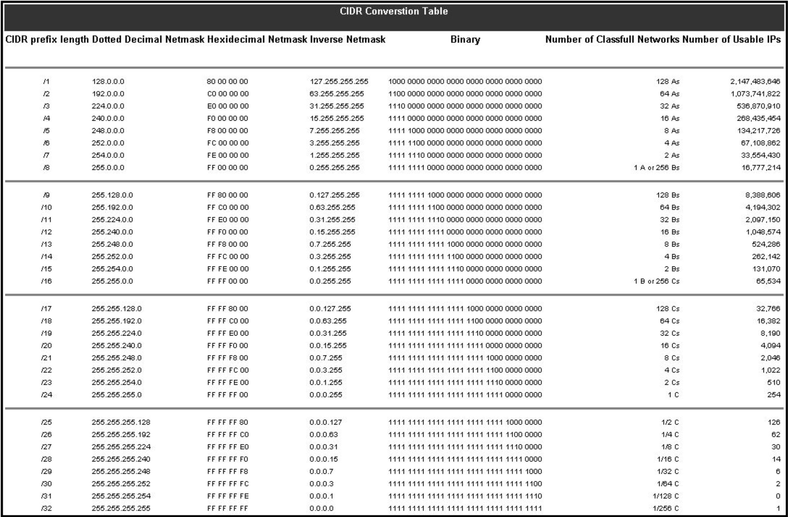

Subnetting 101: identifying the number of Subnets

CIDR notation – a short hand for subnets

/24 is for our standard subnet with 255 hosts (255.255.255.0) (11111111 11111111 11111111 00000000)

(Note the first 3 binary octets are the network portion of the address and the final octet (full of zeros) is the host portion)

The 24 designation is for the 24 1’s that make up the network portion)

A subnet mask will always have consistent 1’s (network portion) and consistent 0’s (host portion)

/20 subnet /20 is 20 1’s followed by remaining 12 0’s) (Four Octets equals 32 digits or 4 to 8 binary digits

/20 subnet in binary is 1111\|1111 1111\|1111 1111\|0000 0000\|0000

Which converts to 255.255.240.0

**Formulas**

**Hosts -\> 2^n-2**

**Subnets -\> 2^n**

1\. When asked for the number of **hosts**, use the formula: Host = 2 to the power of n -2

(Note: Count the Host Bits from Right to Left Networks = 2 to the power of n or 2^n

2\. When asked for the number of **subnets**, use the formula. Networks = 2 ^ N (N being the factor that is equal to or more than our desired amount of subnets) (example make 20 subnets 2^4 is 16 and 2^5 is 32, thus 16 is not enough and we will need to take 5 bits from the host section and add them to the network section, leaving us with 32 available subnets)

Subnets Formaula

Example 1: Let’s say we want 16 subnets for our network

16= 2 ^ 4 (Therefore N=4)

Thus steal 4 bits from hosts for and give them to network portion. **(represent the subnet portion in Green**)

10.1.1.0/24

**255.255.255.(0000\|0000) take 4 bits from the hosts leaving you with 255.255.255.(0000\|0000) (Green portion is subnets / Blue is Hosts for these subnets)**

2 Rules

Example Question 1: How many subnets for this /12 network?

How many valid subnets exists on 10.0.0.0 subnet 255.240.0.0 or in CIDR notation (10.0.0.0/12)

255.240.0.0 in binary is (1111\|1111 1111\|0000 0000\|0000 0000\|0000) (Since there are 12 consecutive 1’s it is /12 in cidr)

10.0.0.0 in binary is (0000\|1010 0000\|0000 0000\|0000 0000\|0000) (Red is Network \| Blue is Host)

Subnet Formula = 2 ^ N

12

