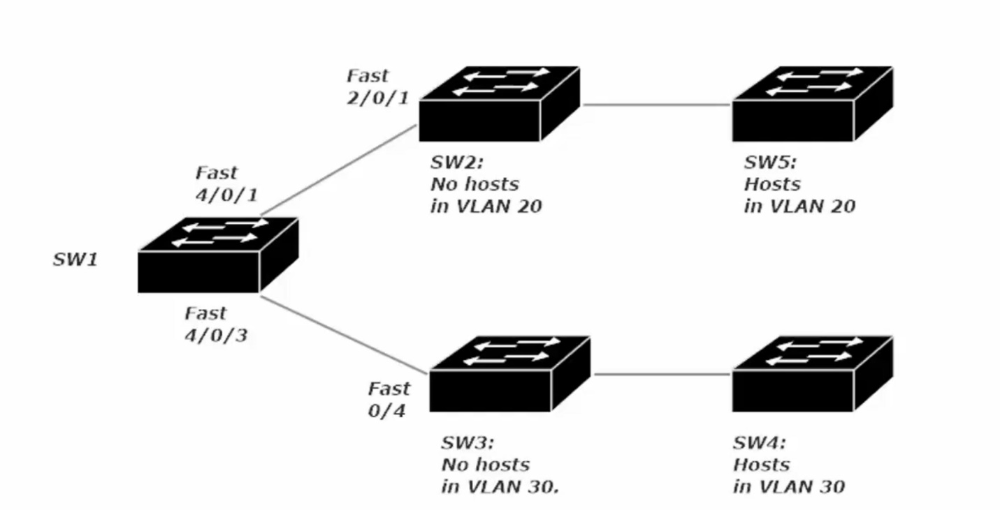
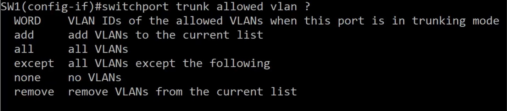
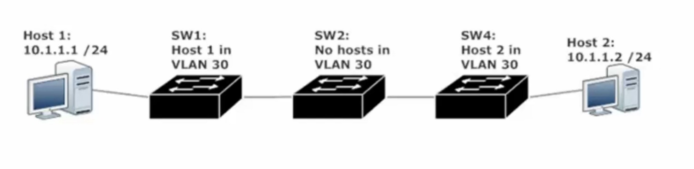
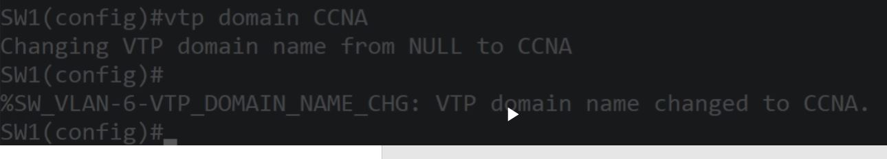
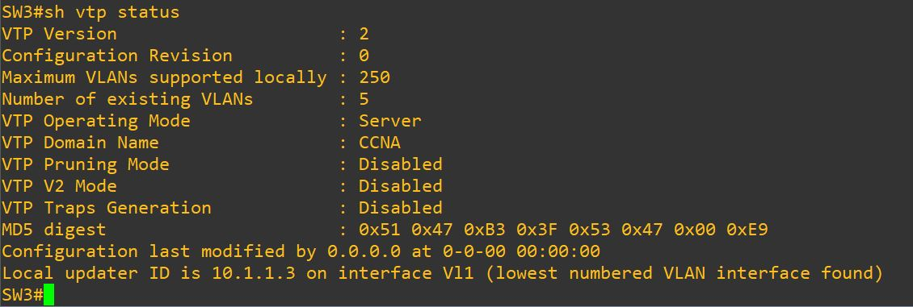
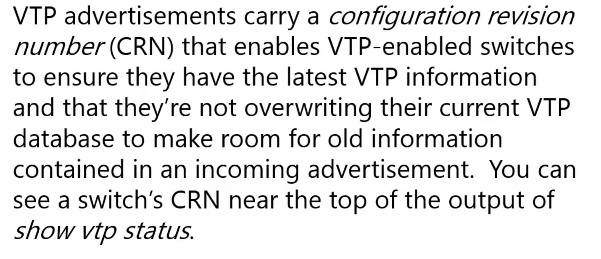

**<u>VLANs</u>**

VLANs help us group hosts by different criteria, rather than just different geographic location

VLANs also allow us to hide a logical group of hosts (increasing security)

VLANs help to prevent network performance degradation by limiting the scope of the network broadcasts (prevents *broadcast storms*)

**Broadcast Storm** – will gradually slow overall network performance down (getting to be more of an issue incrementally, until a certain point when the number of broadcasts in the network have the switch so busy handling broadcasts that it cannot handle other tasks)

**Native VLAN Concept** - the default for Cisco switches is VLAN 1

**Dot1q** – industry standard, recognizes the native VLAN concept.

Does not encapsulate the frame (resulting in lower overhead)

Inserts the VLAN ID as a 4 byte value into an ethernet header

When a frame is destined to VLAN1, the 4 byte value is not inserted (no VLAN tag)

When untagged traffic is received, it defaults to VLAN 1

**ISL** – cisco proprietary, will not work with other vendors of routers and switches, does not work with all Cisco gear either

Does encapsulate the entire frame (requiring for overhead of system resources)

By not recognizing the Native VLAN, ISL Trunking encapsulates each frame it sends and the receiving Switch must de-encapsulate each incoming frame (more overhead)

***Dynamic Trunking Protocol* (DTP)** – handles the actual Trunk negotiation workload. When this Cisco proprietary point-to-point protocol is in action, it attempts to negotiate a trunk with the remote port.

This mode sends DTP frames every 30 seconds, thus eating into HW resources.

To turn this function off

SW1(config)#switchport nonegotiate

For this command to work you need to remove dynamic status

SW1(config)#switchport trunk encapsulation dot1q (Encapsulation cannot be set to auto)

SW1(config)#switchport mode trunk

SW1(config)#switchport nonegotiate

Four Switchport modes

Unconditional trunking - \#switchport mode trunk

Unconditional non-trunking - \#switchport mode access

Dynamic trunking - \#switchport mode dynamic desirable (Actively attempts to trunk)

Passive trunking - \#switchport mode dynamic auto

> (waits for other switch to initiate the process)
>
> If one port is desirable or on mode a trunk is made
>
> If both ports are on auto (Passive) (<u>auto-auto no trunk is made</u>)

**  
**

**Per-VLAN Load Filtering** –

It is vital to look at the entire network when filtering VLANs and not just the 2 or 3 switches you are looking at. Downstream switches may have hosts on VLANs that are about to be excluded

SW2 needs VLAN 20 in its VLAN.dat or VLAN table to know to forward those tagged frames to SW5

If SW2 doesn’t have VLAN 20 in its table, the frames for VLAN 20 would be dropped as SW2 is unaware that VLAN 20 exists. Adding VLAN 20 can be done statically (conf t \> (config)#int vlan 20) or dynamically via VTP (VLAN Trunking Protocol)

These are the available options when allowing VLANs (default is to only VLAN 1) Note these options are on a per TRUNK port basis. As such SW1 above would need both Fa 4/0/1 and Fa 4/0/3 setup as trunks

Note: except command allows all except the stated VLAN, while the remove command will remove the stated vlan from the list of allowed VLANs

***VLAN Trunking Protocol* (*VTP*)** - allows switches to sync their vlan databases by advertising their vlan info to other switches in the same VTP domain.

This allows switches with no ports in a particular VLAN to still handle traffic for that VLAN. (i.e. it dynamics teaches switches in the VTP domain the VLAN info of the switch with VTP setup). When a VLAN is created on one switch in a VTP domain, all other switches in that VTP domain are notified of that VLANs existence.

(note: VTP Domain names are case sensitive) (V3 of VTP is the only version with a crypto secret)

<u>Three Types of VTP Modes</u>

1.  ***Server mode*** – allows the switch to create name and delete VLANs. (Server mode is default VTP mode). There must be at least one switch in a VTP domain running in server mode.

2.  ***Client mode*** – prevents the switch from, creating, naming or deleting VLANs

3.  ***Transparent mode*** – Switches <u>forward the VTP advertisements</u> received from other switches, <u>but does **not** actually process the info in those ads</u>. <u>VLANs can be created name and deleted</u> on switches running in transparent mode, <u>but these changes **are not advertised** to the other switches in the VTP domain.</u>

LAB 1

In the image above, SW2 will not be able to forward VLAN 30 tagged frames to SW4 unless that VLAN is manually added to the VLAN.dat file / table or VTP Server mode is enabled on one of the other switches.

Configure a VTP domain

SW1(config)#vtp domain \_\_\_\_\_\_\_\_\_\_\_ (provide a name)

The latest CRN will be taken and this verify that the latest VLAN info is present to switches in the VTP domain

One scenario where resetting the CRN to 0 is necessary, a new switch is needed for the network and is taken from other setup. If this new switch has a higher CRN than that of the VPT Server mode switch, the remaining VTP Client or VTP Transparent switches. Will pull the VLAN table from this new switch which can erase the table (provided VLAN 1 is the only VLAN setup) or provide incorrect VLAN numbers and names from the new switches old VLAN table.

**  
**

**VTP Pruning**

Since Trunk ports are members of all VLANs, broadcasts and multicasts for all VLANs (it knows about) will go out to other switches, whether or not that switch at the other end of the trunk has ports in those VLANs. This means wasted broadcasts and multicasts are sent unnecessarily and the receiving switch processes them unnecessarily, wasting bandwidth.

To resolve this issue, VTP pruning allows a switch to send a message to its trunking partners identifying the VLANs in use by the recipient switch.

Configure VTP Pruning (you just turn it on \| can only be on or off) (you only have to enable it on one switch for the other members of a VTP domain to likewise enable it)

SW1(config)#VTP pruning
